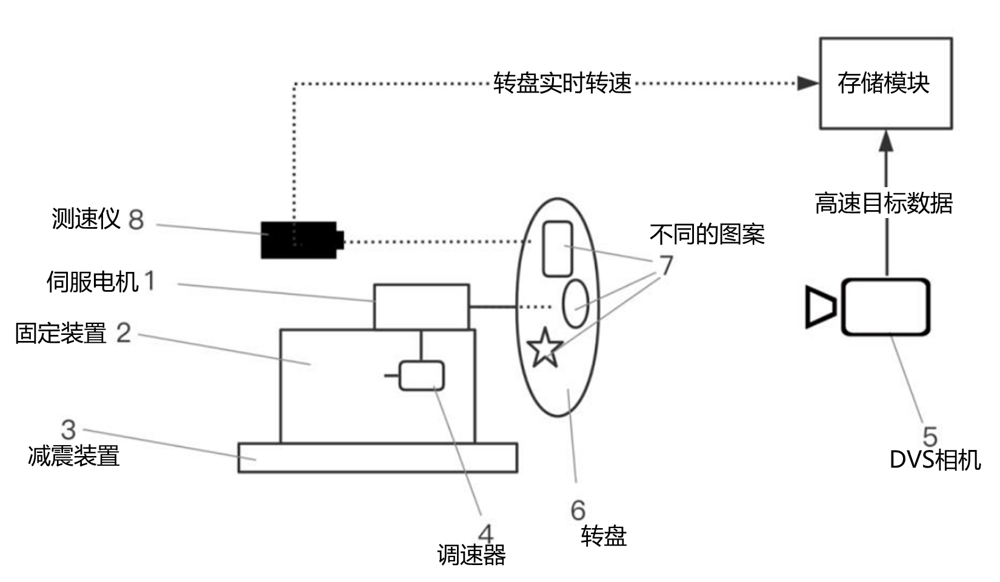
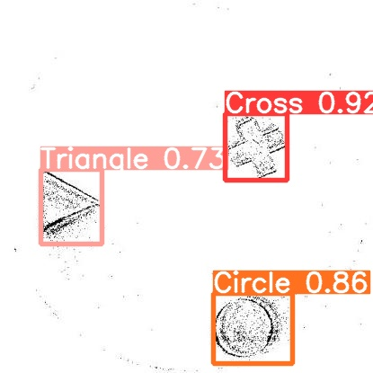

数据及预处理
^^^^^^^^^^^^^^^^^^^^^^^^^^^^^^^^^^^^^^^^^^^^^^^^^^^^^^^^^^^^^^^^^^^^^^^^^^^^^^^^^^^^^^^^^^

本数据集使用灵汐科技自有的高速移动目标数据采集装置进行数据采集，该装置示意图如下图所示。
DVS事件流数据采集后，经过事件流成帧处理，标签生成，数据集整合等步骤后，形成完整的DVS高速
转盘目标检测数据集。本数据集共三类目标，分别为{0: 'Cross', 1: 'Triangle', 2: 'Circle'}。

   图 高速移动目标数据采集装置

如下图所示，展示了一个检测结果的可视化。

   图 高速转盘检测可视化

网络模型
^^^^^^^^^^^^^^^^^^^^^^^^^^^^^^^^^^^^^^^^^^^^^^^^^^^^^^^^^^^^^^^^^^^^^^^^^^^^^^^^^^^^^^^^^^

DVS高速转盘目标检测采用ST-YOLO网络，基于时间空间动力学，进行事件流数据目标检测。
与 :ref:`st-yolo` 人车目标检测所不同的是，由于数据集标注格式差异，本任务中，网络head部分
采用yolov5 head。