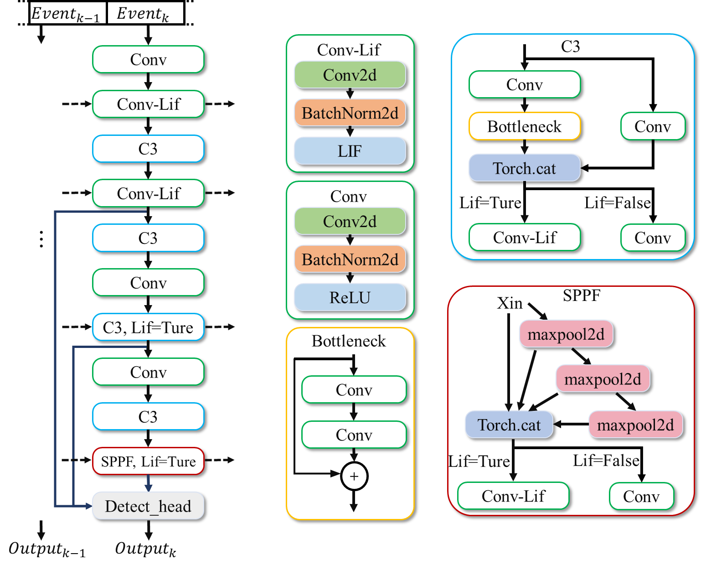

数据及预处理
^^^^^^^^^^^^^^^^^^^^^^^^^^^^^^^^^^^^^^^^^^^^^^^^^^^^^^^^^^^^^^^^^^^^^^^^^^^^^^^^^^^^^^^^^^

Gen1数据集是使用安装在汽车仪表板上的PROPHESEE GEN1传感器记录的，该传感器的分辨率为
:math:`304 \times 240`\ 像素。标签是利用 ATIS摄像机的灰度估计功能生成特定频率的标准灰度图像，进而通过手动标注获得。该数据集包含39个小时的开放道路和各种驾驶场景，包括城市、高速公路、郊区和乡村场景。手动标注的边界框包含两个类别：行人和汽车。

为了便于深度学习方法的训练，我们将连续拍摄的数据剪切成60秒的片段。这样，共获得2359个样本：训练数据为1460个，测试数据为470个，验证数据为429个。每个样本都以二进制.dat格式提供，其中事件编码使用4个字节表示时间戳，4个字节表示位置和极性。更确切地说，x位置使用14位，y位置使用14位，极性使用1位。

边界框注释以numpy格式提供。每个numpy数组都包含以下字段：

- -ts，方框的时间戳（以微秒为单位）；
- -x，左上角的横座标（以像素为单位）
- -y，左上角的纵座标（以像素为单位）；
- -w，方框的宽度（以像素为单位）；
- -h，方框的高度（以像素为单位）；
- -class id，对象的类别：
- 汽车为0；
- 行人为1。

预处理步骤首先是创建一个四维张量E：

- 第一个维度由两个部分组成，代表极性；
- 第二个维度有T个分量，与时间的T个离散化步长相关；
- 第三个维度和第四个维度分别代表事件摄像机的高度和宽度。

按以下方法处理时间段[:math:`t_{a}`, :math:`t_{b}`]内的事件集E：

.. math:: E(p,\ \tau,\ x,\ y) = \sum_{e_{k} \in \varepsilon}^{}{\delta\left( p\  - \ p_{k} \right)\delta\left( x\  - \ x_{k},\ y\  - \ y_{k} \right)\delta\left( \tau\  - \ \tau_{k} \right)},\ {\ \ \ \ \ \ \tau}_{k} = \left\lfloor \frac{t_{k}\  - \ t_{a}}{t_{b}\  - \ t_{a}} \bullet T \right\rfloor

换句话说，我们创建了T个双通道帧，其中每个像素包含T个时间帧中一个帧内正负事件的数量。最后，我们对极性和时间维度进行了扁平化处理，以获取形状为（2T、H、W）的三维张量，从而直接与二维卷积相兼容。

网络模型
^^^^^^^^^^^^^^^^^^^^^^^^^^^^^^^^^^^^^^^^^^^^^^^^^^^^^^^^^^^^^^^^^^^^^^^^^^^^^^^^^^^^^^^^^^

ST-YOLO网络可基于时间空间动力学，进行事件流数据目标检测。事件流信息按顺序输入网络后，首先被处理成代表空间和时间事件的张量。每一个时间步都会有一个新的事件张量输入网络，此外，特定的Lif层还会接受之前时间步的状态。每次经过骨干网后，Lif层的输出都会被用作检测框架的输入。具体结构如下图所示。

   图 ST-YOLO网络架构图

该网络包含backbone，Detect_head两个部分。其中，backbone部分基于yolov5的backbone进行修改，主要是使用了Lif层替代ReLU层，并利用Lif层的时空特性，处理时间维度的信息。Detect_head部分包含一个FPN网络和一个YoloXhead。