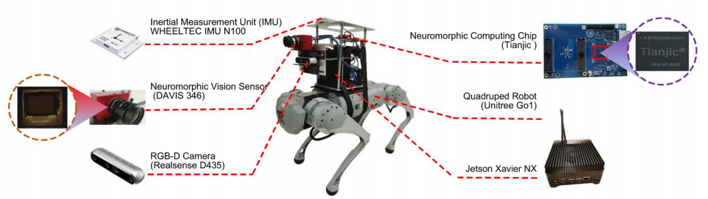
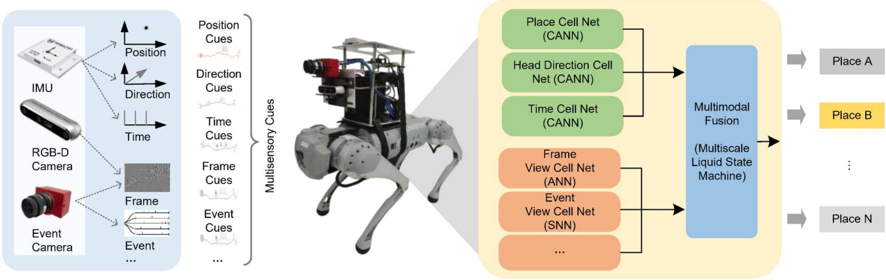

**位置识别机器人简介**

此四足机器人包含有多个传感器：IMU惯性测量仪用于获取位置信息，RGB摄像头用于获取图像数据，时间摄像机用于获取事件数据；一颗神经形态芯片:用于处理多模态的数据。

   图 位置识别机器人

**网络模型**

位置识别网络的架构见下图，该网络包含四个模块：卷积神经网络（可使用预训练的resnet50或mobilenet_v2）用于处理图像数据，SNN网络用于处理事件数据，连续吸引子网络（即CANN）用于处理GPS信息，这三个模块处理后的多模态数据输入到MLSM模块（即液体状态机）进行处理，最终得到位置信息。

   图 位置识别网络架构图