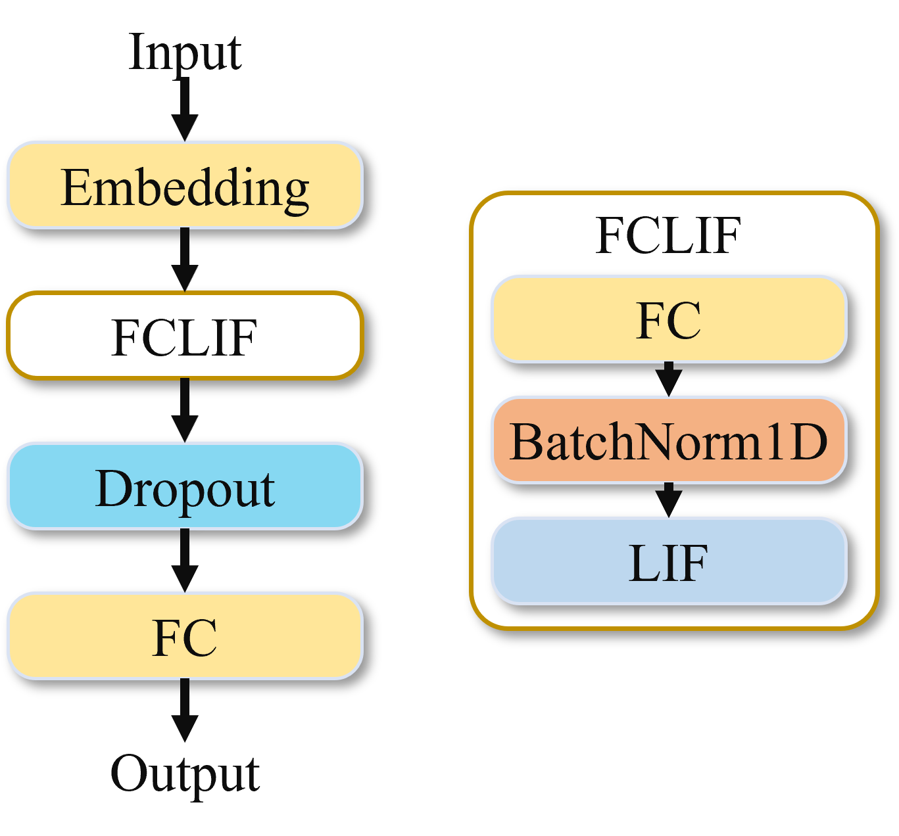

DVS数据处理
~~~~~~~~~~~~~~~~~~~~~~~~~~~~~~~~~~~~~~~~~~~~~~~~~~~~~~~~~~~~~~~~~~~~~~~~~~~~~~~~~~~~~~~~

动态视觉传感器（Dynamic vision sensor，DVS）是一种基于神经形态工程，模拟人类视网膜感知机制进行信息采集工作的硅视网膜（Silicon Retina）器件。DVS与传统的基于帧的传感器有着本质的区别。类似于人类视网膜收到光线刺激后向大脑发送脉冲，DVS以像素粒度异步、独立的接收光强信号，并将视觉信号编码为连续的时空事件流。神经拟态视觉传感器没有“帧”的概念。当现实场景中发生变化时，神经拟态视觉传感器会产生一些像素级的输出（即事件），一个事件具体包括(t, x, y, p)，这里的x,y为事件在2D空间的像素坐标，t为事件的时间戳，p为事件的极性。事件的极性代表场景的亮度变化：上升（positive）或下降（negative）。

DVS Gesture
^^^^^^^^^^^^^^^^^^^^^^^^^^^^^^^^^^^^^^^^^^^^^^^^^^^^^^^^^^^^^^^^^^^^^^^^^^^^^^^^^^^^^^^^^^

**网络模型**

DVS Gesture数据在训练和推理的过程中均对时间窗口T进行循环操作，每个循环所执行的模型结构如下图所示，其中的输入为单拍，shape为[b,2,40,40]。最后的模型输出是所有60拍的output求和再除以60。

.. figure:: _images/DVS-gesture网络模型.png
   :alt: DVS-gesture网络模型
   :scale: 60%

   图 DVS-gesture网络模型

该模型结构包含三个Conv2dLif模块以及2个FcLif模块，最后一个Fclif模块中Fc层的output_channel为DVS Gesture模型的类别数11。

**训练与性能**

随机选取数据集中的1176个样本做训练，288个样本做验证。我们使用学习速率为1e-2，权重衰减为1e-4的Adam优化器对这个网络进行训练，并且在训练过程中使用learning rate微调策略。神经元参数采用全共享模式，训练100个epoch，在验证集上达到了94.09%的top-1分类精度。

MNIST-DVS
^^^^^^^^^^^^^^^^^^^^^^^^^^^^^^^^^^^^^^^^^^^^^^^^^^^^^^^^^^^^^^^^^^^^^^^^^^^^^^^^^^^^^^^^^^

**网络模型**

MNIST-DVS网络模型包含3个Conv2dLif块，每个样本对时间拍进行循环，每次取单拍的样本送到这3个Conv2dLif块进行特征提取。之后会有一个SumLayer层，在该层对时间维度进行信息汇总，即将所有时间拍的特征图按元素相加并除以T，得到平均信息。模型的最后有FcBlock块，包含三层全连接，用于分类，最后一层Fc的out_channel为分类类别数10。

   
   图 MNIST-DVS网络模型

**训练与性能**

我们使用学习速率为1e-1，权重衰减为1e-4的带momentum的SGD优化器对训练集进行训练，momentum值设置为0.9，并且在训练过程中使用learning rate微调策略。神经元参数采用全共享模式，训练20个epoch，在验证集上达到了99.54%的top-1分类精度。

CIFAR10-DVS
^^^^^^^^^^^^^^^^^^^^^^^^^^^^^^^^^^^^^^^^^^^^^^^^^^^^^^^^^^^^^^^^^^^^^^^^^^^^^^^^^^^^^^^^^^

**模型介绍**

	
   图 CIFAR10-DVS网络模型

对比与MNIST-DVS，特征提取部分Conv2dLIf由三个增加至5个，而时间聚合层SumLayer后的FcBlock只包含2层Fc。

**训练与性能**

我们使用学习速率为1e-2，权重衰减为1e-4的Adam优化器对这个网络进行训练，并且在训练过程中使用learning rate微调策略。神经元参数采用全共享模式，训练100个epoch，在验证集上达到了68.23%的top-1分类精度。

短视频处理
~~~~~~~~~~~~~~~~~~~~~~~~~~~~~~~~~~~~~~~~~~~~~~~~~~~~~~~~~~~~~~~~~~~~~~~~~~~~~~~~~~~~~~~~~~

RGB-gesture
^^^^^^^^^^^^^^^^^^^^^^^^^^^^^^^^^^^^^^^^^^^^^^^^^^^^^^^^^^^^^^^^^^^^^^^^^^^^^^^^^^^^^^^^^^

**训练与性能**

RGB gesture数据的模型结构跟DVS gesture是一致的。我们使用学习速率为1e-3，权重衰减为1e-4的Adam优化器对这个网络进行训练，并且使用DVS gesture上训练的模型文件做为预训练的模型，训练50个epoch，在验证集上达到了97.05%的top-1分类精度。

Jester
^^^^^^^^^^^^^^^^^^^^^^^^^^^^^^^^^^^^^^^^^^^^^^^^^^^^^^^^^^^^^^^^^^^^^^^^^^^^^^^^^^^^^^^^^^

**网络模型**

训练Jester数据集的模型采用类resnet18的结构，具体如下图所示。

.. figure:: _images/训练Jester数据集的模型.png
   :alt: 训练Jester数据集的模型
   :scale: 60%

   图 训练Jester数据集的模型

同其它模型类似，SumLayer之前的均是单个时间步的操作，在SumLayer层，将所有时间步的结果进行求和再除以时间步16，进行时间维度的汇聚，最后再通过Fc层进行分类输出。

**训练与性能**

对训练集进行训练，优化器采用学习速率为1e-1，权重衰减为1e-4的带momentum的SGD优化器，momentum值设置为0.9，在训练过程中使用余弦退火的learning rate微调策略。训练200个epoch，在验证集上达到了93.87的top-1分类精度。

文本处理
~~~~~~~~~~~~~~~~~~~~~~~~~~~~~~~~~~~~~~~~~~~~~~~~~~~~~~~~~~~~~~~~~~~~~~~~~~~~~~~~~~~~~~~~

IMDB
^^^^^^^^^^^^^^^^^^^^^^^^^^^^^^^^^^^^^^^^^^^^^^^^^^^^^^^^^^^^^^^^^^^^^^^^^^^^^^^^^^^^^^^^^^

**网络模型**

IMDB模型同样是对时间拍进行循环操作，每次读入单时间拍的信息送入模型，模型首先通过Embedding层进行降维处理，之后通过FcLif层再进行升维操作，最后通过Fc层进行分类输出。该模型没有时间聚合层，只取最后一拍的结果做为输出。

   图 IMDB网络模型

**训练与性能**

训练中采用的优化器是学习速率为1e-3，权重衰减为1e-4的Adam优化器，训练过程中根据epoch对学习速率进行微调。共训练50个epoch，在验证集上达到了82.8%的分类精度。

医学影像处理
~~~~~~~~~~~~~~~~~~~~~~~~~~~~~~~~~~~~~~~~~~~~~~~~~~~~~~~~~~~~~~~~~~~~~~~~~~~~~~~~~~~~~~~~~

LUNA16Cls
^^^^^^^^^^^^^^^^^^^^^^^^^^^^^^^^^^^^^^^^^^^^^^^^^^^^^^^^^^^^^^^^^^^^^^^^^^^^^^^^^^^^^^^^^^

**网络模型**

Luna16Cls分类任务网络模型包含3个Conv2dLif块，每个样本对时间拍进行循环，每次取单拍的样本送到这3个Conv2dLif块进行特征提取。之后会有一个SumLayer层，在该层对时间维度进行信息汇总，即将所有时间拍的特征图按元素相加并除以T，得到平均信息。模型的最后有FcBlock块，包含三层全连接，用于分类，最后一层Fc的out_channel为分类类别数2。

   图 Luna16Cls网络模型

**训练与性能**

我们使用学习率0.05，权重衰减为1e-4，momentum为0.9的SGD优化器，对训练集进行训练，并在训练过程中使用学习率微调策略。神经元参数采用全共享模式，训练20个epoch，在验证集上达到了90.50%的top-1分类精度。在GPU上进行推理，速度为72.3fps。

大规模事件信息分类
~~~~~~~~~~~~~~~~~~~~~~~~~~~~~~~~~~~~~~~~~~~~~~~~~~~~~~~~~~~~~~~~~~~~~~~~~~~~~~~~~~~~~~~~~~

ESImagenet
^^^^^^^^^^^^^^^^^^^^^^^^^^^^^^^^^^^^^^^^^^^^^^^^^^^^^^^^^^^^^^^^^^^^^^^^^^^^^^^^^^^^^^^^^^

**网络模型**

网络的骨干网为resnetlif-18，同Jester数据集一样，只是LIF神经元的模式为 *analog* ，不同于Jester的 *spike* 模式。

**训练与性能**

我们使用学习率0.03，权重衰减为1e-4，momentum为0.9的SGD优化器，对训练集进行训练，并在训练过程中使用学习率微调策略。神经元参数采用全共享模式，训练25个epoch，在验证集上达到了44.16%的top-1分类精度。在GPU上进行推理，速度为121.6fps。

大规模图像分类
~~~~~~~~~~~~~~~~~~~~~~~~~~~~~~~~~~~~~~~~~~~~~~~~~~~~~~~~~~~~~~~~~~~~~~~~~~~~~~~~~~~~~~~~~~

Spike-driven Transformer V2
^^^^^^^^^^^^^^^^^^^^^^^^^^^^^^^^^^^^^^^^^^^^^^^^^^^^^^^^^^^^^^^^^^^^^^^^^^^^^^^^^^^^^^^^^^

**介绍**

Spikerformerv2（Spike driven transformer V2）是一种基于Transformer的通用SNN架构，称为“Meta - SpikeFormer”，旨在为神经形态计算提供一种高能效、高性能且通用的解决方案，可作为视觉骨干网络结构，在视觉任务方面表现出色。其特点包括：（1）低功耗，支持网络中仅存在稀疏加法的脉冲驱动范式；（2）通用性，处理各种视觉任务；（3）高性能，相比基于CNN的SNNs显示出压倒性的性能优势；（4）元架构，为未来下一代基于Transformer的神经形态芯片设计提供灵感。其采用Meta-SpikeFormer 架构, 借鉴通用视觉 Transformer 架构，将 Spike-driven Transformer 中的四个卷积编码层扩展为四个基于 Conv 的 SNN 块，并在最后两个阶段采用金字塔结构的 Transformer-based SNN 块。具体模型介绍请参考原论文[1].

.. figure:: _images/spikeformer.png
  :alt: Spikeformer V2 architecture

  Figure: Spike driven transformer V2 网络结构图

**性能**

该网络取得了较为优秀的精度结果。在图像分类（ImageNet - 1K 数据集），Meta-SpikeFormer 取得了显著成果。例如，当参数为 55M 时，通过采用蒸馏策略，准确率可达 80.0%。在不同模型规模下，与其他方法相比，在准确率、参数和功耗方面展现出优势。此外，在基于事件的动作识别任务（HAR - DVS 数据集），对象检测（COCO 基准测试）、语义分割（ADE20K 和 VOC2012 数据集）等多种任务上都取得了很好的精度结果。

**灵汐系统部署**

本网络模型可通过单个KA200芯片部署，目前默认部署的模型为metaspikformer_8_512模型(预训练权重，55M参数版本，T=4（4个时间拍）。原先代码模型为Spikingjelly框架设计的，本案例对其进行了一定的修改并纳入了此软件栈。本代码只支持推理，不支持训练，如需训练，建议采用原代码框架进行。注：本案例只保证在灵汐类脑计算芯片复现了正确的推理结果，并不保证复现原论文的功耗和能效等指标。原代码链接：https://github.com/BICLab/Spike-Driven-Transformer-V2

**参考文献**

[1]. Yao, Man, et al. "Spike-driven transformer v2: Meta spiking neural network architecture inspiring the design of next-generation neuromorphic chips." arXiv preprint arXiv:2404.03663 (2024).

