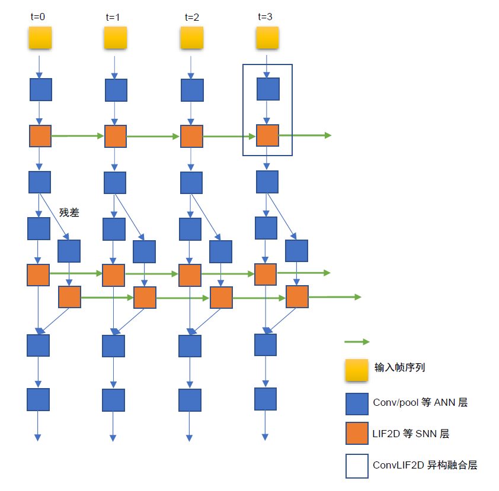
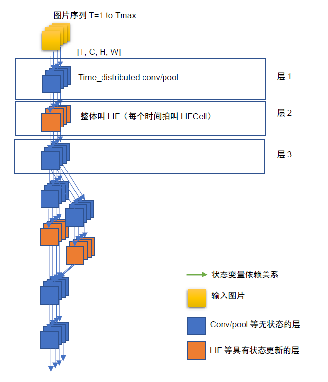
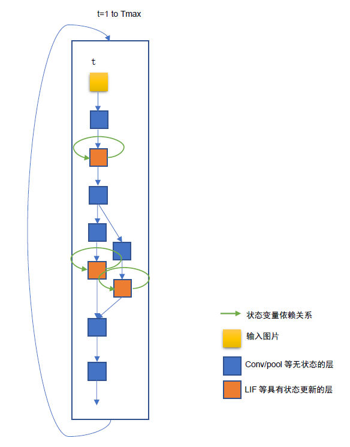
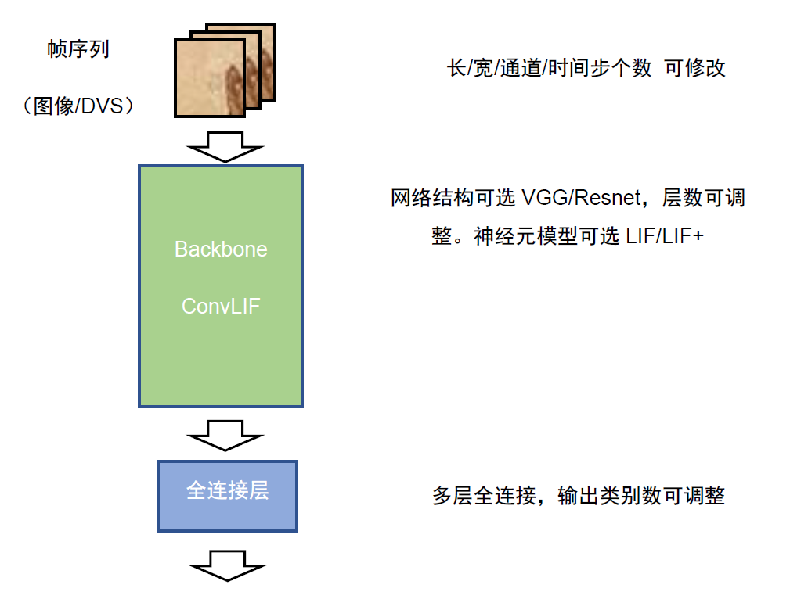
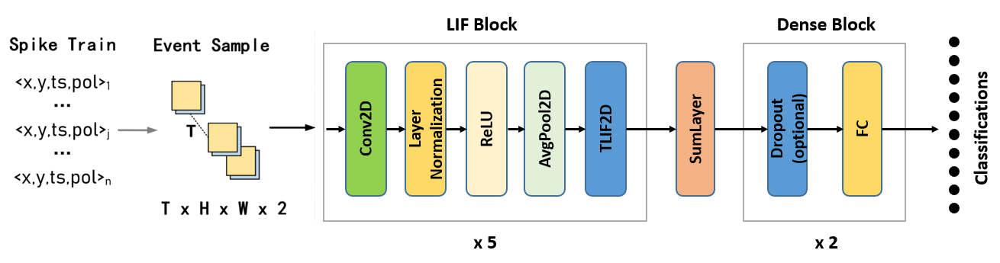
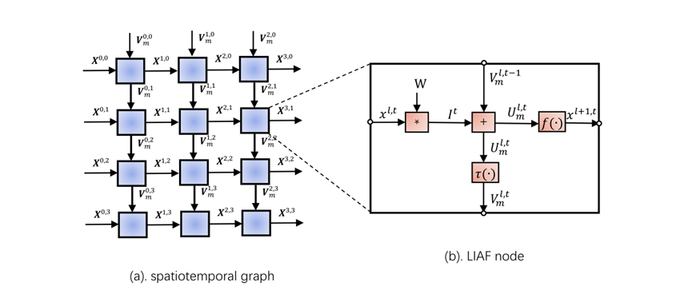
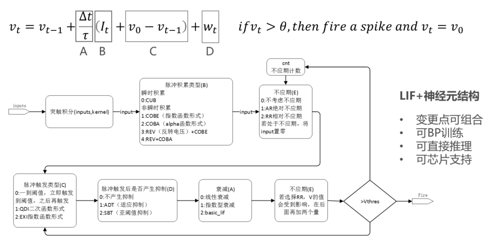
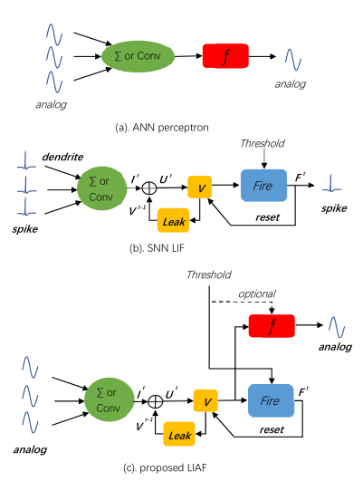

原理说明
===============================================================================

ANN+SNN异构融合网络结构
--------------------------------------------------------------------------------

异构融合网络采用多时间拍的前向网络结构，即每个时间拍是一个前向网络，各个时间拍在SNN层通过状态变量（如膜电位）实现时间维度迭代。网络包含SNN层和ANN层，其中SNN层指Leaky Integrate and Fire（LIF）、LIF变种（LIFPlus）、Izhikevich等类脑神经元层，ANN层指Conv，Pooling，Batch Normalization等人工神经网络层。此外，为了收集时间维度的信息，还具有时间维度聚合层（可理解为时域维度求和）。

网络的输入形态为帧序列，包括由短视频或DVS转换得到的帧序列，每帧可具有[C,H, W]三个维度，当具有多batch和多时间步时，输入数据的维度为[B, T, C, H,W]。输入形态也可以是一维的序列，如文本/语音，每帧只有一个维度L。当具有多batch和多时间步时，输入数据的维度为[B,T,L]。每拍需要输入一帧数据。网络在每个时间拍具有输出，也可仅使用最后一拍的输出，输出可以为多维的，也可以为一维的（采用global average pooling或flatten实现维度变换）。当前，采用灵汐类脑计算平台进行推理时，仅支持B=1。

对于帧序列处理，其主干网络由ConvLIF/ConvLIAF层堆叠而成，层间接口是一个维度为[B,T, C, H,W]的5D张量，分别表示批大小、时间步长、特征图数、高度、宽度。对于一维信息处理，其主干网络由LIF/LIAF层堆叠而成，层间接口是一个维度为[B,T,L]的三维张量，其中L为神经元的数量。类似的，当采用ANN层构建网络时，对于帧序列处理，Conv3D/ConvLSTM层也是类似的5D张量，对于一维信息处理，LSTM/GRU也是类似的3维张量，因此，LIAF与其他ANN层共享相同的数据格式和接口，这使得只要将LIF/LIAF看作一个类似于Conv3D或ConvLSTM的时空层，可以很容易的相互替换或集成使用。网络结构如下图所示。

.. attention:: Pytorch描述中，channel维度位于中间，即[B, T, C, H, W]，而灵汐的映射工具和芯片实现中，channel维度位于最后，即[B, T, H, W, C]，为表述方便，除特殊指明外，下文以Pytorch的表示形态为准。

.. _fig_2:

   图 用于空时处理的异构融合网络结构示意图

空时异构融合网络的代码表达形式
--------------------------------------------------------------------------------

基于 :ref:`fig_2` 的基础形态，空时异构融合网络有两种表达形态，主要用于代码容易表述。

内循环模式
~~~~~~~~~~~~~~~~~~~~~~~~~~~~~~~~~~~~~~~~~~~~~~~~~~~~~~~~~~~~~~~~~~~~~~~~~~~~~~~~

每层都是多时间拍的，层的输入输出变量自带时间维度。对于只能处理一个时间拍信息的纯空间处理层，如卷积层，需要在每拍重复的计算需要加入time_distributed标识，表示每个时间拍重复此运算，如time_distributed(conv)。对于Lif等具有时间拍更新的层，每个时间拍的更新内容描述为一个cell，每个层包含了一个多次执行cell的过程描述，以及最开始的状态值初始化描述，从而实现了时间维度的多次执行。如下图所示。

   图 异构融合空时网络的内循环模式（层内含有时间拍形式）

外循环模式
~~~~~~~~~~~~~~~~~~~~~~~~~~~~~~~~~~~~~~~~~~~~~~~~~~~~~~~~~~~~~~~~~~~~~~~~~~~~~~~~

所有网络结构的表达都是单时间拍的描述，并在最外层有时间拍循环，用于循环多个时间拍。对于没有状态变量的纯空间层，如卷积层，与普通的DNN图像处理网络一样，对于包含状态变量的层，如SNN，状态变量置于每层的私有变量中，这种结构中每个层只包含cell，如LIFCell，cell外部不再包含循环壳，网络只在最外层具有时间拍循环。如下图所示。

   图 异构融合空时网络的外循环模式（外循环时间拍的形式）

可见上述两种形态构建的空时网络逻辑上是可以等价的，都等价于 :ref:`fig_2` 的形态，目前灵汐的Lyngor编译主要针对外循环模式进行编译和部署，后期会扩展对内循环模式的支持。

外循环扩展模式
~~~~~~~~~~~~~~~~~~~~~~~~~~~~~~~~~~~~~~~~~~~~~~~~~~~~~~~~~~~~~~~~~~~~~~~~~~~~~~~~

当进行分类任务时，通常输入的信息具有时间维度而输出为分类结果，不带有时间维度，因此逻辑上分成了一个带有多层循环（多时间拍）的backbone（通常为VGG或ResNet）和一个不带有循环的head（通常为多层全连接），两者之间采用时域聚合层时间时间维度的削减（时间维度的pooling），在本框架中训练时通常使用head输入=\ :math:`sum(各时间拍backbone输出)/timesteps`\ ，即时间维度取平均。伪代码如下：

::

   reset_states()
   for t = 0 : T - 1
   rst(t) = backbone(in(t))
   rst_no_temporal = sum(rst)/T
   out_cls = head(rst_no_temporal)

在采用灵汐芯片推理时，由于目前仅支持外循环模式，因此将上述代码转化为如下形态：

::

   reset_states()
   for t = 0 : T - 1
   rst(t) = backbone(in(t))
   temporal(t) = add(rst(t), temporal(t))
   out(t) = head(temporal(t)/T)

其中最后一拍的输出 ``out(T)`` 与原先的out_cls结果一致，其余的 ``out(t)`` 可以抛弃。

其原理是将多时间拍的加法转换成了每时间拍累加，因此最后一拍的\ :math:`temporal(t)/T`\ 与原来的\ :math:`sum(rst)/T`\ 的值是一样的。

BIDL支持的网络结构
--------------------------------------------------------------------------------

网络结构描述
~~~~~~~~~~~~~~~~~~~~~~~~~~~~~~~~~~~~~~~~~~~~~~~~~~~~~~~~~~~~~~~~~~~~~~~~~~~~~~~

当前，BIDL重点支持VGG-LIF和ResNet-LIF两种网络形态，即带有LIF层的类VGG网络和ResNet网络。支持对短视频、DVS数据尺寸的适配，包括输入图像长宽调整，输出分类类别数调整。时间步数调整。网络深度和通道数可调。目前只用于空时分类任务。对于其他形态的神经网络结构，由于种类繁多，暂不提供确定性支持，但在Lyngor可编译的范围内通常可以支持。主体形态如下图所示：

   图 BIDL的可配置形态

输入的处理
~~~~~~~~~~~~~~~~~~~~~~~~~~~~~~~~~~~~~~~~~~~~~~~~~~~~~~~~~~~~~~~~~~~~~~~~~~~~~~~

对于DVS数据，通常为事件数据形态，每个事件为四元组，即(x, y, ts, p)，分别表示事件的横纵坐标，时间戳，亮度增强/减弱标识。大量事件组成事件序列，表征当前的感知图像亮度变化情况。为使用上述结构，需将一段时间内的上述事件信息进行成帧处理，形成帧序列，如将每15ms内的事件合并到一个帧数据上，这个帧数据具有[C,H,W]的维度，其中C=2，即有两个channel，分别存储p=1的事件和p=-1的事件。一个样本包含多帧数据组成的帧序列，通常一个样本是DVS拍摄的一小段时间内的动态光强变化图序列。灵汐芯片的输入数据可选择采用fp16或int8形态，因此p可以为模拟值而非二值，取决于用户的需求。

对于短视频数据，也需要处理为上述帧序列形态，每帧为一个小图像，各帧图像尺寸需一致。

对于一维度数据处理，通常需要预处理成一维向量的序列（每个时间拍为一维向量）输入到网络中。

输出的处理
~~~~~~~~~~~~~~~~~~~~~~~~~~~~~~~~~~~~~~~~~~~~~~~~~~~~~~~~~~~~~~~~~~~~~~~~~~~~~~~

目前重点支持的为识别（分类）网络，输出为若干分类的概率。如需支持其他输出形态，逻辑上也是可行的，需要用户自行构建。

网络描述与训练描述方法
~~~~~~~~~~~~~~~~~~~~~~~~~~~~~~~~~~~~~~~~~~~~~~~~~~~~~~~~~~~~~~~~~~~~~~~~~~~~~~~

在网络构建和训练方面，BIDL基于Pytorch构建，具体使用方案将在代码使用指导中进行阐述。

在编译和部署方面，构建好的网络采用Lyngor进行全自动编译，并采用LynSDK实现推理。在此方面BIDL提供示例代码。

示例网络结构
~~~~~~~~~~~~~~~~~~~~~~~~~~~~~~~~~~~~~~~~~~~~~~~~~~~~~~~~~~~~~~~~~~~~~~~~~~~~~~~

一个用于CIFAR10 DVS数据处理的网络结构如下图所示。

   图 空时处理网络结构示意

网络结构包含五个时空卷积网络（LIF Block）+SumLayer（用来消除时间维度，将特征维度从[T,H,W,L]减小为[H,W,L]）+两个全连接层。其中LIF Block层由Conv2d, Layer
Normalization（循环网络中的隐藏状态稳定动态方面非常有效）、Relu、AvgPool2D、TLIF2D五部分组成；DenseBlock由一个dropout层（可选）和一个全连接层组成。

.. _bptt:

异构融合网络的BPTT训练
--------------------------------------------------------------------------------

异构融合网络可以通过时间反向传播（BPTT）进行训练，BPTT在时域神经网络的训练中得到了广泛应用。异构融合网络是递归网络，因此我们展开时域，形成二维网格，如 :ref:`fig_7` (a)所示。每个节点表示一个节点函数（NF），其定义为：

.. math::

   \begin{array}{r}
   \left( V_{m}^{l,t},X^{l + 1,t} \right) = NF\left( V_{m}^{l,t - 1},X^{l,t} \right)
   \end{array}

其中：\ :math:`l`\ 为层指数，\ :math:`t`\ 为当前时间步长，\ :math:`V_{m}^{l,t}`\ 为神经元的膜电位（隐状态），\ :math:`X^{l,t}`\ 为激活。

由于递归网络的图 与 :ref:`fig_7` (a)相同，因此在NF水平上使用相同的反向传播规则进行训练。区别在于节点内部。我们可以在 :ref:`fig_7` (b)中详细描述LIAF节点函数。对于LIAF、\ :math:`U_{m}^{l,t}`\ 和\ :math:`V_{m}^{l,t}`\ 之间的关系可以描述为一个\ :math:`\tau( \cdot )`\ 函数：

.. math::
   
   {\tau(U}_{m}^{l,t}) = \alpha \cdot S\left( U_{m}^{l,t - 1} - V_{th} \right) \cdot V_{reset} + \alpha \cdot \left\lbrack 1 - S\left( U_{m}^{l,t} - V_{th} \right) \right\rbrack \cdot U_{m}^{l,t} + \beta

其中\ :math:`S(x)`\ 是Heaviside阶跃函数。采用BPTT算法，根据导数链，\ :math:`V_{m}^{l,t}`\ 对\ :math:`U_{m}^{l,t}`\ 求偏导时，有：

.. math::

   \begin{array}{r}
   \frac{\partial\tau\left( U_{m}^{l,t} \right)}{U_{m}^{l,t}} = \alpha \cdot \delta\left( U_{m}^{l,t} - V_{th} \right) \cdot \left( V_{reset} - U_{m}^{l,t} \right) + \alpha \cdot \left( 1 - S\left( U_{m}^{l,t} - V_{th} \right) \right)
   \end{array}

:math:`\delta(x)` Dirac Delta函数，反向传播时很不友好，因此我们为\ :math:`\delta(x)`\ 引入一个矩形窗口近似，定义为：

.. math::

   \begin{array}{r}
   \overline{\delta}(x) = \left\{ \begin{aligned}
   1,\ \  & when\ |x| < \mu \\
   0,\ \  & otherwise
   \end{aligned} \right.
   \end{array}

其中，\ :math:`\mu`\ 是一个小的正数。在LIAF-Net中，其他操作的偏导数很容易获得，并且可以通过深度学习框架自动处理。

.. _fig_7:

   图 训练方法示意图

.. attention:: 目前BIDL需要采用GPU实现BPTT训练。

BIDL神经元模型支持描述
--------------------------------------------------------------------------------

BIDL支持的主要神经元模型参见下表。此外，BIDL也可以采用代码描述实现自定义神经元模型。

表 支持的神经元模型（层）列表

+--------------+-------------------------------------------------------+
| 模型（层）   | 描述                                                  |
+==============+=======================================================+
| LIF/LIAF     | 标准LIF/LIAF模型（兼容IF模型）                        |
+--------------+-------------------------------------------------------+
| LIFPlus      | 各类LIF变种模型，含各类脉冲累积类型（突触后电流类     |
|              | 型），如指数形式，alpha形式，反转电压形式；不应期方式 |
|              | （绝对，相对， 取消）；脉冲触发类型（立即、二次函数、 |
|              | 指数），抑制方式（适应一致，亚阈值一致）；衰减方式    |
|              | （线性，指数）等                                      |
+--------------+-------------------------------------------------------+
| 自定义       | 采用Pytorch自定义                                     |
| （待开放）   |                                                       |
+--------------+-------------------------------------------------------+

其中LIFPlus是对LIF的各个执行阶段的一些变更形态，如下图所示。

   图 LIFPlus神经元的可选项及组合方式一览

下文将针对各个模型具体介绍。更详细的神经元API说明请参考详细使用说明（readme.md）。

LIF及LIAF神经元模型
~~~~~~~~~~~~~~~~~~~~~~~~~~~~~~~~~~~~~~~~~~~~~~~~~~~~~~~~~~~~~~~~~~~~~~~~~~~~~~~~~~~~~~

基本LIF模型的动力学形式描述
^^^^^^^^^^^^^^^^^^^^^^^^^^^^^^^^^^^^^^^^^^^^^^^^^^^^^^^^^^^^^^^^^^^^^^^^^^^^^^^^^^^^^^

原始LIF模型被描述成一个微分方程来展示神经元的动态特性，表达式如下：

.. math::

   \begin{array}{r}
   \tau\frac{dV(t)}{dt} = - \left( V(t) - V_{reset} \right) + \sum_{i = 1}^{n}{W_{i} \cdot X_{i}(t)}
   \end{array}

其中\ :math:`\tau`\ 是神经元的时间因子，\ :math:`V_{reset}`\ 是复位电位。\ :math:`Xi(t)`\ 是第\ :math:`i`\ 个神经元通过权重为\ :math:`W_{i}`\ 连接到当前神经元的输入信号（脉冲或无信号）。当\ :math:`V(t)`\ 达到某个阈值\ :math:`V_{th}`\ 时，会发出脉冲信号，并且
\ :math:`V(t)`\ 会重置为其初始值\ :math:`V_{reset}`\ 。

迭代形式描述（实际使用的形式）
^^^^^^^^^^^^^^^^^^^^^^^^^^^^^^^^^^^^^^^^^^^^^^^^^^^^^^^^^^^^^^^^^^^^^^^^^^^^^^^^^^^^^^

由于空时融合神经网络中，模拟值发放具有更好的性能，因此我们对LIF进行了扩充，形成了LIAF神经元。BIDL支持LIF/LIAF，由于两者类似，因此在此一并介绍。

LIF和LIAF神经元相似，具有类似的树突整合过程，同时融合了时间动态特性，包括阈值比较和发射脉冲，膜电位重置。LIF的输入值和输出值都是脉冲值（0/1序列或事件序列），LIAF的输入值和输出值都是连续值，如图所示。与LIF不同，LIAF中的神经元模型发射出的脉冲只是被用来重置膜电势，因此LIAF神经元膜电势与LIF中一样，但是输出激活却是通过另一个激活函数进行。

   图 传统感知器、LIF和LIAF神经元模型的比较

LIAF保持类似感知器神经元的模拟输入和模拟输出，而且保持类似于LIF神经元的时间动态。

LIF/LIAF模型数学描述
^^^^^^^^^^^^^^^^^^^^^^^^^^^^^^^^^^^^^^^^^^^^^^^^^^^^^^^^^^^^^^^^^^^^^^^^^^^^^^^^^^^^^^

原始的LIF模型被描述成一个微分方程来展示神经元的动态特性[30,33]，表达式如下：

.. math::

   \begin{array}{r}
   \tau\frac{dV(t)}{dt} = - \left( V(t) - V_{rest} \right) + \sum_{i = 1}^{n}{W_{i} \cdot X_{i}(t)}
   \end{array}

其中\ :math:`\tau`\ 是神经元的时间因子，\ :math:`V_{rest}` \ 是静息电位。\ :math:`Xi(t)` \ 是第i个神经元通过权重为\ :math:`W_{i}`\ 连接到当前神经元的输入信号（脉冲或无信号）。当\ :math:`V(t)`\ 达到某个阈值\ :math:`V_{th}`\ 时，会发出脉冲信号，并且\ :math:`V(t)`\ 会重置为其初始值\ :math:`V_{reset}`\ 。为了便于推导和训练，我们采用LIF在离散时间上的迭代版本[34,35]。下面将LIF和LIAF神经元模型做出如下对比：

1. 突触整合：

   .. math::

      \begin{array}{r}
      I^{t} = \left\{ \begin{array}{r}
      X^{t} \cdot W,\ \ \ \ \ \ for\ dense; \\
      Conv\left( X^{t},W \right),\ \ \ \ \ \ for\ convolution;\ \ \ \ \ \ \ \ \ \  \\
      X^{t},\ \ \ \ \ \ \ \ \ \ for\ integration - free.\ 
      \end{array} \right.\ 
      \end{array}

   其中：

   - :math:`X^{t}`\ 代表突触前神经元的激活值；
   - W指突触权重。

   突触整合可以采用全连接或卷积形式。

2. 结合空间信息和时间信息：

   .. math::

      \begin{array}{r}
      U_{}^{t} = I^{t} + V_{m}^{t - 1}
      \end{array}

   其中：

   - :math:`V_{m}^{t - 1}`\ ：先前的膜电位；
   - :math:`U_{}^{t}`\ ：当前的膜电位。

3. 内稳态，进行batchnorm操作：

   .. math:: U_{bn}^{t} = \ BatchNorm(U_{}^{t})

4. 阈值比较，发射脉冲：

   .. math::

      \begin{array}{r}
      F^{t} = U_{bn}^{t} \geq V_{th}
      \end{array}

   其中，\ :math:`F^{t}`\ 是发射信号。

   .. note:: 
      
      对于\ :math:`F^{t}`\ 中的每个\ :math:`F_{j}^{t}`\ ，\ :math:`F_{j}^{t}` 
      = 1表示发射脉冲事件，否则\ :math:`F_{j}^{t}` = 0。

5. 重置膜电势。

   .. math::

      \begin{array}{r}
      R_{m}^{t} = F^{t} \cdot V_{reset} + \left( 1 - F^{t} \right) \cdot \ U_{bn}^{t}
      \end{array}

6. 执行泄漏。

   .. math::

      \begin{array}{r}
      V_{m}^{t} = \alpha \cdot R_{m}^{t} + \beta
      \end{array}

   其中α和β分别代表乘性衰减系数和加性衰减系数。

7. 输出。

   .. math::

      \begin{array}{r}
      Y^{t} = \left\{ \begin{aligned}
      F^{t},\ \  & for\ LIF; \\
      f(U_{bn}^{t},V_{th}),\ \  & for\ LIAF.
      \end{aligned} \right.
      \end{array}

   :math:`f(U_{m}^{t},V_{th})`\ 是模拟激活函数。它可以是阈值相关（TR模式），
   也可以不是（NTR模式）。

   .. math::

      \begin{array}{r}
      f\left( x,V_{th} \right) = \left\{ \begin{aligned}
      Act\left( x - V_{th} \right),\ \  & for\ TR\ mode; \\
      Act(x),\ \  & for\ NTR\ mode.
      \end{aligned} \right.
      \end{array}

我们将LIAF/LIF中Dense integration、Convolutional integration和integration free分别命名为DenseLIAF/DenseLIF, ConvLIAF/ConvLIF and DirectLIAF/DirectLIF，其中卷积指2维卷积。

另外，\ :math:`V_{th}`\ ，\ :math:`V_{reset}`\ ，\ :math:`\alpha`\ 和
\ :math:`\beta`\ 在每一个卷积通道可能都是变化的（一个通道中的神经元共享相同的值），也可能在每一个神经元都是变化的，也可能在整个网络中所有神经元上都是相同的，将这三种不同的情况分别命名为：Channel-Sharing mode、Non-Sharing mode和All-Sharing mode。

为了减少实验中的参数量，在ConvLIAF/ConvLIF中要避免使用Non-Sharing mode。

LIFPlus神经元模型
~~~~~~~~~~~~~~~~~~~~~~~~~~~~~~~~~~~~~~~~~~~~~~~~~~~~~~~~~~~~~~~~~~~~~~~~~~~~~~~~~~~~~~

LIF模型变种（LIFPlus）指对LIF的膜电位衰减，输入脉冲累积，脉冲触发，脉冲触发电流和不应期进行更精细或差异化的建模，形成的一些LIF变种模型，统称LIFPlus。

LIF模型建模：

.. math::

   \begin{array}{r}
   \tau\frac{dv}{dt} = v_{0} - v + I\ \ \ \ \ if\ v > \theta,then\ fire\ a\ spike\ and\ v = v_{0}
   \end{array}

使用欧拉方法得到：

.. math::

   \begin{array}{r}
   v_{t} = v_{t - 1} + \frac{\mathrm{\Delta}t}{\tau}\left( v_{0} - v_{t - 1} + I_{t} \right)\ \ \ \ ifv_{t} > \theta,then\ fire\ a\ spike\ and\ v_{t} = v_{0}
   \end{array}

其中 :math:`\mathrm{\Delta}t` 代表采样时间间隔， :math:`\tau` 是神经元的时间因子。

使用LIF模型作为基线神经元模型，根据特征如何影响神经元的行为，将识别出的特征分为五类：膜衰减，输入脉冲累积，脉冲触发，脉冲触发电流和不应期。

膜衰减：根据神经元的膜电位随时间衰减的方式，存在两个生物学上的共同特征：指数衰减（EXD）和线性衰减（LID）。（LID主要是LLIF采用）

.. math::

   \begin{array}{r}
   v_{t} = \left\{ \begin{array}{r}
   v_{t - 1} + \frac{\mathrm{\Delta}t}{\tau}\left( v_{0} - v_{t - 1} + I_{t} \right)\ \ \ (EXD模式) \\
   v_{t - 1} + I_{t} - V_{leak}\ \ \ \ \ \ (LID模式)
   \end{array}\ \ \ \ \  \right.
   \end{array}

.. math::

   \text{if } v_t > \theta, \text{ then fire a spike and } v_t = v_0

其中\ :math:`V_{leak}`\ 是线性延时常数。

输入脉冲积累：神经元通过突触接受脉冲时会根据突触的突触权重更新膜电位，有即时和非即时累积两种，存在四个生物学上的共同特征。

电流积累（CUB）：在神经元获得输入脉冲信号后立即将输入脉冲信号的突触重量累积到神经元的膜电位。

电导累积：根据替代函数的类型，分为指数函数型（COBE）和阿尔法函数型（COBA）。

反转电压（REV）：调节替代功能对膜电位的作用。电流膜电位与反转电压之差越小，其贡献越小。

利用附加变量，将LIF模型扩展为：

.. math::

   \begin{array}{r}
   y_{t,i} = \left( 1 - \varepsilon_{g,i} \right)y_{t - 1,i} + I_{t,i}
   \end{array}

.. math::

   \begin{array}{r}
   g_{t,i} = \left\{ \begin{array}{r}
   I_{t,i},\ \ \ \ \ \ \ \ \ \ \ \ \ \ (CUB模式) \\
   \left( 1 - \varepsilon_{g,i} \right)g_{t - 1,i} + I_{t,i},\ \ \ \ \ (COBE模式) \\
   \left( 1 - \varepsilon_{g,i} \right)g_{t - 1,i} + e\varepsilon_{g,i}y_{t,i}\ ,(COBA模式)
   \end{array} \right.
   \end{array}

.. math::

   \begin{array}{r}
   v_{rev,i} = \left\{ \begin{aligned}
   1,\ \  & (非REV模式) \\
   v_{g,i}{- v}_{t - 1},\ \  & (REV模式，不能同时为CUB模式)
   \end{aligned} \right.
   \end{array}

.. math::

   \begin{array}{r}
   v_{t} = v_{t - 1} + \frac{\mathrm{\Delta}t}{\tau}\left( v_{0} - v_{t - 1} + \sum_{}^{i}{v_{rev,i} \cdot g_{t,i}} \right)
   \end{array}

式中，\ :math:`\varepsilon_{g,i}`\ 和\ :math:`v_{g,i}`\ 为第\ :math:`i`\ 个突触类型的电导衰减常数，和反向电压常数，e为欧拉数。

脉冲触发：在LIF模型中，当神经元的膜电位达到阈值电压\ :math:`\theta`\ 时，神经元立即触发一个尖峰并将其膜电位设置为静止电压\ :math:`v_{0}`\ 。还有另一种，神经元模型不会立即触发脉冲。这种神经元模型采用替代的非瞬时函数，一旦膜电位达到阈值电压，就控制膜电位。还有两种生物学上的共同特征属于此类别：二次（QDI）和指数（EXI）尖峰启动。与输入尖峰累积的情况类似，QDI和EXI分别采用二次函数和指数函数作为替代函数。

.. math::

   \begin{array}{r}
   f(t) = \left\{ \begin{array}{r}
   v_{0} - v_{t - 1} + \mathrm{\Delta}T \cdot e^{\frac{v_{t - 1} - \theta}{\mathrm{\Delta}T}}\ \ (EXI模式) \\
   \left( v_{0} - v_{t - 1} \right)\left( v_{c} - v_{t - 1} \right)\ (QDI模式)
   \end{array}\ \ \ \ \ \ \  \right.
   \end{array}

.. math::

   \begin{array}{r}
   v_{t} = v_{t - 1} + \frac{\mathrm{\Delta}t}{\tau}\left( f(t) + I_{t} \right)
   \end{array}

.. math:: if\ \ v_{t} > v_{\theta}\ \ ,then\ fire\ a\ spike\ and\ v_{t} = v_{0}

其中\ :math:`v_{\theta}`\ 是触发电压（大于阈值电压\ :math:`\theta`\ ），\ :math:`\mathrm{\Delta}T`\ 是锐度因子（不是无穷大），\ :math:`v_{c}`\ 是临界电压。

脉冲触发电流：在包括AdEx模型在内的某些神经元模型中，神经元在触发输出脉冲后会自行抑制其膜电位。在此类别中，存在两个生物学上的共同特征：适应（ADT）和亚阈值振荡（SBT）。

- ADT：在短时间内接收到大量连续的输入脉冲时，ADT会缓慢降低神经元的允许脉冲触发频率。因此，ADT增强的神经元可以对自输入开始以来经过的时间信息进行编码。

- SBT：使神经元的膜电位在一定电压水平附近振荡。振荡电压电平通常高于静止电压。SBT增强的神经元可以在一定的时间间隔内滤除脉冲，因此可以充当带通滤波器。

LIF模型可以扩展为：

.. math::

   \begin{array}{r}
   w_{t} = \left\{ \begin{aligned}
   (1 - \varepsilon_{w})w_{t - 1},\ \  & (ADT模式) \\
   \left( 1 - \varepsilon_{w} \right)w_{t - 1} + \frac{\mathrm{\Delta}t}{\tau}a\left( v_{t - 1} - v_{w} \right),\ \  & (SBT模式)
   \end{aligned} \right.
   \end{array}

.. math::

   v_{t} = v_{t - 1} + \frac{\mathrm{\Delta}t}{\tau}\left( v_{0} - v_{t - 1} + I_{t} \right) + w_{t}

.. math::
   
   \text{if } v_t > \theta, \text{ then fire a spike and } v_t = v_0, w_t = w_t - b
   

其中，

- :math:`\varepsilon_{w}`\ 是适应衰减常数；
- :math:`a`\ 是亚阈值耦合常数；
- :math:`b`\ 是脉冲触发的跳跃大小；
- :math:`v_{w}是`\ 耦合膜电位偏置常量；
- 由于ADT和SBT是由输出脉冲的产生触发的，因此在脉冲触发时，\ :math:`w_{t}`\ 和\ :math:`v_{t}`\ 一起进行调整。

不应期：可以防止神经元在短时间内发射出过多的输出脉冲。生物学上有两个共同的特征属于此类别：绝对不应期（AR）和相对不应期（RR）。

其中AR的LIF模型可以表示为：

.. math::

   \begin{array}{r}
   if\ {cnt}_{t - 1} > 0,then\ \ I_{t} = 0
   \end{array}

.. math::

   \begin{array}{r}
   {cnt}_{t} = \max\left( 0,{cnt}_{t - 1} - 1 \right)
   \end{array}

.. math::

   \begin{array}{r}
   v_{t} = v_{t - 1} + \frac{\mathrm{\Delta}t}{\tau}\left( v_{0} - v_{t - 1} + I_{t} \right)
   \end{array}

.. math::
   
   \text{if } v_t > \theta, \text{ then fire a spike and } v_t = v_0, \text{cnt}_t = \text{cnt}_{\max}

RR的LIF模型可以表示为：

.. math::

   \begin{array}{r}
   r_{t} = \left( 1 - \varepsilon_{r} \right)r_{t - 1}
   \end{array}

.. math::

   \begin{array}{r}
   w_{t} = \left( 1 - \varepsilon_{w} \right)w_{t - 1}
   \end{array}

.. math::

   \begin{array}{r}
   v_{t} = v_{t - 1} + \frac{\mathrm{\Delta}t}{\tau}\left( v_{0} - v_{t - 1} + I_{t} \right) + r_{t}\left( v_{rr} - v_{t - 1} \right) + w_{t}\left( v_{ar} - v_{t - 1} \right)
   \end{array}

.. math::

   \text{if } v_t > \theta, \text{ then fire a spike and } v_t = v_0, r_t = r_t - q_r, w_t = w_t - b

其中，

- :math:`\varepsilon_{r}`\ 是相对不应期衰减常数；
- :math:`\varepsilon_{w}`\ 是适应性衰减的常数；
- :math:`v_{ar}`\ 是适应性反转电压；
- :math:`q_{r}`\ 是相对不应期的跳变尺寸；
- :math:`v_{rr}`\ 是相对不应期反转电压。

.. _zdysjymx:

自定义神经元模型
~~~~~~~~~~~~~~~~~~~~~~~~~~~~~~~~~~~~~~~~~~~~~~~~~~~~~~~~~~~~~~~~~~~~~~~~~~~~~~~~~~~~~~

BIDL支持自定义神经元。用户可采用Pytorch默认语法规范描述神经元。

自定义神经元的构建：在BIDL工程下的 */bidlcls/models/layers* 目录新建文件 
*custom_neuron.py* ，即首先构建代码实现自定义神经元模型。 *custom_neuron.py* 中需要包含
``Custom_neuron`` 、 ``Custom_neuron1d`` 、 ``Custom_neuron2d`` 、 ``Fc_Custom_neuron`` 和 ``Conv2d_Custom_neuron`` 等类的实现。

*Custom_neuron* 类是自定义神经元的基础类，实现自定义神经元计算的完整流程，继承自
``torch.nn.Module`` 。该类的 ``init`` 方法中除了包含神经元常用的几种参数，即norm（内稳态）、mode（输出值是spike还是analog）、soma_params（神经元胞体参数）、noise（训练过程中加入 的噪声）等之外，还需包含用于区分是否在APU上编译的标志位 ``on_apu`` 和 ``fit`` 。在初始化中，如果判断 ``on_apu`` 为 ``True`` ，则需要用uuid1函数为该神经元产生一个ID值。此外，对于该自定义神经元的状态变量（膜电位等），需要在 ``init`` 方法中初始化为 ``None`` 。
``Custom_neuron`` 类的 ``forward`` 方法中具体对神经元的运算过程进行实现。在 ``forward`` 方法的首尾判断该类是否具有ID属性，如果有的话，即需要在APU上编译，则调用自定义算子
``load`` 和 ``save`` ，实现状态变量的读取和保存，Lif神经元中的示例如下：

::

    def forward(self, xi: pt.Tensor) -> pt.Tensor:
       if hasattr(self, 'id'):  # for lyngor apu
           self.v = ops.custom.load(self.v, f'v{self.id}')
   
   ....
   
      if hasattr(self, 'id'):  # for lyngor apu
          self.v = ops.custom.save(self.v, f'v{self.id}')

如果自定义神经元中有阈值比较和脉冲发放的操作，即类似表达式：

.. math::
   
   \begin{array}{r}
   F^{t} = V^{t} \geq V_{th}\ \ \ \ 
   \end{array}`

则APU编译标志位为 ``True`` 时，可以为了提高APU执行速度，用如下自定义算子代替。

::

   fire = ops.custom.cmpandfire(self.v.clone(), self.v_th)

``Custom_neuron`` 类除了实现 ``init`` 方法和 ``forward`` 方法之外，还需要实现
``add_noise`` 方法和 ``reset`` 方法。

``add_noise`` 方法：如果为训练模式，且初始化中的参数noise非零，则为神经元的状态变量添加随机噪声。Lif神经元 ``add_noise`` 方法实现如下：

::

   def add_noise(self):
       with pt.no_grad():
           v_shape = self.v.shape
           noise = pt.randn(v_shape, dtype=self.v.dtype, device=self.v.device)
           scale = pt.std(self.v, dim=[\_ for \_ in range(2, len(v_shape))], keepdim=True) \* self.noise
           self.v += noise \* scale

``reset`` 方法：用于定义状态变量的形状大小并初始化为0。如果APU编译，直接在每个自定义神经元执行前调用其 ``reset`` 方法，否则在每个样本的第一拍调用 ``reset`` 。Lif中 ``reset`` 方法示例如下：

::

      def reset(self, xi):
         self.v = pt.zeros_like(xi)

``Custom_neuron1d`` 和 ``Custom_neuron2d`` 类分别是对自定义神经元进行一维封装和二维封装，均继承自 ``Custom_neuron`` 类。 ``Custom_neuron1d`` 类中如果需要内稳态，内稳态直接采用
``nn.BatchNorm1d`` 操作，而 ``Custom_neuron2d`` 类中则是 ``nn.BatchNorm2d`` 。这两个类均只有 ``init`` 方法， ``forward`` 方法直接使用基类的 ``forward`` 。

``Fc_Custom_neuron`` 类：对fc层和自定义神经元进行封装，继承自 ``torch.nn.Module`` ，包含 ``init`` 、 ``forward`` 和 ``reset`` 方法。注意的是，对于fc层是二维操作，而如果在APU上编译，自定义神经元中的自定义算子则只支持四维操作，所以需要根据标志位进行升降维操作。具体操作包含如下几个方面：

- ``init`` 方法中，如果 ``on_apu`` 标志位为 ``True`` ，且需要内稳态操作，则调用 
  ``nn.BatchNorm2d`` 方法，否则直接使用 ``nn.BatchNorm1d`` 方法。
- ``reset`` 方法中，如果 ``on_apu`` 标志位为 ``True`` ，则状态变量初始化为4维的张量，否则初始化为2维的张量。
- ``forward`` 操作中，如果判断 ``on_apu`` 标志位为 ``True`` ，且当前的输入为二维，则连续调用两次 ``unsqueeze`` 方法将输入升至4维，再进行自定义神经元层的操作，之后再通过
  ``reshape`` 将维度降至2维。

``Conv2d_Custom_neuron`` 类：对二维卷积层和自定义神经元层进行封装，继承自 ``torch.nn.Module`` 。由于二维卷积层本身的输入输出就是4维，所以不需要 ``Fc_Custom_neuron`` 类中的升降维操作。

自定义神经元的使用：自定义神经元极其相应的封装类构建完成，则可用于构建模型。对于外循环网络，backbone的构建在 *bidlcls/models/backbones/bidl_backbones_itout.py* 文件中。构建基于自定义神经元 ``custom_neuron`` 的模型类，首先需要在 *bidl_backbones_itout.py* 文件中 *import custom_neuron.py* 中定义的 ``Fc_Custom_neuron`` 和 ``Conv2d_Custom_neuron`` 。之后编写模型的 ``backbone`` 类，继承自 ``torch.nn.Module`` 。模型类的 ``init`` 方法中按照需要添加 ``Conv2d_Custom_neuron`` 层或者 ``Fc_Custom_neuron`` 层。
