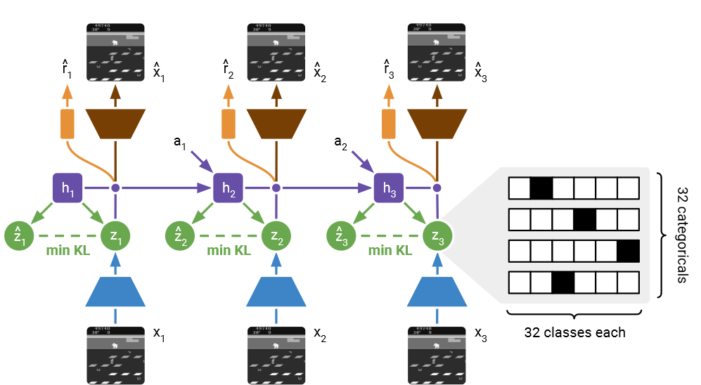
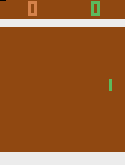
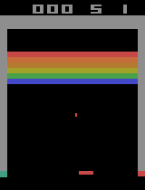
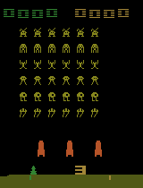

DreamerV2
~~~~~~~~~~~~~~~~~~~~~~~~~~~~~~~~~~~~~~~~~~~~~~~~~~~~~~~~~~~~~~~~~~~~~~~~~~~~~~~~~~~~~~~~~~

**网络模型**

人类进行决策时，主要依靠脑中对世界的建模进行，而真实世界用于更新世界模型。DreamerV2是一个
采用上述机制构建的基于世界模型的强化学习框架。其策略完全通过隐层空间训练而成。在Atari游戏
上超过了人类水平。是目前最具竞争力的强化学习方案。

   
   图 DreamerV2网络模型

**训练与性能**

基于强化学习平台GYM中的atari游戏模拟库训练。如下是训练后的Dreamerv2基于APU推理的游戏效果图。

   图 Dreamerv2基于APU推理的游戏效果图（a） Atari Pong

   图 Dreamerv2基于APU推理的游戏效果图（b） Atari Breakout

   图 Dreamerv2基于APU推理的游戏效果图（c） Atari Space Invaders

Spike-DreamerV2
~~~~~~~~~~~~~~~~~~~~~~~~~~~~~~~~~~~~~~~~~~~~~~~~~~~~~~~~~~~~~~~~~~~~~~~~~~~~~~~~~~~~~~~~~~

将DreamerV2中的核心网络GRU设计为spike-GRU，训练后也能达到上图游戏效果。目前训练完成Atrai
Pong。