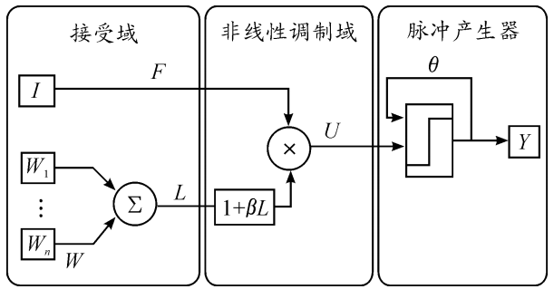
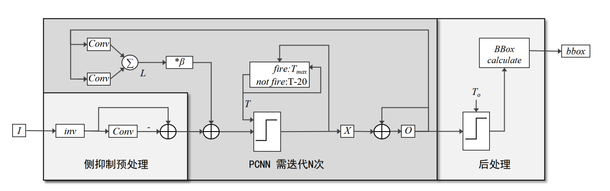
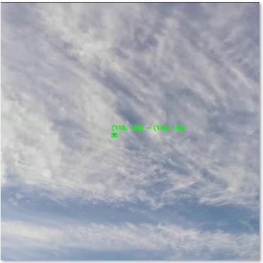

PCNN
~~~~~~~~~~~~~~~~~~~~~~~~~~~~~~~~~~~~~~~~~~~~~~~~~~~~~~~~~~~~~~~~~~~~~~~~~~~~~~~~~~~~~~~~

**网络模型**

基于PCNN（脉冲耦合神经网络）对输入图像进行处理，实现背景抑制和目标增强。用于红外运动弱小目标的检测任务。

   
   图 PCNN网络模型

**训练与性能**

PCNN网络无需训练。下图为PCNN网络部署在APU上的检测效果图。

.. figure:: _images/PCNN网络部署在APU上的检测效果图.gif
   :alt: PCNN网络部署在APU上的检测效果图

   图 PCNN网络部署在APU上的检测效果图

pcnn_de
~~~~~~~~~~~~~~~~~~~~~~~~~~~~~~~~~~~~~~~~~~~~~~~~~~~~~~~~~~~~~~~~~~~~~~~~~~~~~~~~~~~~

脉冲耦合发放算法（Pulse-Coupled Neural Networks，PCNN）是一种基于神经生物学的启发而设计的算法，主要用于图像处理领域，特别是在图像分割、目标识别和纹理分析等方面。PCNN模拟了生物视觉系统中的神经元活动，特别是视网膜上的神经元如何通过同步发放脉冲来响应视觉刺激。本案例展示了基于一种改进地PCNN的可见光小目标（飞机）检测。该算法无需复杂训练，可用于小样本目标的检测。

本案例展示地PCNN网络由侧抑制滤波器和变阈值动态神经元两部分组成。第一部分利用侧抑制对图像滤波进行预处理来抑制复杂背景。第二部分通过可变阈值来产生脉冲信号实现目标与背景分割的目的。分离采用脉冲发放实现，发放的神经元代表目标前景，未发放代表背景。该过程持续N个迭代次数。迭代过程中，阈值动态变化，并通过卷积操作逐渐提升发放目标周边的像素的取值，从而将目标区域扩大，最终获得目标区域，并计算目标区域的位置及边界，得到检测输出。像素点对应的发放阈值的调节规律如下：阈值T每个像素不同，当输入图像在像素已被检测为前景像素时，T取较高值Tmax，当输入像素未达到阈值时，T减少一个定值，用于更容易地在后一轮次中发放。信号O在多轮迭代中将自身与X相加，从而收集所有已发放的神经元，得到前景目标。后处理进一步将O二值化，并计算目标框位置。整体流程如下图所示。

   图 pcnn_de算法流程图

检测的输入为一个视频，某帧效果如下图所示。

   
   图 pcnn_de算法效果检测示意图