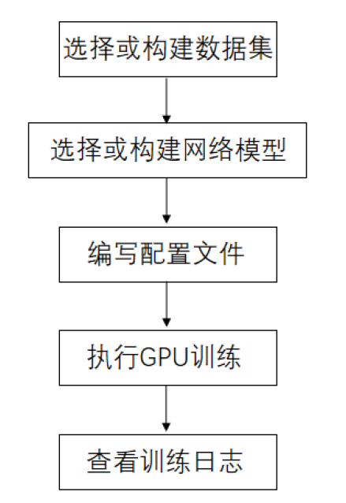
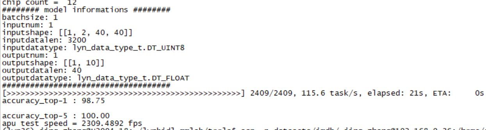
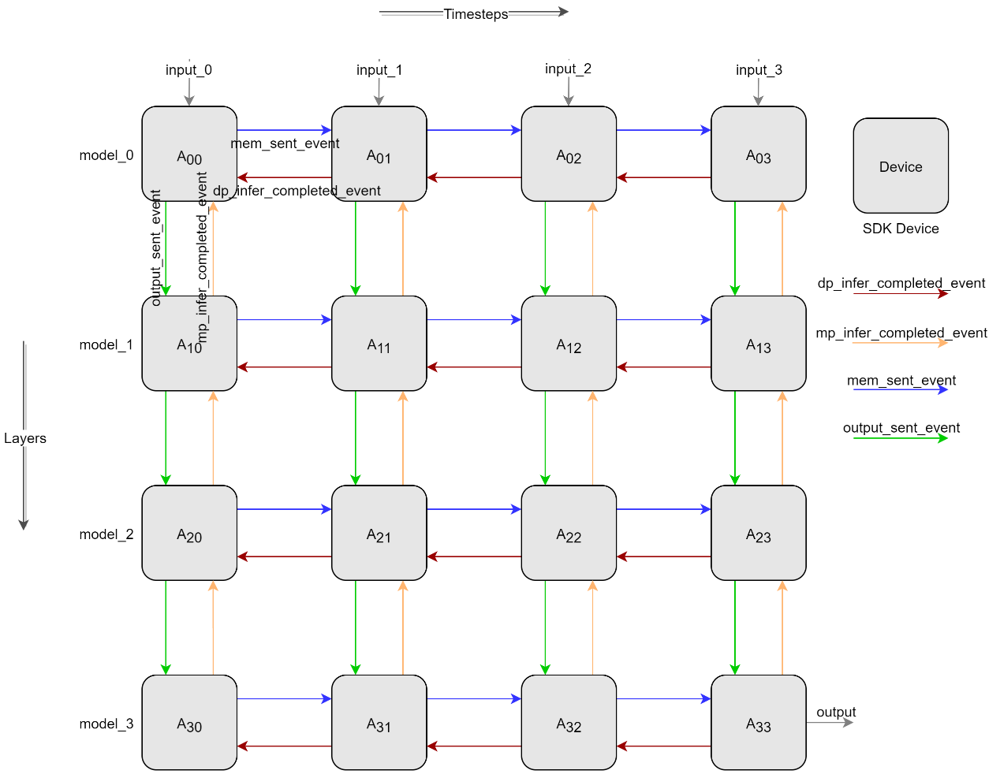
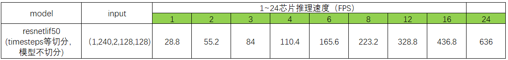
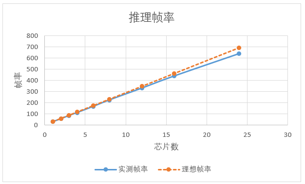
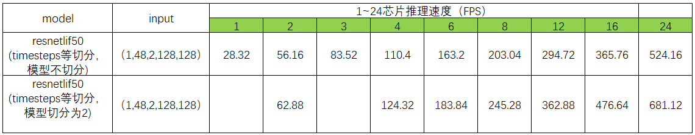
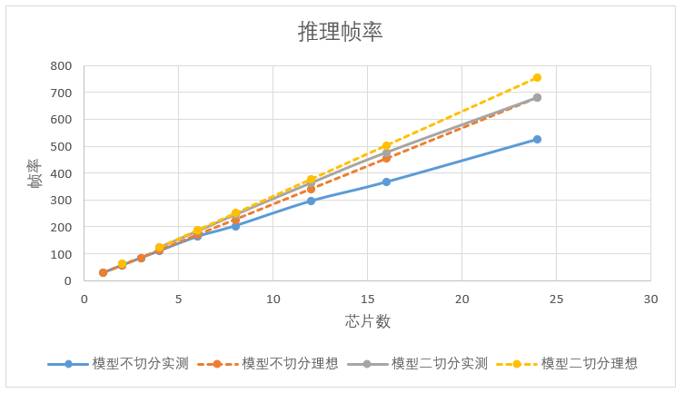
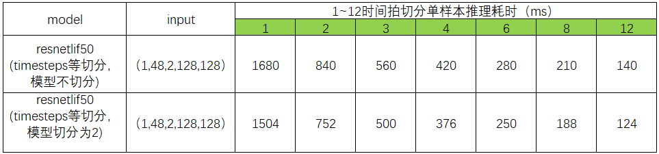
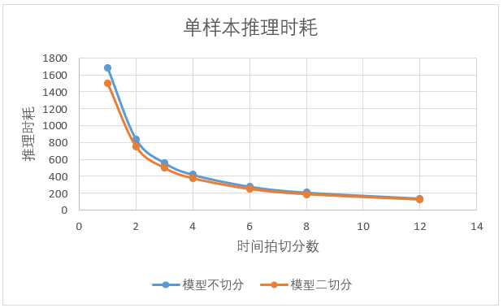
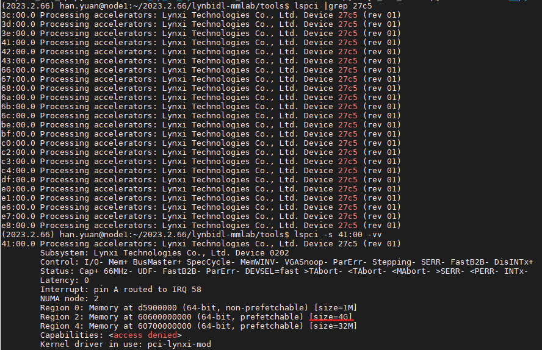

操作说明
========================================================================================

BIDL的使用流程分为如下几个步骤：

构建及网络训练阶段：

1. 选择或构建一个数据集；
2. 选择或构建一个网络结构；
3. 修改配置config文件及训练脚本；
4. 网络训练过程；
5. 采用GPU进行验证和推理；

部署阶段：

6. 采用Lyngor编译网络；
7. 采用LynSDK实现网络推理。

训练部分
----------------------------------------------------------------------------------------

操作流程
~~~~~~~~~~~~~~~~~~~~~~~~~~~~~~~~~~~~~~~~~~~~~~~~~~~~~~~~~~~~~~~~~~~~~~~~~~~~~~~~~~~~~~~~

训练部分主要操作流程如下图所示。

   图 训练部分操作流程

1. 添加自定义数据集。
2. 添加自定义模块。

   a. 添加新主干网络。
   b. 添加其他组件，包括新的颈部、头部、损失函数组件。

3. 编写配置文件。
4. 执行GPU训练。
5. 查询训练结果。

选择或构建数据集
~~~~~~~~~~~~~~~~~~~~~~~~~~~~~~~~~~~~~~~~~~~~~~~~~~~~~~~~~~~~~~~~~~~~~~~~~~~~~~~~~~~~~~~~

选择已支持的数据集
^^^^^^^^^^^^^^^^^^^^^^^^^^^^^^^^^^^^^^^^^^^^^^^^^^^^^^^^^^^^^^^^^^^^^^^^^^^^^^^^^^^^^^^^

目前已添加到BIDL框架中的数据集均定义在 *bidlcls/datasets/* 目录下，每个数据集对应一个文件，如 *bidl_cifar10dvs.py* 文件实现了将CIFAR10-DVS数据集添加到BIDL框架中使用的功能，即不同的文件将不同的数据集添加到了BIDL框架中，关于其中部分数据集构成的介绍参见
:ref:`data_task` 。

根据在 *bidlcls/datasets/* 目录下的文件中定义的数据集名称来选择使用不同的数据集，比如CIFAR10-DVS数据集在 *bidl_cifar10dvs.py* 文件定义的名称为Cifar10Dvs，可以将此名称写入需要使用此数据集的配置文件中，具体的方法可以参考 :ref:`edit_config_file` 中 *编写配置文件* 段落的数据（data）部分。

构建新的数据集
^^^^^^^^^^^^^^^^^^^^^^^^^^^^^^^^^^^^^^^^^^^^^^^^^^^^^^^^^^^^^^^^^^^^^^^^^^^^^^^^^^^^^^^^

根据数据集的构成，可以将数据集分为三类：帧序列、DVS事件数据、一维数据，帧序列数据一般是从视频片段中固定间隔抽帧来构成数据集，DVS事件数据通过将事件信息转换成帧序列的方式构成数据集。

各种形态的数据集的预处理方式会有区别，但在添加到BIDL框架中时，均需在
*bidlcls/datasets/* 目录下定义一个相应的文件，且在文件中需要定义对应的类，具体步骤为：

1. 编写继承自BasesDataset的新数据集类。
2. 重载 ``load_annotations(self)`` 方法，返回包含所有样本的列表。其中，每个样本都是一个
   字典，字典中包含了必要的数据信息，例如img和gt_label等信息。

下面以CIFAR10DVS数据集的添加过程为例，介绍在BIDL框架中添加数据集的步骤。

1. 在 *bidlcls/datasets/* 目录下创建一个 *bidl_cifar10dvs.py* 文件，在该文件中创建一个Cifar10Dvs类以加载数据。

   ::

      from bidlcls.datasets.base_dataset import BaseDataset
      
      class Cifar10Dvs(BaseDataset):
         CLASSES = ['airplane', 'automobile', 'bird', 'cat', 'deer', 'dog', 'frog', 'horse', 'ship', 'truck']
      
      def load_annotations(self):
         print(f'loading {self.data_prefix}.pkl...')
         with open(self.data_prefix + '.pkl', 'rb') as f:
            dats, lbls, shape = pk.load(f)
         data_infos = []
         for dat, lbl in zip(dats, lbls):
            info = {
               'img': dat, 'pack': shape, # \``np.unpackbits`\`
               'gt_label': np.array(lbl, dtype='int64')
            }
         data_infos.append(info)
         return data_infos

2. 将定义好的新数据集类添加至 *bidlcls/datasets/__init__.py* 。

   ::

      from .bidl_cifar10dvs import Cifar10Dvs #从编写好的数据集.py文件中导入数据集类

      __all__ = [
         ...,
         'Cifar10Dvs', # 将新数据集类添加进来
         ...
      ]

3. 在 *configs/* 目录下的配置文件中使用新的数据集，配置文件的详细使用方法参考 :ref:`edit_config_file` 的 *编写配置文件* 部分。

   ::

      dataset_type = 'Cifar10Dvs' # 新数据集的名称
      ...
      data = dict(
         samples_per_gpu=64,
         workers_per_gpu=2,
         train=dict(
            type=dataset_type,
            data_prefix='./data/cifar10dvs/train', # 新数据集的存放路径
            pipeline=train_pipeline,
            test_mode=False
         ),
         val=dict(
            type=dataset_type,
            data_prefix='./data/cifar10dvs/test',
            pipeline=test_pipeline,
            test_mode=True
         ),
         test=dict(
            type=dataset_type,
            data_prefix='./data/cifar10dvs/test',
            pipeline=test_pipeline,
            test_mode=True
         )
      )

选择或构建网络模型
~~~~~~~~~~~~~~~~~~~~~~~~~~~~~~~~~~~~~~~~~~~~~~~~~~~~~~~~~~~~~~~~~~~~~~~~~~~~~~~~~~~~~~~~

选择已有的网络模型
^^^^^^^^^^^^^^^^^^^^^^^^^^^^^^^^^^^^^^^^^^^^^^^^^^^^^^^^^^^^^^^^^^^^^^^^^^^^^^^^^^^^^^^^

BIDL框架中已有的网络模型均定义在bidlcls/models/backbones目录下，可通过映射部署在灵汐芯片上，其中 *bidl_backbones_itout.py* 和 *bidl_resnetlif_itout.py* 中定义的都是外循环版的网络模型，即时间步的循环在神经网络层外面，区别于时间步循环在网络层里面的网络模型。

可以根据数据集的特点，如数据集的规模或复杂程度等，选择不同的网络模型进行训练，例如对于Cifar10Dvs数据集，既可以选择SeqClif5Fc2CdItout网络模型，也可以选择ResNetLifItout网络模型，在后者为ResNet18时，其accuracy_top-1相比前者提升4%，后者所需的训练时间也长于前者。

针对特定的数据集选择的网络模型，需要将此网络模型的名称写入数据集相应的配置文件中，具体的方法可以参考 :ref:`config_content` 章节中的编写配置文件内容的模型（model）部分。

构建新的网络模型
^^^^^^^^^^^^^^^^^^^^^^^^^^^^^^^^^^^^^^^^^^^^^^^^^^^^^^^^^^^^^^^^^^^^^^^^^^^^^^^^^^^^^^^^

典型的网络包括Sequential类网络和非Sequential类网络系列，分别位于 *bidlcls/models/backbones* 路径下的 *sequential* 文件夹和 *residual* 文件夹，下面举例介绍这两类典型骨干网络的构建方法。

典型的外循环网络模型名称的后缀都有 *Itout* ，是Iterate outside的缩写，用于表示时间步的循环在神经网络层外面。

**Sequential类网络**

下面以类VGG的SeqClif3Fc3DmItout网络模型的添加过程为例，介绍在BIDL框架中添加Sequential类外循环版网络模型的步骤。

在文件 *bidlcls/models/backbones/sequential/bidl_backbones_itout.py* 中添加时间循环在层外的SeqClif3Fc3DmItout网络模型。

在网络构建部分，此网络的三层卷积所用的Conv2d是conv2dLif不，而不是Conv2dLifIt层，因为前者只能处理单个时间步。各个时间步的结果需要聚合到一起，这里采用的模式为 *mean* ，即取均值的方式，还可以选择 *sum* 或 *pick* 模式。而Flatten层之前的数据维度为(B,C,H,W)，因此Flatten层将CHW三个维度合在一起，然后输入后面的三层全连接网络，此三层全连接网络可以使用``nn.Sequential`` 结构，让代码更为简洁。

在网络 ``forward`` 部分，在特定网络层第一次运行的时候，需要显式调用reset方法给层中的部分状态变量赋予形状，这些网络层的详细介绍参见 :ref:`sjymx` 。另外根据是在GPU上训练还是在灵汐芯片上推理，有两个分支：对于GPU训练分支，执行过程跟网络构建部分的顺序一致，三层卷积是通过循环的方式执行所有时间步的，然后将所有时间步的执行结果取均值，接着Flatten展平后输入全连接网络；而对于芯片推理分支，由于所有时间步的执行过程都是相同的，因此只需要执行一遍三层卷积，然后采用 ``ops.custom.tempAdd`` 的方式将所有时间步的结果加起来，接着Fatten展平后输入全连接网络，通过trace可以生成对应的op图，然后映射到芯片中通过LynSDK循环调用就可以实现时间步的循环，而对应于GPU训练的取均值，会通过LynSDK对tempAdd的结果取均值。

::

   class SeqClif3Fc3DmItout(nn.Module):
       """For DVS-MNIST."""
      def \__init\_\_(self, timestep=20, c0=2, h0=40, w0=40, nclass=10, cmode='spike', amode='mean', soma_params='all_share', noise=0, neuron='lif', neuron_config=None):
         super(SeqClif3Fc3DmItout, self).\__init\_\_()
         neuron=neuron.lower()
         assert neuron in ['lif']
         self.clif1 = Conv2dLif(c0, 32, 3, stride=1, padding=1, mode=cmode, soma_params=soma_params, noise=noise)
         self.mp1 = nn.MaxPool2d(2, stride=2)
         self.clif2 = Conv2dLif(32, 64, 3, stride=1, padding=1, mode=cmode, soma_params=soma_params, noise=noise)
         self.mp2 = nn.MaxPool2d(2, stride=2)
         self.clif3 = Conv2dLif(64, 128, 3, stride=1, padding=1, mode=cmode, soma_params=soma_params, noise=noise)
         self.mp3 = nn.MaxPool2d(2, stride=2)
         assert amode == 'mean'
         self.flat = Flatten(1, -1)
         self.head = nn.Sequential(
            nn.Linear(h0 // 8 \* w0 // 8 \* 128, 512),
            nn.ReLU(),
            nn.Linear(512, 128),
            nn.ReLU(),
            nn.Linear(128, nclass)
         )
         self.tempAdd = None
         self.timestep = timestep
         self.ON_APU = globals.get_value('ON_APU')
         self.FIT = globals.get_value('FIT')
      def reset(self, xi):
         self.tempAdd = pt.zeros_like(xi)
      def forward(self, xis: pt.Tensor) -> pt.Tensor:
         if self.ON_APU:
            assert len(xis.shape) == 4
            x0 = xis
            self.clif1.reset(xis)
            x1 = self.mp1(self.clif1(x0))
            self.clif2.reset(x1)
            x2 = self.mp2(self.clif2(x1))
            self.clif3.reset(x2)
            x3 = self.mp3(self.clif3(x2))
            x4 = self.flat(x3)
            x5 = self.head(x4)
            x5 = x5.unsqueeze(2).unsqueeze(3)
            self.reset(x5)
            self.tempAdd = load_kernel(self.tempAdd, f'tempAdd')
            self.tempAdd = self.tempAdd + x5 / self.timestep
            output = self.tempAdd.clone()
            save_kernel(self.tempAdd, f'tempAdd')
            return output.squeeze(-1).squeeze(-1)
         else:
            t = xis.size(1)
            xo_list = []
            xo = 0
            for i in range(t):
               x0 = xis[:, i, ...]
               if i == 0: self.clif1.reset(x0)
               x1 = self.mp1(self.clif1(x0))
               if i == 0: self.clif2.reset(x1)
               x2 = self.mp2(self.clif2(x1))
               if i == 0: self.clif3.reset(x2)
               x3 = self.mp3(self.clif3(x2))
               # xo_list.append(x3)
               x4 = self.flat(x3)
               x5 = self.head(x4)
               xo = xo + x5 / self.timestep
            return xo

在 *bidlcls/models/backbones/__init__.py* 中导入自定义的新主干网络。

::

      from .sequential.bidl_backbones_itout import SeqClif3Fc3DmItout # 从编写好的新模块.py文件导入新模块类
      ...
      __all__ = [
         ...,
         'SeqClif3Fc3DmItout' # 将新模块添加进来
         ...
      ]

在各数据集对应文件夹下的配置文件中使用新的主干网络，配置文件的详细使用方法参考 :ref:`edit_config_file` 说明文档。

::

   model = dict(
   ...
      backbone=dict(
         type='SeqClif3Fc3DmItout', # 新模块的名称
         timestep=20, 
         c0=2, 
         h0=40, 
         w0=40, 
         nclass=10, 
         cmode='analog',
         amode='mean', 
         noise=0
      ),
   ...
   )

**非Sequential类网络**

下面以类ResNetLifItout网络模型的添加过程为例，介绍在BIDL框架中添加非Sequential类外循环版网络模型的步骤。

在文件 *bidlcls/models/backbones/residual/bidl_resnetlif_itout.py* 中添加时间循环在层外的ResNetLifItout网络模型。

在网络构建部分，参考经典的ResNet组建方式构建网络，池化层采用全局平均池化。

由于非Sequential类网络结构比较复杂，在特定网络层第一次运行的时候，不采用手动显式调用``reset`` 方法给层中的状态变量赋予形状的方式，而是通过注册自定义hook的方式来实现。

利用 ``nn.modules`` 自带的 ``register_forward_pre_hook`` 方法，在 ``_register_lyn_reset_hook`` 函数中遍历整个网络的所有层，在需要给状态变量赋予形状的层中注册自定义的 ``lyn_reset_hook`` ；然后在我们自定义的hook中通过 ``setattr()`` 方法给注册了此hook的层添加一个属性 ``lyn_cnt`` 并给它赋初值为 ``0`` ，在一个样本 ``forward`` 的第一个时间步的时候会调用注册了自定义hook的层的 ``reset`` 方法，将其中的状态变量赋予形状并将此层的 ``lyn_cnt`` 加 ``1`` ，而在其他时间步由于 ``lyn_cnt`` 非 ``0`` ，则不需要调用此层的 ``reset`` 方法了。

而在一个样本 ``forward`` 执行完了所有的时间步之后，需要调用 ``self._reset_lyn_cnt`` 方法将``lyn_cnt`` 属性的值清零，以便于下一个样本对特定的层中的状态变量赋予形状。

在GPU上进行训练时，执行过程跟网络构建部分的顺序一致，全连接之前的层是通过循环的方式执行所有时间步的，然后将所有时间步的执行结果取均值，接着输入全连接网络。

::

   # 参考经典的ResNet组建方式，定义BasicBlock类
   class BasicBlock(nn.Module):
      pass # 此处省略

   # 参考经典的ResNet组建方式，定义BottleNeck类
   class Bottleneck(nn.Module):
      pass # 此处省略

   # 定义ResNetLifItout类
   class ResNetLifItout(nn.Module):

      # ResNet深度与其对应的Block结构与数量
      arch_settings = {
         10: (BasicBlock, (1, 1, 1, 1)),
         18: (BasicBlock, (2, 2, 2, 2)),
         34: (BasicBlock, (3, 4, 6, 3)),
         50: (Bottleneck, (3, 4, 6, 3)),
         101: (Bottleneck, (3, 4, 23, 3)),
         152: (Bottleneck, (3, 8, 36, 3))
      }

      def __init__(
         self,
         depth,
         nclass,
         low_resolut=False,
         timestep=8,
         input_channels=3, 
         stem_channels=64, 
         base_channels=64,
         down_t=(4, 'max'),
         zero_init_residual=False,
         noise=1e-3,
         cmode='spike', 
         amode='mean', 
         soma_params='all_share',
         norm =None
      ):

      super(ResNetLifItout, self).__init__()

      # 其他特殊初始化流程
      assert down_t[0] == 1
      ...

      # 参考经典的ResNet实现方法，根据不同的Block结构来生成对应的层，此处不做具体说明
      @staticmethod
      def _make_layer(block, ci, co, blocks, stride, noise, mode='spike', soma_params='all_share', hidden_channels=None):
         pass # 此处省略

      # 将自定义的self.lyn_reset_hook注册到所有的Lif2d层中
      def \_register_lyn_reset_hook(self):
         for child in self.modules():
            if isinstance(child, Lif2d): # Lif, Lif1d, Conv2dLif, FcLif...
               assert hasattr(child, 'reset')
               child.register_forward_pre_hook(self.lyn_reset_hook)

      # 在此hook中，特定层的reset方法只在其属性lyn_cnt为0时调用一次
      def lyn_reset_hook(m, xi: tuple):
         assert isinstance(xi, tuple) and len(xi) == 1
         xi = xi[0]
         if not hasattr(m, 'lyn_cnt'):
            setattr(m, 'lyn_cnt', 0)
         if m.lyn_cnt == 0:
            # print(m)
            m.reset(xi)
            m.lyn_cnt += 1
         else:
            m.lyn_cnt += 1
      
      # 在一个样本的所有时间步执行完了之后调用此方法
      def \_reset_lyn_cnt(self):
         for child in self.modules():
            if hasattr(child, 'lyn_cnt'):
               child.lyn_cnt = 0
      
      # 重写forward方法，输入为样本，返回值为ResNet最后一个全连接层的结果，此处不做具体说明
      def forward(self, x):
         x5s = []
         for t in range(xis.size(1)):
            xi = xis[:, t, ...]
            x0 = self.lif(self.conv(xi))
            x0 = self.pool(x0)
            x1 = self.layer1(x0)
            x2 = self.layer2(x1)
            x3 = self.layer3(x2)
            x4 = self.layer4(x3)
            x5 = self.gap(x4)
            x5s.append(x5)
            xo = (sum(x5s) / len(x5s))[:, :, 0, 0]
            xo = self.fc(xo)
            self._reset_lyn_cnt()
            return xo

在 *bidlcls/models/backbones/__init__.py* 中导入自定义的新主干网络。

::
   
   from .residual.bidl_resnetlif_itout import ResNetLifItout # 从编写好的新模块.py文件导入新模
   
   #块类   
   ...
   
   __all\_\_ = [
      ...,
      'ResNetLifItout', # 将新模块添加进来
      ...
   ]

在数据集对应的目录下的配置文件中使用新的主干网络，配置文件的详细使用方法参考编写配置文件说明文档。

:: 

   model = dict(
      ...
      backbone = dict(
         type = 'ResNetLifItout',      # 新模块的名称
         depth = 10,                   # 新模块的配置信息
         nclass = 11,
         other_args = xxx
      ),
      ...
   )

.. _edit_config_file:

编写配置文件
~~~~~~~~~~~~~~~~~~~~~~~~~~~~~~~~~~~~~~~~~~~~~~~~~~~~~~~~~~~~~~~~~~~~~~~~~~~~~~~~~~~~~~~~

所有配置文件都放在 *application* 对应的目录下，目录的基本结构为：

*数据集所属的类别/数据集名称/数据集使用的模型名称/配置文件*

配置文件命名规则
^^^^^^^^^^^^^^^^^^^^^^^^^^^^^^^^^^^^^^^^^^^^^^^^^^^^^^^^^^^^^^^^^^^^^^^^^^^^^^^^^^^^^^^^

配置文件名称分为三部分信息：

- 模型信息
- 训练信息
- 数据信息

属于不同部分的单词用短横线 ``-`` 连接。

**模型信息**

指骨干网络模型信息，例如：

- clif3fc3dm_itout
- clif3flif2dg_itout
- clif5fc2cd_itout
- resnetlif10_itout

*itout* 是iterate outside的缩写，用于表示时间步的循环在神经网络层外面，典型的外循环网络模型名称均有 *itout* 后缀。

**训练信息**

指训练策略的设置，包括：

- Batchsize
- GPU数量
- 学习率策略，可选

示例：

- ``b16x4`` 即单个GPU的上batchsize = 16，单个GPU的线程数为4；
- ``cos160e`` 即采用余弦退火学习率策略，最大epoch为160。

**数据信息**

指采用的数据集，例如：

- dvsmnist
- cifar10dvs
- jester

配置文件命名案例
^^^^^^^^^^^^^^^^^^^^^^^^^^^^^^^^^^^^^^^^^^^^^^^^^^^^^^^^^^^^^^^^^^^^^^^^^^^^^^^^^^^^^^^^

*resnetlif18-b16x4-jester-cos160e.py*

使用resnetlif18作为骨干网络，训练策略为单个GPU的上 ``batchsize = 16`` ，单个GPU的线程数为4，数据集为jester数据集，采用余弦退火学习率策略，最大训练160个epoch。

.. _config_content:

配置文件内容
^^^^^^^^^^^^^^^^^^^^^^^^^^^^^^^^^^^^^^^^^^^^^^^^^^^^^^^^^^^^^^^^^^^^^^^^^^^^^^^^^^^^^^^^

配置文件内有4个基本组件类型，分别是：

- 模型（model）
- 数据（data）
- 训练策略（schedule）
- 运行设置（runtime）

以 *applications/classification/dvs/dvs-mnist/clif3fc3dm/clif3fc3dm_itout-b16x1-dvsmnist.py* 为例对上述四个部分分别进行说明。

**模型（model）**

模型参数model在配置文件中是一个Python字典，主要包括网络结构，损失函数等信息：

- type：分类器名称，目前只支持ImageClassifier；
- backbone：主干网络，可选项参考所支持模型说明文档；
- neck：颈网络类型，目前暂不使用；
- head：头网络模型；
- loss：损失函数类型，支持CrossEntropyLoss、LabelSmoothLoss等。

::

   model = dict(
      type='ImageClassifier',
      backbone=dict(
         type='SeqClif3Fc3DmItout', timestep=20, c0=2, h0=40, w0=40, nclass=10, 
         cmode='analog', amode='mean', noise=0, soma_params='all_share', 
         neuron='lif',           # neuron mode: 'lif' or 'lifplus'
         neuron_config=None      # neron configs: 
                                 # 1.'lif': neuron_config=None;
                                 # 2.'lifplus': neuron_config=[input_accum, rev_volt, fire_refrac,
                                 # spike_init, trig_current, memb_decay], eg.[1,False,0,0,0,0]
         ),
      neck=None,
      head=dict(
         type='ClsHead',
         loss=dict(type='LabelSmoothLoss', label_smooth_val=0.1, loss_weight=1.0),
         topk=(1, 5),
         cal_acc=True
      )
   )

.. note::

   目前BIDL框架的模型主要集成在backbone当中，neck暂不使用，head仅指定分类头网络的损失函数和评估指标。

**数据（data）**

模型参数model在配置文件中是一个Python字典，主要包括构造数据集加载器（dataloader）配置信息：

- samples_per_gpu：构建dataloader时，每个GPU的batchsize；
- workers_per_gpu：构建dataloader时，每个GPU的线程数；
- train \| val \| test：构造数据集。
- type：数据集类型，支持ImageNet、Cifar、DVS-Gesture等数据集
- data_prefix：数据集根目录。
- pipeline：数据处理流水线。

::

   dataset_type = 'DvsMnist' # 数据集名称

   # 训练数据处理流水线
   train_pipeline = [
      dict(type='RandomCropVideo', size=40, padding=4),           # 带时间轴样本的随机裁剪
      dict(type='ToTensorType', keys=['img'], dtype='float32'),   # image 转为torch.Tensor
      dict(type='ToTensor', keys=['gt_label']),                   # gt_label 转为 torch.Tensor
      dict(type='Collect', keys=['img', 'gt_label'])              #   决定数据中哪些键应传递给检测器的流程，train时传递img, gt_label
   ]

   # 测试数据处理流水线
   test_pipeline = [
      dict(type='ToTensorType', keys=['img'], dtype='float32'),   # image 转为torch.Tensor
      dict(type='Collect', keys=['img'])                          # test 时不需要传递 gt_label
   ]
   data = dict(
      samples_per_gpu=16,                    # 单个 GPU 的 batchsize
      workers_per_gpu=2,                     # 单个 GPU 的线程数
      train=dict(
         type=dataset_type,                  # 数据集名称
         data_prefix='data/dvsmnist/train/', # 数据集目录文件
         pipeline=train_pipeline             # 数据集需要经过的数据处理流水线
      ),
      val=dict(
         type=dataset_type, # 数据集名称
         data_prefix='data/dvsmnist/val/',   # 数据集目录文件
         pipeline=test_pipeline,             # 数据集需要经过的数据处理流水线
         test_mode=True
      ),
      test=dict(
         type=dataset_type,
         data_prefix='data/dvsmnist/test/',
         pipeline=test_pipeline,
         test_mode=True
      )
   )

数据处理流水线（pipeline），定义了所有准备数据字典的步骤，由一系列操作组成，每个操作都将以一个字典作为输入，并输出一个字典。数据流水线中的操作方法都定义在
*bidlcls/datasets/pipeline* 文件夹下。

数据流水线中的操作可以分为以下三个类别：

- 数据加载：从文件中加载图像，定义在 *pipelines/bidl_loading.py* 中，例如 
  ``LoadSpikesInHdf5()`` ，从Hdf5类型的文件中读取dvs数据集。
- 预处理：对图像进行旋转和裁剪等操作，定义在 *pipelines/bidl_formating.py* 和
  *pipelines/bidl_transform.py* 中，例如 ``RandomCropVideo()`` ，对图像进行随机裁剪。
- 格式化：将图像或标签转换至指定的数据类型，定义在 *pipelines/bidl_formating.py* 中，例如 ``ToTensorType()`` ，将处理好的图像转换为Tensor类型。

**训练策略（schedule）**

主要包含优化器设置、optimizer hook设置、学习率策略和runnner设置。

- optimizer：优化器设置信息，支持pytorch中所有的优化器，同时它们的参数设置与pytorch中的优化器参数一致，可参考相关Pytorch文档。
- optimizer_config：optimizer hook的配置文件，如设置梯度限制。
- lr_config：学习率策略，支持CosineAnnealing、Step等。

::

   optimizer = dict(
      type='SGD',          # 优化器类型
      lr=0.1,              # 优化器的学习率
      momentum=0.9,        # 动量
      weight_decay=0.0001  # 权重衰减系数
   ) 
   optimizer_config = dict(grad_clip=None)               # 大多数方法不使用梯度限制(grad_clip)
   lr_config = dict(policy='CosineAnnealing', min_lr=0)  # 学习率调整策略
   runner = dict(type='EpochBasedRunner', max_epochs=40) # 使用的runner类别

**运行设置（runtime）**

主要包含保存权重策略，日志配置，训练参数，断点权重路径和工作目录等信息：

::

   checkpoint_config = dict(interval=1)   # checkpoint 保存的间隔为1，单位根据runner不同变动，可以为epoch或者iter
   log_config = dict(interval=50,         # 打印日志的间隔
   hooks=[dict(type='TextLoggerHook')])   # 用于记录训练过程的文本记录器(logger)
   dist_params = dict(backend='nccl')     # 用于设置分布式训练的参数，端口也同样可以被设置
   log_level = 'INFO'                     # 日志的输出级别
   load_from = None                       # 从给定路径恢复检查点(checkpoints)，训练模式将从检查点保存的轮次开始恢复训练
   resume_from = None                     # 从给定路径恢复检查点(checkpoints)，训练模式将从检查点保存的轮次开始恢复训练

执行GPU训练
~~~~~~~~~~~~~~~~~~~~~~~~~~~~~~~~~~~~~~~~~~~~~~~~~~~~~~~~~~~~~~~~~~~~~~~~~~~~~~~~~~~~~~~~

训练入口为 *tools/train.py* ，同一目录下的 *dist_train.sh* 提供了单机多卡训练。

前提条件：已编写配置文件，包含训练相关的模型，数据，训练策略等信息。具体说明参见 :ref:`edit_config_file`。

例如，使用 *resnetlif10-b16x1-dvsmnist.py* 配置文件。

在 *tools/* 目录下执行以下命令，开始训练。

::
   
   python train.py --config resnetlif10-b16x1-dvsmnist

查看训练日志
~~~~~~~~~~~~~~~~~~~~~~~~~~~~~~~~~~~~~~~~~~~~~~~~~~~~~~~~~~~~~~~~~~~~~~~~~~~~~~~~~~~~~~~~

训练所保存的日志和检查点存档在 *work_dirs/resnetlif10-b16x1-dvsmnist/* 保存，保存文件的目录可参考 :ref:`mxxl` 。

部署部分
----------------------------------------------------------------------------------------

部署部分主要包括了先在GPU上进行评估、以及为了适用于Lyngor编译的骨干网定义而进行的对骨干网的替换方法，最后在APU上进行评估/部署。

使用GPU进行评估
~~~~~~~~~~~~~~~~~~~~~~~~~~~~~~~~~~~~~~~~~~~~~~~~~~~~~~~~~~~~~~~~~~~~~~~~~~~~~~~~~~~~~~~~

评估入口： *tools/test.py*

前提条件：已编写配置文件，包含训练相关的模型，数据，训练策略等信息。具体说明参见 :ref:`edit_config_file` 。

设置 ``use_lyngor`` 标识设置为0，即使用GPU进行编译。

::

   --use_lyngor 0 # 是否使用Lyngor进行编译，设置为0表示用GPU

分别设置 ``--config`` 和 ``--checkpoint`` ，选择目录下已定义的配置文件和对应的checkpoint文件。

比如，用资源包 *weight_files* 中对应路径下的 *latest.pth* 权重文件，用于在Jester验证集上评估模型性能：

在 *tools/* 目录下执行如下命令：

::

   python test.py --config resnetlif18-itout-b20x4-16-jester --checkpoint latest.pth --use_lyngor 0 --use_legacy 0
   
评估的推理速度和正确率都会显示在终端中。

.. _build-and-install:

使用灵汐类脑计算设备进行编译和部署
~~~~~~~~~~~~~~~~~~~~~~~~~~~~~~~~~~~~~~~~~~~~~~~~~~~~~~~~~~~~~~~~~~~~~~~~~~~~~~~~~~~~~~~~

注：此部分需将软件包部署于灵汐类脑计算设备（服务器或嵌入式盒子），且无需GPU支持。

使用灵汐类脑计算设备进行编译和部署，需要在执行命令后加上参数 ``--use_lyngor 1`` 。

使用Lyngor进行编译
^^^^^^^^^^^^^^^^^^^^^^^^^^^^^^^^^^^^^^^^^^^^^^^^^^^^^^^^^^^^^^^^^^^^^^^^^^^^^^^^^^^^^^^^

使用Lyngor进行编译，还需要执行命令后加上参数 ``--use_legacy 0`` ，即不加载历史编译生成物，而是直接编译。

前提条件：使用Lyngor编译，需要先执行 *lynadapter* 目录下的 *build_run_lif.sh* 脚本，在Lyngor中注册自定义算子。

::

   if args.use_lyngor == 1:
      globals.set_value('ON_APU', True)
      globals.set_value('FIT', True)      
      if 'soma_params' in cfg.model["backbone"] and cfg.model["backbone"]['soma_params'] == 'channel_share':
         globals.set_value('FIT', False)
   else:
      globals.set_value('ON_APU', False)
      cfg.data.samples_per_gpu = 1

上述代码中，如果判断为在APU上编译，就会将模型的backbone的两个配置参数 ``on_apu`` 和 ``fit`` 设置为 ``True`` ，即每个lif类实例会生成一个UUID且会将LIF神经元的部分计算用自定义算子的方式实现。此外，还将数据集的 ``batchsize`` 设置为 ``1`` ，输入类型设置为 ``uint8`` 以适配底层。

::

   dataset = build_dataset(cfg.data.test)
   t, c, h, w = dataset.__getitem__(0)['img'].shape
   in_size = [((1, c, h, w),)]
   input_type=”uint8”
   from lynadapter.lyn_compile import model_compile
   model_compile(model.backbone.eval(),_base\_,in_size,args.v,args.b,input_type=input_type)

上述代码中，先从数据集中获取模型输入大小，即t,c,h,w值。之后通过lyn_compilee中的
``model_compile`` 方法执行Lyngor编译， ``in_size`` 为四维大小，且 ``batchsize`` 为 ``1`` 。

在 ``model_compile`` 方法中主要调用 ``run_custom_op_in_model_by_lyn()`` 函数进行编译操作，该函数调用Lyngor相关接口函数加载模型和执行编译，具体的实现代码如下：

::

   def run_custom_op_in_model_by_lyn(in_size, model, dict_data,out_path,target="apu"):
      dict_inshape = {}
      dict_inshape.update({'data':in_size[0]})
   
      # \*1.DLmodel load
      lyn_model = lyn.DLModel()
      model_type = 'Pytorch'
      lyn_model.load(model, model_type, inputs_dict = dict_inshape)
      
      # \*2.DLmodel build
      # lyn_module = lyn.Builder(target=target, is_map=False, cpu_arch='x86', cc="g++")
      lyn_module = lyn.Builder(target=target, is_map=True)
      opt_level = 3
      module_path=lyn_module.build(lyn_model.mod, lyn_model.params, opt_level, out_path=out_path)

假设配置文件名为 *clif3fc3dm_itout-b16x1-dvsmnis.py* ，则会在配置文件同目录下生成名称为
*Clif3fc3dm_itoutDm* 的文件夹，而相应的编译生成物会存放在该文件夹下，具体如下：

::

   .

   ├── Net_0
   │   ├── apu_0
   │   │   ├── apu_lib.bin
   │   │   ├── apu_x
   │   │   │   ├── apu.json
   │   │   │   ├── cmd.bin
   │   │   │   ├── core.bin
   │   │   │   ├── dat.bin
   │   │   │   ├── ddr_config.bin
   │   │   │   ├── ddr.dat
   │   │   │   ├── ddr_lut.bin
   │   │   │   ├── lookup_ddr_addr.bin
   │   │   │   ├── lyn\__2023-12-11-16-28-59-076024.mdl
   │   │   │   ├── pi_ddr_config.bin
   │   │   │   ├── snn.json
   │   │   │   └── super_cmd.bin
   │   │   ├── case0
   │   │   │   └── net0
   │   │   │   └── chip0
   │   │   │   └── tv_mem
   │   │   │   └── data
   │   │   │   ├── input.dat
   │   │   │   ├── output.dat
   │   │   │   └── output_ddr.dat
   │   │   ├── data
   │   │   │   └── 100
   │   │   │   ├── dat.bin
   │   │   │   ├── input.dat
   │   │   │   ├── output.dat
   │   │   │   ├── output_ddr_2.dat
   │   │   │   └── output_ddr.dat
   │   │   ├── fpga_config.log
   │   │   └── prim_graph.bin
   │   └── top_graph.json
   └── net_params.json

跳过Lyngor编译
^^^^^^^^^^^^^^^^^^^^^^^^^^^^^^^^^^^^^^^^^^^^^^^^^^^^^^^^^^^^^^^^^^^^^^^^^^^^^^^^^^^^^^^^

如果已有相关模型的编译生成物，则可以跳过重新编译的步骤，直接加载历史编译生成物，具体的方法是执行命令时加上 ``--use_legacy 1`` 。

SDK推理
^^^^^^^^^^^^^^^^^^^^^^^^^^^^^^^^^^^^^^^^^^^^^^^^^^^^^^^^^^^^^^^^^^^^^^^^^^^^^^^^^^^^^^^^

得到模型的编译生成物后就可以进行SDK推理。首先根据芯片ID、编译生成物的路径以及时间拍数实例化 ``ApuRun`` 类。

::

   arun = ApuRun(chip_id, model_path,t)

实例化的过程中调用 ``self._sdk_initialize()`` 函数进行模型的初始化。

::

   def _sdk_initialize(self):
   ret = 0

   self.context, ret = sdk.lyn_create_context(self.apu_device)
   error_check(ret != 0, "lyn_create_context")

   ret = sdk.lyn_set_current_context(self.context)
   error_check(ret != 0, "lyn_set_current_context")

   ret = sdk.lyn_register_error_handler(error_check_handler)
   error_check(ret != 0, "lyn_register_error_handler")

   self.apu_stream_s, ret = sdk.lyn_create_stream()
   error_check(ret != 0, "lyn_create_stream")

   self.apu_stream_r, ret = sdk.lyn_create_stream()
   error_check(ret != 0, "lyn_create_stream")
   
   self.mem_reset_event, ret = sdk.lyn_create_event()
   error_check(ret != 0, "lyn_create_event")

之后调用 ``self._model_parse()`` 函数进行模型参数解析以及内存空间申请。

::

   def _model_parse(self):
      ret = 0
      self.modelDict = {}
      model_desc, ret = sdk.lyn_model_get_desc(self.apu_model)
      error_check(ret != 0, "lyn_model_get_desc")
      self.modelDict['batchsize'] = model_desc.inputTensorAttrArray[0].batchSize
      self.modelDict['inputnum'] = len(model_desc.inputTensorAttrArray)
      inputshapeList = []
      
      for i in range(self.modelDict['inputnum']):
         inputDims = len(model_desc.inputTensorAttrArray[i].dims)
         inputShape = []
      
      for j in range(inputDims):
         inputShape.append(model_desc.inputTensorAttrArray[i].dims[j])
         inputshapeList.append(inputShape)
         self.modelDict['inputshape'] = inputshapeList
         self.modelDict['inputdatalen'] = model_desc.inputDataLen
         self.modelDict['inputdatatype'] = model_desc.inputTensorAttrArray[0].dtype
         self.modelDict['outputnum'] = len(model_desc.outputTensorAttrArray)
         outputshapeList = []
      
      for i in range(self.modelDict['outputnum']):
         outputDims = len(model_desc.outputTensorAttrArray[i].dims)
         outputShape = []
      
      for j in range(outputDims):
         outputShape.append(model_desc.outputTensorAttrArray[i].dims[j])
         outputshapeList.append(outputShape)
         self.modelDict['outputshape'] = outputshapeList
         self.modelDict['outputdatalen'] = model_desc.outputDataLen
         self.modelDict['outputdatatype'] = model_desc.outputTensorAttrArray[0].dtype
         # print(self.modelDict)
         print('######## model informations ########')
      
      for key,value in self.modelDict.items():
         print('{}: {}'.format(key, value))
         print('####################################')
      
      for i in range(self.input_list_len):
         apuinbuf, ret = sdk.lyn_malloc(self.modelDict['inputdatalen'] * self.modelDict['batchsize'] * self.time_steps)
         self.apuInPool.put(apuinbuf)
         setattr(self, 'apuInbuf{}'.format(i), apuinbuf)
         apuoutbuf, ret = sdk.lyn_malloc(self.modelDict['outputdatalen'] * Self.modelDict['batchsize'] * self.time_steps)
         self.apuOutPool.put(apuoutbuf)
         setattr(self, 'apuOutbuf{}'.format(i), apuoutbuf)
         self.hostOutbuf = sdk.c_malloc(self.modelDict['outputdatalen'] * self.modelDict['batchsize'] * self.time_steps)
      
      for i in range(self.input_list_len):
         self.input_list[i] = np.zeros(self.modelDict['inputdatalen'] * self.modelDict['batchsize'] * self.time_steps/dtype_dict[self.modelDict['inputdatatype']][1], dtype = dtype_dict[self.modelDict['inputdatatype']][0])
         self.input_ptr_list[i] = sdk.lyn_numpy_to_ptr(self.input_list[i])
         self.dev_ptr, ret = sdk.lyn_malloc(self.modelDict['inputdatalen'] * self.modelDict['batchsize'])
         self.dev_out_ptr, ret = sdk.lyn_malloc(self.modelDict['outputdatalen'] * self.modelDict['batchsize'])
         self.host_out_ptr = sdk.c_malloc(self.modelDict['outputdatalen'] * self.modelDict['batchsize'])

之后就可以在测试集上进行推理。

::

   for epoch in range(num_epochs):
      for i, data in enumerate(data_loader):
         data_img = data["img"]
         arun.run(data_img.numpy())
         prog_bar.update()
         output = arun.get_output()

代码中，对每个batch的测试数据进行遍历。data_img中存储1个测试样本（已设置 ``batchsize`` 为 ``1`` ）的数据。之后再调用 ``arun`` 类的 ``run`` 方法在灵汐芯片中运行该数据。 ``run`` 函数如下：

::

   def run(self, img):
      assert isinstance(img, np.ndarray)

      currentInbuf = self.apuInPool.get(block=True)
      currentOutbuf = self.apuOutPool.get(block=True)

      ret = 0
      sdk.lyn_set_current_context(self.context)
      img = img.astype(dtype_dict[self.modelDict['inputdatatype']][0])
      i_id = self.run_times % self.input_list_len
      self.input_list[i_id][:] = img.flatten()
      # img_ptr, _ = sdk.lyn_numpy_contiguous_to_ptr(self.input_list[i_id])
      ret = sdk.lyn_memcpy_async(self.apu_stream_s, currentInbuf,
      self.input_ptr_list[i_id], self.modelDict['inputdatalen'] * self.modelDict['batchsize'] * self.time_steps, C2S)
      error_check(ret != 0, "lyn_memcpy_async")
      apuinbuf = currentInbuf
      apuoutbuf = currentOutbuf
      
      for step in range(self.time_steps):
         if step == 0:
            if self.run_times > 0:
               sdk.lyn_stream_wait_event(self.apu_stream_s, self.mem_reset_event)
            ret = sdk.lyn_model_reset_async(self.apu_stream_s, self.apu_model)
            error_check(ret != 0, "lyn_model_reset_async")
            # ret = sdk.lyn_execute_model_async(self.apu_stream_s, self.apu_model, apuinbuf, apuoutbuf, self.modelDict['batchsize'])
            # error_check(ret!=0, "lyn_execute_model_async")
            ret = sdk.lyn_model_send_input_async(self.apu_stream_s, self.apu_model, apuinbuf, apuoutbuf, self.modelDict['batchsize'])
            error_check(ret != 0, "lyn_model_send_input_async")
            ret = sdk.lyn_model_recv_output_async(self.apu_stream_r, self.apu_model)
            error_check(ret != 0, "lyn_model_recv_output_async")
            apuinbuf = sdk.lyn_addr_seek(apuinbuf, self.modelDict['inputdatalen'] * self.modelDict['batchsize'])
            apuoutbuf = sdk.lyn_addr_seek(apuoutbuf, self.modelDict['outputdatalen'] * self.modelDict['batchsize'])
            if step == self.time_steps - 1:
               ret = sdk.lyn_record_event(self.apu_stream_r, self.mem_reset_event)
            # sdk.lyn_memcpy_async(self.apu_stream_r,self.hostOutbuf,self.apuOutbuf,self.modelDict['outputdatalen']*self.modelDict['batchsize']*self.time_steps,S2C)
            ret = sdk.lyn_stream_add_callback(self.apu_stream_r, get_result_callback, [self, currentInbuf, currentOutbuf])
            self.run_times += 1

上述推理过程中，先将多拍的数据拷贝到设备侧，再对时间拍进行循环，每一拍推理一次，并且如果是第一帧的话调用SDK接口 ``sdk.lyn_model_reset_async`` 对状态变量进行复位。所有拍推理结束调用 
``sdk.lyn_stream_add_callback`` 接口将推理结果传回主机侧。具体接口说明参见《LynSDK开发指南（C&C++/Python）》。

以dvs-mnist数据为例，最后推理结果显示：

   图 dvs-mnist数据推理结果

部署单机多卡
~~~~~~~~~~~~~~~~~~~~~~~~~~~~~~~~~~~~~~~~~~~~~~~~~~~~~~~~~~~~~~~~~~~~~~~~~~~~~~~~~~~~~~~~

单机多卡设计方案
^^^^^^^^^^^^^^^^^^^^^^^^^^^^^^^^^^^^^^^^^^^^^^^^^^^^^^^^^^^^^^^^^^^^^^^^^^^^^^^^^^^^^^^^

.. _fig_11:

   图 流水并行设计图

如 :ref:`fig_11` 所示，横向表示时间切分，纵向表示模型切分，通过时空切分来实现多卡流水并行推理。Device之间通过 :ref:`fig_11` 所示箭头来进行数据传递和同步。横向A00推理完成后先确认接收到A01推理完成的event（如红色箭头）后，A00发送膜电位给A01并发送膜电位发送完成的event（如红色箭头），A01确认收到膜电位发送完成的event后开始推理。纵向A00推理完成后先确认接收到A10推理完成的event（如橙色箭头）后，A00发送输出给A10并发送输出发送完成的event（如绿色箭头），A10确认收到输出发送完成的event后使用A00的输出作为输入开始推理。

单机多卡测试结果
^^^^^^^^^^^^^^^^^^^^^^^^^^^^^^^^^^^^^^^^^^^^^^^^^^^^^^^^^^^^^^^^^^^^^^^^^^^^^^^^^^^^^^^^

如单样本推理时间占比远大于其他开销测试，帧率与芯片数量呈线性增长。测试结果如下图表所示。

如芯片数量相同，时空切分后的推理帧率要优于只做时间拍切分，测试结果如下图表所示。

相同输入大小情况下，模型切分后推理耗时要小与单模型推理。如上图，模型二切分2颗芯片推理速度要大于模型不切分1颗芯片时推理速度的2倍。

源代码及操作
^^^^^^^^^^^^^^^^^^^^^^^^^^^^^^^^^^^^^^^^^^^^^^^^^^^^^^^^^^^^^^^^^^^^^^^^^^^^^^^^^^^^^^^^

代码路径： *./tools/*

- apuinfer_mutidevice.py：单机多卡推理测试脚本；
- lyn_sdk_model_multidevice.py：时空切分流水并行SDK封装类文件；
- complie_for_mp.py：模型切分编译脚本；

**Resentlif50模型切分编译**

配置文件：resnetlif50-itout-b8x1-cifar10dvs_mp.py

::

   models_compile_inputshape = [[1, 2, 128, 128], [1, 512, 16, 16]] # dim 0 represents the number of model slice; dim 1 represent the input shape of model slice;

   model_0 = dict(
      type='ImageClassifier',
      backbone=dict(
         type='ResNetLifItout_MP',
         timestep=10,
         depth=50, nclass=10,
         down_t=[1, 'avg'],
         input_channels=2,
         noise=1e-5,
         soma_params='channel_share',
         cmode='spike',
         split=[0, 6] # layers included of model_0
      ),

      neck=None,
      head=dict(
         type='ClsHead',
         # loss=dict(type='CrossEntropyLoss', loss_weight=1.0),
         loss=dict(type='LabelSmoothLoss', label_smooth_val=0.1, loss_weight=1.0),
         topk=(1, 5),
         cal_acc=True
      )
   )
   
   model_1 = dict(
      type='ImageClassifier',
      backbone=dict(
         type='ResNetLifItout_MP',
         timestep=10,
         depth=50, nclass=10,
         down_t=[1, 'avg'],
         input_channels=2,
         noise=1e-5,
         soma_params='channel_share',
         cmode='spike',
         split=[6, 16] # layers included of model_1
      ),
      neck=None,
      head=dict(
         type='ClsHead',
         # loss=dict(type='CrossEntropyLoss', loss_weight=1.0),
         loss=dict(type='LabelSmoothLoss', label_smooth_val=0.1, loss_weight=1.0),
         topk=(1, 5),
         cal_acc=True
      )
   )

**Resnetlif50单机多卡推理**

配置文件：

*resnetlif50-itout-b8x1-cifar10dvs.py*

::

   # dim 0 represents the number of timesteps slices;
   # dim 1 represents the number of model segments;
   # value represents the device id;
   # eg. lynxi_devices = [[0,1],[2,3],[4,5]], timesteps slices are 3, model segments are 2, device ids are 0,1,2,3,4,5.
   # lynxi_devices = [[0],[1],[2],[3],[4],[5],[6],[7],[8],[9],[10],[11],[12],[13],[14],[15],[16],[17],[18],[19],[20],[21],[22],[23]]

   lynxi_devices = [[0],[1]]

*resnetlif50-itout-b8x1-cifar10dvs_mp.py*

::

   # dim 0 represents the number of timesteps slices;
   # dim 1 represents the number of model segments;
   # value represents the device id;
   # eg. lynxi_devices = [[0,1],[2,3],[4,5]], timesteps slices are 3, model segments are 2, device ids are 0,1,2,3,4,5.
   # lynxi_devices = [[0,1],[2,3],[4,5],[6,7],[8,9],[10,11],[12,13],[14,15],[16,17],[18,19],[20,21],[22,23]]

   lynxi_devices = [[0,1]]

**测试环境**

- SDK 1.11.0版本
- ``apuinfer_mutidevice.py中默认lyn_sdk_model_multidevice.via_p2p = False`` ，表示不使用P2P功能。
  如设置为True时，需要设备支持P2P功能。如下图红色划线部分（ ``size=4G`` ）表示设备已支持P2P功能。

