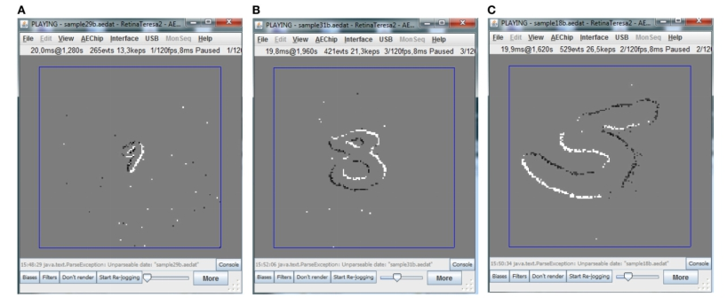
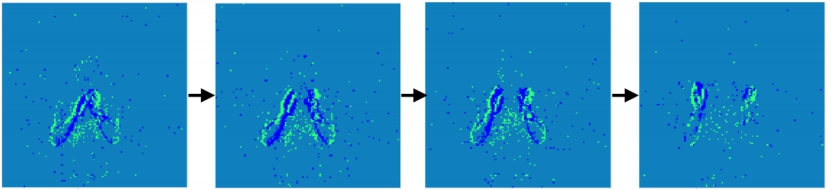
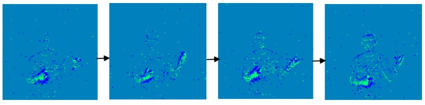
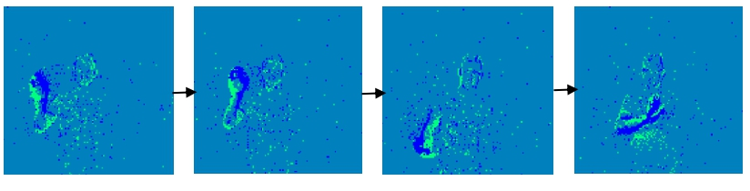
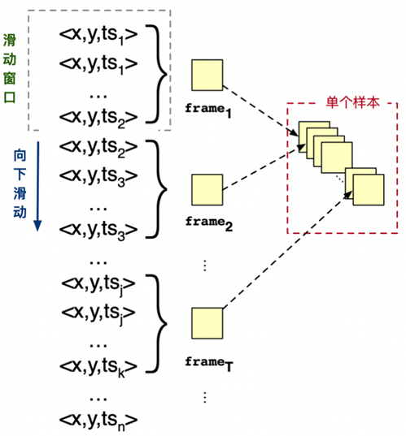
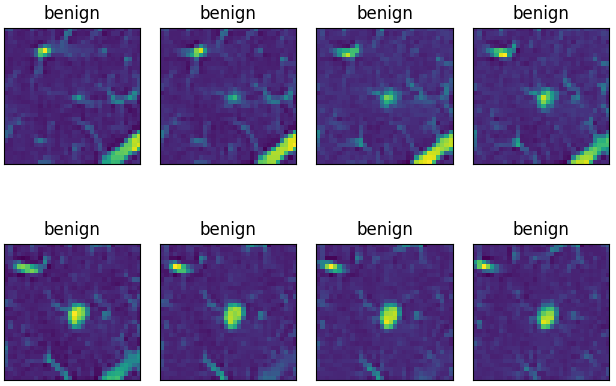
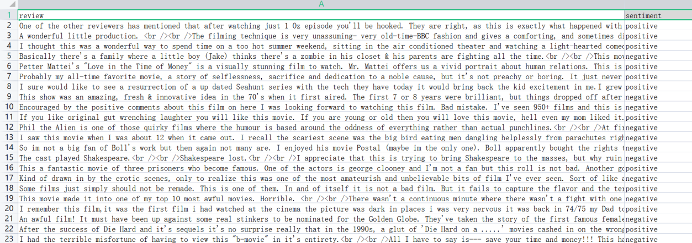
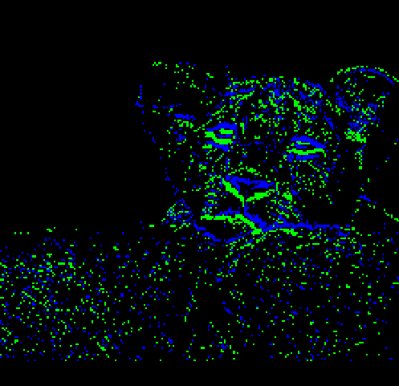
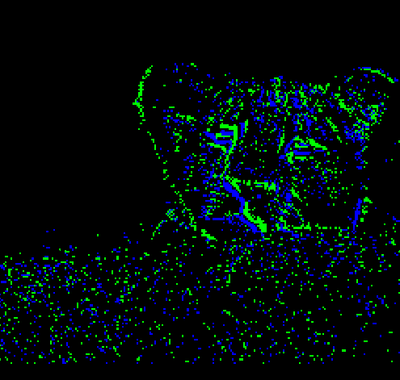
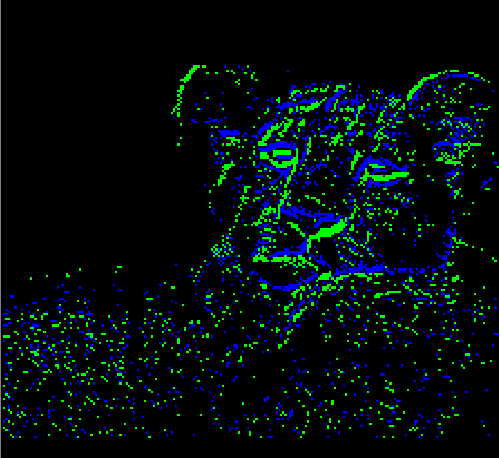

数据集介绍
===============================================================================

.. _data_task:

支持的数据集
-------------------------------------------------------------------------------

DVS-MNIST
~~~~~~~~~~~~~~~~~~~~~~~~~~~~~~~~~~~~~~~~~~~~~~~~~~~~~~~~~~~~~~~~~~~~~~~~~~~~~~~

数据集名称原为MNIST-DVS，但在此项目的代码和文件命名中均记为DVS-MNIST，此数据集为DVS版本的MNIST，用DVS相机录制手写字符图像，得到脉冲事件样本。具体地说，数据集中的每个样本是通过在固定轨迹上移动液晶显示器（LCD）上相应的原始图像帧，并使用DVS相机进行记录而获得的。基于事件的数据是典型的尖峰序列，每个尖峰是由每个像素处的光强度变化触发的。脉冲（Spike）用(x,y, ts,pol)等四边形来表示，其中x和y是Spike的空间坐标，ts是事件的时间戳(以1us为单位)，pol表示光强变化的类型（变亮为1或变暗为-1）。对于MNIST-DVS数据集，共有10000个数据，每个数据都以三种不同的比例显示，分别记录为scale-4，8，16，如下图所示，录制多个尺寸可以更好的模拟自然环境。

   图 12 DVS相机捕获的不同尺寸移动数字的示例
   （A）scale-4（B）scale-8（C）scale-16

在使用时，考虑到手写数字比较简单，所以只截取了40*40的像素大小，时间窗口T我们取20，则维度变为（20，40，40，2），这样降低了数据集的内存，可以有效加快网络的训练速度。

数据集共10个类别，分别为：

::

   '0', '1', '2', '3', '4', '5', '6', '7', '8', '9'

参考文献： `MNIST-DVS and FLASH-MNIST-DVS Databases <http://www2.imse-cnm.csic.es/caviar/MNISTDVS.html>`__

DVS-Gesture
~~~~~~~~~~~~~~~~~~~~~~~~~~~~~~~~~~~~~~~~~~~~~~~~~~~~~~~~~~~~~~~~~~~~~~~~~~~~~~~~~~

DVS-Gesture数据集是由DVS相机直接从真实场景中记录下来的，DVS相机不同于传统相机以固定帧率的采样方式，而是采用AER异步传输方式的差分型视觉采样模型，以异步时空脉冲信号表示场景光强变化，如下图所示：

   图 DVS Gesture 数据集示例（a） hand clap

   图 DVS Gesture 数据集示例（b） air guitar

   图 DVS Gesture 数据集示例（c） right hand clockwise

数据集是直接用DVS相机录制的人类手势，得到脉冲事件样本，共11个类别，同RGB-Gesture，每个样本时间分辨率为1/25000秒，每个样本空间分辨率为128*128。在使用时，我们选择1/3.2下采样分辨率，即40×40以节省图形内存。为了使用网络结构进行训练，我们通过每25ms内累积尖峰序列来生成大小为40×40的事件帧。然后根据是减弱还是增强每个像素的亮度，将每个帧扩展为两个通道。最后，按时间顺序堆叠多个相邻事件框架，以获得尺寸为
（T×2×40×40）的样本，我们选择时间窗口T为60。

11个类别为：

::

   'Hand Clapping',
   'Left Hand Wave',
   'Right Hand Wave',
   'Left Arm CW',
   'Left Arm CCW',
   'Right Arm CW',
   'Right Arm CCW',
   'Arm Roll',
   'Air Drums',
   'Air Guitar',
   'Other'

参考文献： `IBM Research - DVS128 Gesture Dataset <https://research.ibm.com/interactive/dvsgesture/>`__

CIFAR10-DVS
~~~~~~~~~~~~~~~~~~~~~~~~~~~~~~~~~~~~~~~~~~~~~~~~~~~~~~~~~~~~~~~~~~~~~~~~~~~~~

DVS版本的CIFAR10，用DVS相机录制CIFAR10图像，得到脉冲事件样本。脉冲事件样本的处理过程如下：首先编码算法使用特定时间长度的滑动窗口在按时间戳排序的事件流数据上从上往下滑动，窗口滑动的步长等于滑动窗口的长度，窗口每滑动一次则可得到一个用于表示一个时间步数据的事件集合，该事件集合包含事件的时间戳范围与事件窗口的时间长度一致。之后，将每一个事件集合中包含的所有事件按照坐标信息和极性信息扩展成一个被称为事件帧的三维向量，每个事件帧包含两个通道，分别承载事件流中不同极性的事件，例如在正极性通道中，属于正极性的事件将按照坐标信息填充进128*128的矩阵中，未被填充的坐标则为零。每一个事件集合可得到由一个窗口长度的事件转换成的事件帧，一个事件帧用于表示一个样本包含的一个时间步的数据，经过T次处理后，就可以得到一个时间步为T的记录，其维度为（T，128，128，2），如下图所示。在BIDL使用中，时间窗口的时间长度被设置为5ms，时间步T被设置为10。

   图 CIFAR10-DVS数据前处理示意

CIFAR10-DVS共10个类别，分别为：

::

   'airplane',
   'automobile',
   'bird',
   'cat',
   'deer',
   'dog',
   'frog',
   'horse',
   'ship',
   'truck'

参考文献：Li, Hongmin, et al. "Cifar10-dvs: an event-stream dataset for
object classification." Frontiers in neuroscience 11 (2017): 309.

Jester
~~~~~~~~~~~~~~~~~~~~~~~~~~~~~~~~~~~~~~~~~~~~~~~~~~~~~~~~~~~~~~~~~~~~~~~~~~~~~~

用普通相机采集的视频帧（RGB格式），是在1376个参与者在他们不受约束的环境中记录一套27个动作。27个类别为：

::

   'Doing other things',
   'Drumming Fingers',
   'No gesture',
   'Pulling Hand In',
   'Pulling Two Fingers In',
   'Pushing Hand Away',
   'Pushing Two Fingers Away',
   'Rolling Hand Backward',
   'Rolling Hand Forward',
   'Shaking Hand',
   'Sliding Two Fingers Down',
   'Sliding Two Fingers Left',
   'Sliding Two Fingers Right',
   'Sliding Two Fingers Up',
   'Stop Sign',
   'Swiping Down',
   'Swiping Left',
   'Swiping Right',
   'Swiping Up',
   'Thumb Down',
   'Thumb Up',
   'Turning Hand Clockwise',
   'Turning Hand Counterclockwise',
   'Zooming In With Full Hand',
   'Zooming In With Two Fingers',
   'Zooming Out With Full Hand',

Jester涉及148092个短视频剪辑长度3秒的长度。这个数据集许多动作都是对称的，例如，“向做移动手指”和“向右移动手指”，所以动作识别需要很强的时间建模能力。每个动作是以多帧RGB图片的形式读入。样本的空间分辨率基本是176*100、共37帧。样本数量非常多，被认为是视频分类的ImageNet。在使用时空间裁剪、填充并上采样为224*224、时间下采样为16。

参考文献：Materzynska, Joanna, et al. "The jester dataset: A large-scale
video dataset of human gestures." Proceedings of the IEEE/CVF
International Conference on Computer Vision Workshops. 2019.

RGB-Gesture
~~~~~~~~~~~~~~~~~~~~~~~~~~~~~~~~~~~~~~~~~~~~~~~~~~~~~~~~~~~~~~~~~~~~~~~~~~~~~~~~~

将普通相机采集到的动作视频按帧（RGB格式）差法计算出正负事件，作为待识别样本。按照一秒25帧的频率将视频解码为帧图像数据存储。我们使用的相机都是彩色相机，不方便做帧的差分处理。为了方便后续处理，将彩色的视频序列帧转换成灰度图像进行处理。帧间差分的基本原理就是在图像序列相邻两帧间采用基于像素的时间差分来提取出图像中的运动区域。即将相邻帧图像对应像素值相减得到差分图像，在环境亮度变化不大的情况下，如果对应像素值变化小于事先确定的阈值时，可以认为此处为背景像素：如果图像区域的像素值变化很大，可以认为这是由于图像中运动物体引起的，将这些区域标记为前景像素，利用标记的像素区域可以确定运动目标在图像中的位置。对于差分的结果做成图像增强和图像减弱两个通道，也就是从原来三通道的RGB图像变为现在的两通道图像。

共11类动作，每个样本60个时间步，每个样本空间分辨率为128*128，通道数为2即正负事件。在使用时降采样为40*40。

11个类别为：

::

   'Hand Clapping',
   'Left Hand Wave',
   'Right Hand Wave',
   'Left Arm CW',
   'Left Arm CCW',
   'Right Arm CW',
   'Right Arm CCW',
   'Arm Roll',
   'Air Drums',
   'Air Guitar',
   'Other'

Luna16Cls
~~~~~~~~~~~~~~~~~~~~~~~~~~~~~~~~~~~~~~~~~~~~~~~~~~~~~~~~~~~~~~~~~~~~~~~~~~~~~~~~~

通过对Luna16（\ `Home - Grand Challenge
(grand-challenge.org) <https://luna16.grand-challenge.org/>`__\ ）数据集的CT影像进行掩膜提取、凸包与扩张和灰度标准化处理，得到Luna16Cls数据集，其中包括888名患者的CT影像以及由放射科医生标注的1186个结节标签。

具体的预处理过程如下：

1. 首先将所有的原始数据转变为HU值；

2. 掩膜提取：在2D切片上，使用标准差为1的高斯滤波和阈值为-600的处理得到肺部以及周围较暗部分的掩膜，再进行连通性分析去除小于30mm2的连通分量（connected component）和离心率大于0.99的部分，再计算得到二值的3D矩阵中所有的3D connected component，且仅保留非边缘部分（用于去除肺部周围较暗的部分）以及体积在0.68~7.5L之间的部分；

3. 凸包与扩张处理：若结节与肺的外壁相连，则其将不会出现在上述提取的掩膜中，对于这种情况，先将肺部分为左右两个部分，即左肺与右肺，再分别对左右肺进行凸包处理，并向外扩张10像素，但对于一些2D切片而言，肺部的底部类似与月牙形，对于该类型进行凸包处理后，面积大于初始的1.5倍，则放弃凸包，从而避免引入过多的其他组织；

4. 灰度标准化处理：将HU值（[-1200,600]）线性变换至0~255内的灰度值，且掩膜以外的像素灰度值均设为170，以及扩张区域内的像素灰度值高于210则也设为170。

5. 为节省图形内存，将数据集下采样至32×32图像分辨率，并设置时间步长为8，获得3795个
   （8×1×32×32）的样本，将其中3416个样本作为训练集，379个做为验证集和测试集。

.. figure:: _images/malignant类.png
   :alt: malignant类

   图 Luna16Cls数据集：malignant类

   图 Luna16Cls数据集：benign类

数据集共2个类别，分别为：

::

   'malignant',
   'benign'

IMDB
~~~~~~~~~~~~~~~~~~~~~~~~~~~~~~~~~~~~~~~~~~~~~~~~~~~~~~~~~~~~~~~~~~~~~~~~~~~~~~~~~~~~

IMDB数据集包含来自互联网电影数据库（IMDB）的50000条严重两极分化的评论。

从kaggle路径上 `下载的数据集包含IMDB Dataset.csv文件 <https://www.kaggle.com/datasets/utathya/imdb-review-dataset/code>`_ 。
该文件部分截图如下：

其中，第一列review表示评论内容，第二列sentiment表示标签，为正面还是负面。

IMDB数据预处理过程中，将训练集和验证集按照3:1进行切分，得到37500条训练样本和12500条测试样本。之后利用大小为1000的词典将样本数据中每个单词转化为数字表示。最后统一将每一个样本数据padding为500个时间拍的大小。

对于标签的处理，二分类用0和1表示，其中0代表负面（negative），1代表正面（positive）。

ESImagenet
~~~~~~~~~~~~~~~~~~~~~~~~~~~~~~~~~~~~~~~~~~~~~~~~~~~~~~~~~~~~~~~~~~~~~~~~~~~~~~~~~~~~~~~~~~

ES-imagenet是目前最具挑战性的事件流数据集，它是由流行的的计算机视觉数据集ILSVRC2012转换而来的，生成约130万帧图像，其中包括1257K个训练和50K个测试样本，分为1000个类。他是目前最大的用于对象分类的es数据集，是目前其他神经形态数据集的几十倍。不同于从静态数据集CIFAR10转换而来的CIFAR-10和从DVS直接录制的事件流数据DVS Gesture128不同。由于使用动态视觉传感器（DVS）等神经型摄像机创建ESdataset是一项耗时且昂贵的任务。所以该数据集的作者是通过将RGB图像模型转换成HSV颜色模型从而获得亮度信息，然后通过提出的一种称为全方位离散梯度算法（ODG）来转换。这个算法是模仿生物产生特征的神经元细胞来获得物体识别的必要信息。最后通过时间轴将时间累加到时间帧中，生成8个与差异信息相关的事件帧。事件帧的大小是224*224，包含两个通道，表示每个坐标位置的事件极性。转换而来的数据集带有了脉冲事件流丰富时空信息的特点。能够很好的验证模型的时空信息提取能力。

|image1| |image2| |image3| |image4|

*图 16样本ILSVRC2012_val_00003013可视化*

