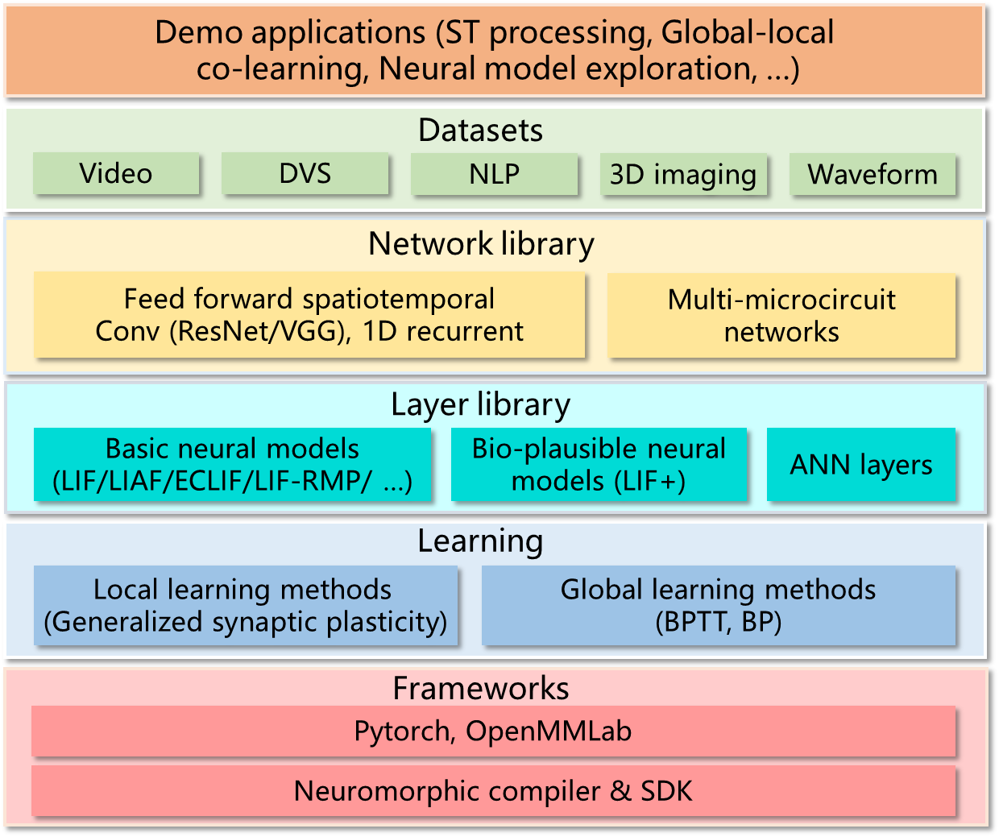

概述
===============================================================================

灵汐ANN+SNN异构融合训练平台BIDL是一套可用于训练类脑深度学习网络的框架，其基于深度学习框架Pytorch构建。

BIDL支持高精度的BPTT训练方法，可用于训练典型的SNN模型，并可与传统的深度学习网络层混合使用，实现异构融合网络构建和训练。该训练平台充分考虑了灵汐类脑计算系统的计算特性，训练后的网络可自动编译并部署于灵汐类脑计算系统，实现高效率推理，也支持网络头部局部的全局-本地融合在线学习能力。

BIDL主要应用方向包括动态视觉传感器（DVS）信息处理，视频信息处理，一维时序信息处理（如语音、文本）等。

BIDL的特点是利用神经元本身的时序信息处理能力，构建的可用于空时处理的轻量级网络，开销较Conv3D或ConvLSTM构建的网络显著降低，从而可用于高效的空时处理任务。

主要功能
--------------------------------------------------------------------------------

BIDL当前支持的特性列表参见下表。其中神经元模型支持LIF和LIFplus，包括一维数据(1D)和帧数据（2D），支持脉冲发放形态和模拟值发放形态。用户也可以自行定义神经元内部实现。网络形态方面，目前支持VGG类（即序贯式，每层只与一个前层连接）及resnet类（具有残差连接）。映射方式目前版本只支持按照时间拍切割（上文提到的外循环模式），后期支持层内循环方式（上文提到的形式1）。突触模型包括卷积/全连接。学习机制目前版本采用BPTT离线训练，后期支持在线学习部分头部网络。网络构建采用Pytorch语言，推理支持C++ SDK。物理形态支持盒子形态和板卡形态。目前工具链基于单芯片进行映射，可支持数据并行，如需模型并行，需用户对网络进行拆分并依次编译。

表 BIDL特性列表

+---------------------+------------------------------------------------+
| 属性                | 参数                                           |
+=====================+================================================+
| 基础LIF系列神经元   | LIF1D/2D                                       |
| 模型                |                                                |
|                     | LIFplus1D/2D五种类型的交叉变种                 |
|                     |                                                |
|                     | 支持自定义神经元                               |
+---------------------+------------------------------------------------+
| 基础LIF的输出模式   | 脉冲发放                                       |
|                     |                                                |
|                     | 模拟值发放                                     |
+---------------------+------------------------------------------------+
| 基础LIF内部参数共享 | 按Channel共享                                  |
| 模式                |                                                |
|                     | 全共享                                         |
+---------------------+------------------------------------------------+
| 网络形态            | VGG-like                                       |
|                     |                                                |
|                     | ResNet-like                                    |
|                     |                                                |
|                     | 支持可变输入尺寸，可变输出尺寸，可变层个数     |
+---------------------+------------------------------------------------+
| 映射方式            | 自动映射-按时间拍切割                          |
+---------------------+------------------------------------------------+
| 简单突触模型        | 2D卷积（只配合LIF2D用）                        |
|                     |                                                |
|                     | 全连接                                         |
+---------------------+------------------------------------------------+
| 辅助层              | 时域聚合层                                     |
+---------------------+------------------------------------------------+
| 学习机制            | BPTT-近似阶跃导数                              |
+---------------------+------------------------------------------------+
| 运行平台（GPU）     | BPTT训练，推理                                 |
+---------------------+------------------------------------------------+
| 运行平台（Lite）    | 推理                                           |
+---------------------+------------------------------------------------+
| 开发语言            | 网络构建和训练：Python（Pytorch）              |
|                     |                                                |
|                     | 网络推理：Python或C++                          |
+---------------------+------------------------------------------------+

软件架构
--------------------------------------------------------------------------------

BIDL系统架构如下图所示，包括基础框架（Frameworks）、学习机制（Learning）、模块组件库（Library）、网络模型库（Network library）、数据集及应用几个层面。

  图 BIDL系统架构

表 2 BIDL系统架构说明

+-------------+--------------------------------------------------------+
| 组件        | 说明                                                   |
+=============+========================================================+
| Learning    | 学习机制，目前通过Pytorch本征支持BP方法，对于有时间    |
|             | 维度的SNN网络，需要采用Back Propagation Through        |
|             | Time（BPTT）+代理梯度方式，其中代理梯度用于脉冲发放步  |
|             | 骤（阶跃函数）的反向计算。原理说明参见 :ref:`bptt` ，  |
|             | 后期此模块计划支持仿生可塑性方法。                     |
+-------------+--------------------------------------------------------+
| Layer Lib   | 层模型库，主要包括LIF/LIF+模型及其他类脑模型，         |
|             | 也支持自定义模型。                                     |
+-------------+--------------------------------------------------------+
| Network lib | 网络库，主要包括前向空时网络，如ResNet-LIF、VGG-LIF、  |
|             | 一维LIF网络。                                          |
+-------------+--------------------------------------------------------+
| Datasets    | 数据集，包含：                                         |
|             |                                                        |
|             | - DVS数据集：DVS Gesture、CIFAR10-DVS、MNIST-DVS等；   |
|             | - 视频数据集：Jesture，RGB-Gesture等；                 |
|             | - NLP数据集：IMDB，BabiQA等；                          |
|             | - 三维医学影像数据集Luna16Cls。                        |
+-------------+--------------------------------------------------------+
| Domo        | 应用案例，包括实时DVS识别，视频流识别等。              |
| Application |                                                        |
+-------------+--------------------------------------------------------+
| Compiler    | 模型编译，主要基于Lyngor，其用于编译Pytorch转出的      |
|             | 计算图，实现Pytorch模型映射到芯片的完整流程，产生芯片  |
|             | 可执行程序。                                           |
+-------------+--------------------------------------------------------+
| SDK         | 推理方面，包含LynSDK（C++版本和Python版本）及基于      |
|             | LynSDK构建的推理程序（inference runtime）。            |
+-------------+--------------------------------------------------------+

适用产品
--------------------------------------------------------------------------------

在推理环节，目前BIDL可适用于以下产品：

- HP系列类脑计算加速卡（及服务器）
- HS系列边缘计算主机
- SL系列类脑计算服务器
- 其他基于HM100类脑计算模组开发的类脑计算产品

在训练环节，训练网络的计算机设备可以为台式计算机或服务器，需要安装Nvidia
GPU（2070及以上的台机版本，或服务器版本）。

基本概念
--------------------------------------------------------------------------------

+----------+------------------------------------------------------------+
| 术语     | 说明                                                       |
+==========+============================================================+
| SNN      | 脉冲神经网络（Spiking Neural Network）                     |
+----------+------------------------------------------------------------+
| ANN      | 人工神经网络（Artificial Neural Network），本说明中主要    |
|          | 指深度神经网络                                             |
+----------+------------------------------------------------------------+
| LIF      | 泄漏积分发放模型（Leaky Integrate and                      |
|          | Fire），一种常用于SNN的神经元模型                          |
+----------+------------------------------------------------------------+
| 膜电位   | 神经元表征时序状态的变量，仿生于生物神经元的               |
+----------+------------------------------------------------------------+
| 空时处理 | 同时处理空间和时间两个维度，空间维度通常指图片，或一个     |
|          | 音节、单词，加入时间维度后，就对应地形成了图片序列（如短   |
|          | 视频），语音及句子。                                       |
+----------+------------------------------------------------------------+
| VGG      | 一类序贯（sequential）模型，在本文指基于ConvLIF序列组成    |
|          | 的序贯形态的模型，不存在分支。                             |
+----------+------------------------------------------------------------+

使用限制
--------------------------------------------------------------------------------

**网络**

需可连接pip源，用于安装主干之外的其他装软件依赖包。

**硬件**

如需采用BIDL实现网络训练，则需要Nvidia GPU设备。

**操作系统**

本软件基于Linux操作系统，推荐Ubuntu 18.04及更高版本的操作系统。

**软件依赖**

- 已安装LynDriver+LynSDK。具体操作说明参见《灵汐产品快速入门》。
- 已安装Lyngor。具体操作说明参见《Lyngor用户指南》。