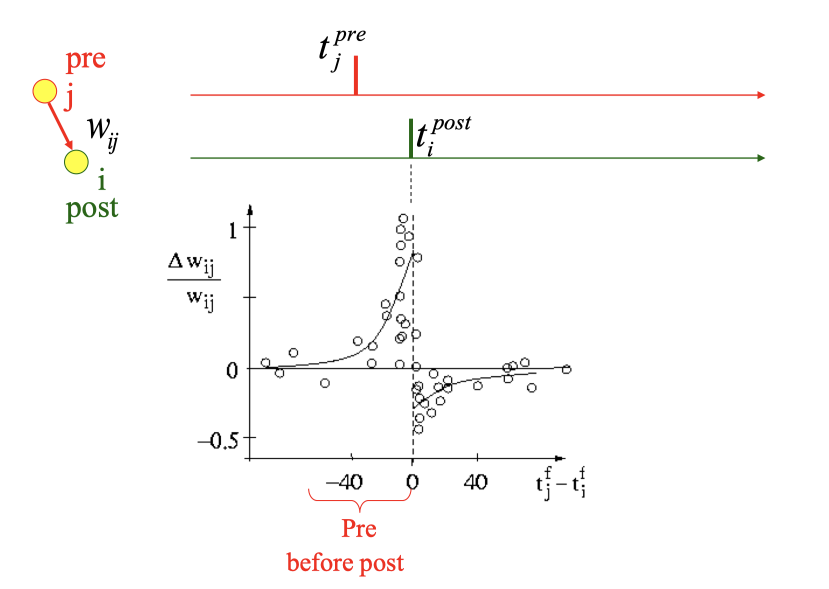

乐曲识别（Hebb学习）
~~~~~~~~~~~~~~~~~~~~~~~~~~~~~~~~~~~~~~~~~~~~~~~~~~~~~~~~~~~~~~~~~~~~~~~~~~~~~~~~~~~~~~~~~~

Midi乐曲预处理
^^^^^^^^^^^^^^^^^^^^^^^^^^^^^^^^^^^^^^^^^^^^^^^^^^^^^^^^^^^^^^^^^^^^^^^^^^^^^^^^^^^^^^^^^^

本案例选取100首乐曲进行学习和识别。对每首乐曲的MIDI文件通过mido库的MidiFile接口进行信息处理，将时间离散化一定的时间拍数，每个时间拍上为音阶信息（0-127）。时间拍取前38拍，音阶转化为one_hot编码的128维大小，并进行压缩处理，最终每首乐曲表示成[10,38]大小的数字矩阵。

乐曲识别算法原理
^^^^^^^^^^^^^^^^^^^^^^^^^^^^^^^^^^^^^^^^^^^^^^^^^^^^^^^^^^^^^^^^^^^^^^^^^^^^^^^^^^^^^^^^^^

在学习阶段通过Hebb法则将乐曲的前后拍之间的相关关系存储到神经网络的连接权重中。在回放及识别阶段，在乐曲音符的激励下，神经网络会逐层预测被记忆的乐曲下一个音符，并在回放结束之后做综合的相似性比较，从而完成识别功能。该方法具有类脑的学习特性，不依赖于反向传播算法，具有单样本一次性学习等优点。该方法中的关键类脑学习过程基于经典的Hebb法则。

Hebb法则是一种关于神经元连接权重的学习规则，它提出了神经元之间的连接强度如何随着时间和经验而改变的原理。该法则由加拿大心理学家Donald
Hebb在1949年首次提出，被认为是神经科学和机器学习中的一个重要概念。根据Hebb法则，当一个神经元的活动频率与另一个神经元的活动频率高度相关时，这两个神经元之间的连接权重就会增加。换句话说，如果一个神经元持续地引发另一个神经元的活动，那么它们之间的连接将得到加强。

具体来说，Hebb法则可以用以下简单的表达方式表示：当一个神经元A反复导致神经元B的兴奋时，神经元A和神经元B之间的突触权重将增加。这种增强的效应可以通过公式表示为：

.. math:: \mathrm{\Delta}w = \eta xy^{T}

其中，\ :math:`x`\ 和\ :math:`y`\ 分别是相互连接的前后两层神经元的脉冲激活值，以列向量表示。\ :math:`\mathrm{\Delta}w`\ 是网络互联权重矩阵的更新量。

下面将介绍本文乐曲识别算法的基本模型、学习过程和回放识别过程。

**基本模型**

本文的乐曲识别网络是一个多层级联的、层间全连接的脉冲神经网络。网络的层数与待识别的乐曲节拍数一致，每层网络用以学习不同节拍间的转移关系。为减轻干扰，为每一个乐曲实例化一个神经网络进行学习。

**学习过程**

在学习阶段，对每一个待学习的乐曲，实例化一个网络去学习。在输入乐曲的激励下，根据以上给出的Hebb法则，对网络的每一层权重进行更新，以使其学习到乐曲节拍之间的转移关系，从而完成学习过程。

**回放识别过程**

在回放识别阶段，将待识别的乐曲输入到各训练完成的网络。在其激励下，每个网络会产生各个时间节拍的预测输出。将这些每个时间节拍的预测脉冲输出拼接，作为特征向量，与预处理过的乐曲库进行相似度比较，选择相似度最大的乐曲作为识别结果。

头部片上学习（基于BP的网络微调）
~~~~~~~~~~~~~~~~~~~~~~~~~~~~~~~~~~~~~~~~~~~~~~~~~~~~~~~~~~~~~~~~~~~~~~~~~~~~~~~~~~~~~~~~~~

BIDL支持模型微调（finetune），对模型头部通过BP算法实现在线学习。在此以跨任务后网络头部微调案例为例描述。其目标是将A下训练的网络迁移到任务B后，对网络头部微调，从而适应B任务。首先根据A任务的数据集训练模型，保留该模型的骨干网（不包括最后的分类层），并加入权重被初始化的若干层（例如两层）全连接，其中第二层的全连接的out_channel为B数据集的分类类别数。微调的过程中，首先网络需加载其在A数据集上训练的权重参数，之后通过BP训练新加入的全连接层的参数，用以分类B数据集。模型结构调整如图25所示，此例中A数据集为DVS-Gesture，B任务采用的数据集为RGB-Gesture，模型结构为Backbone=SeqClif3Flif1DgItout。其中w1为第一个全连接的权重，w2为第二个全连接的权重，BP的目的是学习最优的w1和w2。

.. _fig_25:

   
   图 模型微调前后的结构图

其中：

- (a)为骨干网，由A任务训练完毕后去除最后的分类头后形成；
- (b)为微调采用的网络

微调部分的多层全连接的BP使用梯度下降算法进行训练。下边以2层为例。Loss选择交叉熵损失函数，

.. math::

   L(Y,Label) = - \log(\frac{e^{Y\lbrack Label\rbrack}}{\sum_{j}^{}e^{Y_{j}}})

其中Y为模型的输出，Label为样本标签（one-hot编码格式）。根据链式法则，

.. math::

   \mathrm{\Delta}W_{2} = - \frac{\partial L}{\partial W_{2}} = - \frac{\partial L}{\partial Y}\frac{\partial Y}{\partial W_{2}} = - \frac{\partial L}{\partial Y}\frac{\partial Y}{\partial f_{softmax}}\frac{\partial f_{softmax}}{\partial W_{2}}

其中，

.. math::

   \frac{\partial L}{\partial Y}\frac{\partial Y}{\partial f_{softmax}} = \ (Y - Label)

.. math::

   \frac{\partial f_{softmax}}{\partial W_{2}} = \ H

其中，H为隐藏层的输出。

.. math::

   \mathrm{\Delta}W_{2} = H^{T}(Y - Labels)

.. math::

   \mathrm{\Delta}W_{1} = - \frac{\partial L}{\partial W_{1}} = - \frac{\partial L}{\partial Y}\frac{\partial Y}{\partial H}\frac{\partial H}{\partial W_{1}} = - \frac{\partial L}{\partial Y}\frac{\partial Y}{\partial H}\frac{\partial H}{\partial f_{Relu}}\frac{\partial f_{Relu}}{\partial W_{1}}

.. math::

   \frac{\partial L}{\partial Y}\frac{\partial Y}{\partial H} = (Y - Labels){W_{2}}^{T}

可以得到：

.. math:: \mathrm{\Delta}W_{1} = X^{T}f_{Relu}^{'}(Y - Labels){W_{2}}^{T}

该微调功能的的反向BP计算过程也采用pytorch表达（显式代码表达而非自动梯度）。此功能可运行于GPU，也可运行于Lynxi系列设备。

下面以提供的案例DVS-Gesture到RGB-Gesture的finetune为例进行说明。

构建微调模型
^^^^^^^^^^^^^^^^^^^^^^^^^^^^^^^^^^^^^^^^^^^^^^^^^^^^^^^^^^^^^^^^^^^^^^^^^^^^^^^^^^^^^^^^^^

Finetune模型是在SeqClif3Flif2DgItout模型的基础上，修改头部结构而成，backbone为SeqClif3Flif2DgItout_finetune，位于 *bidlcls/models/backbones/sequential/bidl_backbone_finetune.py* 文件中。

::

   @BACKBONES.register_module()

   class SeqClif3Flif2DgItout_finetune(nn.Module):

      """For DVS-Gesture finetune rgb-gesture."""
      def \__init\_\_(self, timestep=60, c0=2, h0=40, w0=40, nclass=11,cmode='spike', fmode='spike', amode='mean', soma_params='all_share', noise=1e-3):
 
         super(SeqClif3Flif2DgItout_finetune, self).\__init\_\_()
         self.norm = nn.BatchNorm2d(c0)
         self.clif1 = Conv2dLif(c0, 64, 3, stride=2, padding=1, feed_back=False, mode=cmode, soma_params=soma_params, noise=noise)
         self.clif2 = Conv2dLif(64, 128, 3, stride=2, padding=1, feed_back=False, mode=cmode, soma_params=soma_params, noise=noise)
         self.clif3 = Conv2dLif(128, 256, 3, stride=2, padding=1, feed_back=False, mode=cmode, soma_params=soma_params, noise=noise)
         self.flat = Flatten(1, -1)
         self.flif1 = FcLif(h0 // 8 \* w0 // 8 \* 256, 256, mode=fmode, soma_params=soma_params, noise=noise)
         self.nclass = nclass
         self.head_finetune = nn.Sequential(
            nn.Linear(256, 256,bias=False),
            nn.ReLU(),
            nn.Linear(256, self.nclass,bias=False),
         )
         #self.init_finetune()
         self.softmax = nn.Softmax()
         self.learning_rate = 0.1
         self.w1 = self.head_finetune[0].weight.data.t()
         self.w2 = self.head_finetune[2].weight.data.t()
         assert amode == 'mean'
         self.tempAdd = None
         self.timestep = timestep
         self.ON_APU = globals.get_value('ON_APU')
         self.FIT = globals.get_value('FIT')

头部的 ``self.nclass`` 已修改为RGB_Gesture的分类类别。两层全连接的权重 ``self.w1`` 和 ``self.w2`` 通过bp算法进行更新。权重更新的代码如下：

::

   def head_finetune_train(self,output,gt_label,finetune):

      if self.ON_APU:
         w1 = load(self.w1.clone(), f'#w1')
         w2 = load(self.w2.clone(), f'#w2')

      else:
         w1 = self.w1.clone()
         w2 = self.w2.clone()

      o1 = output.mm(w1)
      o2 = self.head_finetune[1](o1)
      o3 = o2.mm(w2)
      out=self.softmax(o3)

      grad_y_pred = (out- gt_label)
      grad_w2 = pt.mm(o2.t(),grad_y_pred)#/16.

      grad_h_relu = grad_y_pred.mm(w2.t())
      grad_h = (o1 > 0.).to(o1.dtype)*grad_h_relu #relu的导数
      grad_w1 = pt.mm(output.t(),grad_h)#/16.

      w1 = w1- self.learning_rate*grad_w1*finetune
      w2 = w2 - self.learning_rate*grad_w2*finetune

      self.w1 = w1.clone()
      self.w2 = w2.clone()

      if self.ON_APU:
         save(self.w1, f'#w1')
         save(self.w2, f'#w2')
      
      return o3

如果是部署在灵汐设备上，self.w1和self.w2通过DDR在不同的iter和epoch之间进行传递。

编写配置文件
^^^^^^^^^^^^^^^^^^^^^^^^^^^^^^^^^^^^^^^^^^^^^^^^^^^^^^^^^^^^^^^^^^^^^^^^^^^^^^^^^^^^^^^^^^

由于finetune功能属于在线学习，且用到的是bp算法，所以在 *applications/onlinelearning/bpfinetun* 路径下创建 *dvsgesture-rgb-finetune* 文件夹，配置文件 *dvsgesture_rgb_finetune.py* 位于该文件夹中。

::

   model = dict(
      type='ImageClassifier',
      backbone=dict(
         type='SeqClif3Flif2DgItout_finetune',
         timestep=60, c0=2, h0=40, w0=40, cmode='spike', fmode='spike', amode='mean', noise=1e-3,
         soma_params='all_share',nclass=11
      ),
      neck=None,
      head=dict(
         type='ClsHead',
         topk=(1, 5),
         cal_acc=True
      )
   )

   ###
   
   dataset_type = 'RgbGesture'
   train_pipeline = [
      dict(type='RandomCropVideo', size=40, padding=4),
      dict(type='ToTensorType', keys=['img'], dtype='float32'), # ImageToTensor
      dict(type='ToTensor', keys=['gt_label']),
      dict(type='ToOneHot', keys=['gt_label'],param=11),
      dict(type='Collect_ft', keys=['img', 'gt_label'])
   ]
   test_pipeline = [
      dict(type='ToTensorType', keys=['img'], dtype='float32'), # ImageToTensor
      dict(type='Collect', keys=['img'])
   ]
   data = dict(
      samples_per_gpu=16,
      workers_per_gpu=1,
      train=dict(
         type=dataset_type,
         data_prefix='data/rgbgesture/',
         ann_file='train.pkl',
         pipeline=train_pipeline,
         shape=(40, 40)
      ),
      val=dict(
         type=dataset_type,
         data_prefix='data/rgbgesture/',
         ann_file='val.pkl',
         pipeline=test_pipeline,
         test_mode=True,
         shape=(40, 40)
      ),
      test=dict(
         type=dataset_type,
         data_prefix='data/rgbgesture/',
         ann_file='val.pkl',
         pipeline=test_pipeline,
         test_mode=True,
         shape=(40, 40)
      )
   )
   ###
   total_epochs = 30
   ###

模型backbone为SeqClif3Flif2DgItout_finetune。数据集为Rgb_gesture，并且需要设置total_epochs，为训练的总epoch数。

Finetune训练
^^^^^^^^^^^^^^^^^^^^^^^^^^^^^^^^^^^^^^^^^^^^^^^^^^^^^^^^^^^^^^^^^^^^^^^^^^^^^^^^^^^^^^^^^^

训练入口文件为 *tools/finetune.py* ，该文件描述的反向BP的过程。

头部片上学习（基于STDP的网络微调）
~~~~~~~~~~~~~~~~~~~~~~~~~~~~~~~~~~~~~~~~~~~~~~~~~~~~~~~~~~~~~~~~~~~~~~~~~~~~~~~~~~~~~~~~~~~

BIDL提供通用本地学习框架，用户可以使用R-STDP、Hebb或自定义学习规则实现片上学习。本案例使用R-STDP对DVS-Gesture数据集进行finetune，首先对DVS-Gesture数据集进行训练，模型的backbone结构为SeqClif3Flif2DgItout，如 :ref:`fig_25` 左边所示，之后将该模型的最后一个FcLif层改成AdaptiveFcLif，即其中全连接层的权重为可学习状态，Lif层为spike模式，且Lif层的神经元个数在之前的分类类别数的基础上进行了倍数的扩充，即由多个神经元表示一个类别。Finetune的过程中加载在DVS-Gesture数据集上训练的权重参数，之后通过R-STDP训练AdaptiveFcLif中全连接层的参数，最后在DVS-Gesture验证集上评估模型效果，其中验证集进行了加噪处理，调整不同的噪声参数可以观察R-STDP对抗噪声的作用。

R-STDP
^^^^^^^^^^^^^^^^^^^^^^^^^^^^^^^^^^^^^^^^^^^^^^^^^^^^^^^^^^^^^^^^^^^^^^^^^^^^^^^^^^^^^^^^^^

突触前和突触后脉冲发放的相对时间差对神经元之间突触的改变方向和大小具有关键作用，这种基于突触前后脉冲发放时间相关的学习规则为STDP，即脉冲时间依赖可塑性机制，是Hebb规则的一种拓展。如果突触前脉冲在突触后脉冲前几毫秒内到达，会导致Long-Term Potentiation(LTP)，即权重增加。反之，会引起Long-Term Depression(LTD)，即权重减小，如下图所示。

   图 STDP示意图

上述文字和图片转化为公式描述为：

.. math:: 

   \Delta w_j = \sum_{f=1}^{N} \sum_{n=1}^{N} W(t_i^n - t_j^f)

其中\ :math:`t_{i}^{n}`\ 代表突触后脉冲的发放时间，\ :math:`t_{j}^{f}`\ 代表突触前脉冲的发放时间。\ :math:`W(x)`\ 就代表STDP函数。常用的W函数表述如下，其中\ :math:`A_{+}`\ 和
\ :math:`A_{-}`\ 取决于突触的当前值，时间常数取10ms。

.. math::

   W(x) = A_+ \exp\left(-\frac{x}{\tau_+}\right) \text{ for } x > 0

.. math::

   W(x) = -A_- \exp\left(\frac{x}{\tau_-}\right) \text{ for } x < 0

本案例中使用R-STDP规则来更新权重，RSTDP规则中涉及trace的概念，如下图所示。

   图 STDP trace示意图

每个突触前脉冲的到达都会留下trace :math:`x_{j}^{t}`\ ，这条trace在脉冲到达时为
\ :math:`a_{+}(x_{j})`\ ，在没有脉冲时按指数衰减。trace的变化公式如下：

.. math::

   \tau_+ \frac{dx_j}{dt} = -x_j + a_+ (x_j) \sum_f \delta(t - t_j^f)

.. math::

   \tau_- \frac{dy}{dt} = -y + a_-(y) \sum_n \delta(t - t^n)

权重的变化公式为：

.. math::

   \frac{dw_j}{dt} = R \left( A_+(w_j) x(t) \sum_n \delta(t - t^n) - A_-(w_j) y(t) \sum_f \delta(t - t_j^f) \right)

其中，R为reward，根据模型需要设置奖惩系数。本案例中，取样本的真实标签值与预测结果的差值为reward系数，其中预测结果由表示每个类别的所有神经元的脉冲发放的均值来表示。

构建STDP微调模型
^^^^^^^^^^^^^^^^^^^^^^^^^^^^^^^^^^^^^^^^^^^^^^^^^^^^^^^^^^^^^^^^^^^^^^^^^^^^^^^^^^^^^^^^^^

STDP微调模型是在SeqClif3Flif2DgItout模型的基础上，修改头部结构而成。修改后的模型backbone为SeqClif3Flif2DgItout_noise_finetune。

::

   @BACKBONES.register_module()

   class SeqClif3Flif2DgItout_noise_finetune(nn.Module):

      """For DVS-Gesture ."""
      
      def __init__(self, timestep=60, c0=2, h0=40, w0=40, nclass=11, fclass=10, cmode='spike', fmode='spike', amode='mean', noise=1e-3, fit=False,neurons_num=7):
      
         super(SeqClif3Flif2DgItout_noise_finetune, self).__init__()
         self.neurons_num = neurons_num
         self.fclass = fclass
         self.norm = nn.BatchNorm2d(c0)
         self.clif1 = Conv2dLif(c0, 64, 3, stride=2, padding=1, feed_back=False, mode=cmode, noise=noise, on_apu=on_apu, fit=fit)
         self.clif2 = Conv2dLif(64, 128, 3, stride=2, padding=1, feed_back=False, mode=cmode, noise=noise, on_apu=on_apu, fit=fit)
         self.clif3 = Conv2dLif(128, 256, 3, stride=2, padding=1, feed_back=False, mode=cmode, noise=noise, on_apu=on_apu, fit=fit)
         self.flat = Flatten(1, -1)
         self.flif1 = FcLif(h0 // 8 \* w0 // 8 \* 256, 256, mode=fmode, noise=noise, on_apu=on_apu, fit=fit)
         self.adapflif = AdaptiveFcLif(256, self.fclass*self.neurons_num,mode=fmode, noise=noise,class_num=self.fclass,neurons_num=self.neurons_num,on_apu=on_apu,fit=fit)
         assert amode == 'mean'
         self.timestep = timestep

这部分的网络结构就是SeqClif3Flif2DgItout去掉最后一个self.flif2，而增加self.adapflif，其中class_num为DVS_Gesture的分类类别，neuron_num为每个类别对应的神经元个数。

AdaptiveFcLif层的代码如下：

::

   class AdaptiveFcLif(nn.Module):
   
   def __init__(self, input_channel: int, hidden_channel: int, feed_back=False, norm_state=True, mode='spike', memb_mode=MEMB_MODE, soma_params='all_share', noise=0, class_num=0,neurons_num=0, fit=False,init_cfg=None):
      super(AdaptiveFcLif, self).__init__()
      self.p0 = nn.Linear(input_channel, hidden_channel,bias=False)
      assert feed_back is False, '不常用，暂不支持。如需，则在forward始末为self.o添加load、save！'
      norm = None
      if norm_state:
         norm = nn.BatchNorm1d(hidden_channel)
      global SOMA_PARAMS
      if soma_params == 'all_share':
         SOMA_PARAMS = SOMA_PARAMS
      elif soma_params == 'channel_share':
         SOMA_PARAMS['shape'] = [1, hidden_channel]
      else:
         raise NotImplemented
      self.lif = Lif(norm, mode, memb_mode, SOMA_PARAMS, noise)
      self.w = self.p0.weight.data.t()
      self.plasticity_rule(rule = "stdp", nu=(0.0001,0.0010), class_num=class_num, neurons_num=neurons_num)
   
   def plasticity_rule(self, rule, nu, class_num, neurons_num):
      if rule == "stdp":
         self.rule =   RSTDPLeanrner(nu=nu,class_num=class_num,neurons_num=neurons_num)
      elif rule == "Hebb":
         self.rule = Hebbian(weight=self.w,nu=nu)
   
   def forward(self, xi:pt.Tensor, gt_label:pt.Tensor, finetune:pt.Tensor) -> pt.Tensor:
      if self.ON_APU:
         weight = ops.custom.load(self.w.clone(), f'#w')
      else:
         weight = self.w.clone()
      x1 = pt.mm(xi, weight)
      x2 = self.lif(x1)
      delta_w = self.rule.update(xi,x2,gt_label)
      weight = weight + delta_w*finetune
      self.w = weight.clone()
      if self.ON_APU:
      ops.custom.save(self.w, f'#w')
      return x2

代码主体跟FcLif一致，只是将全连接层的权重作为类的成员self.w，之后在其中加入了RSTDPLeanrner类，用于更新self.w。如果部署在APU上，权重需要通过load和save加载和保存，由于权重不会每一拍重置，所以需要在名称前加 ``#`` 号。

RSTDPLeanrner类的update方法如下：

::

   def update(self, source_s, target_s,gt_label):
      if self.ON_APU:
         source_x = ops.custom.load(self.source_x.clone(), f'sx')
         target_x = ops.custom.load(self.target_x.clone(), f'tx')
      else:
         source_x = self.source_x.clone()
         target_x = self.target_x.clone()
      reward_new = self.reward_fn(gt_label, target_s)
      source_x = source_x \* self.pre_trace_decay
      target_x = target_x \* self.post_trace_decay
      
      if self.traces_additive:
         source_x = source_x + self.trace_scale*source_s#.float()
         target_x = target_x + self.trace_scale*target_s#.float()
      else:
         tem = source_x + source_s*self.trace_scale
         tem1 = source_x \* source_s
         source_x = (tem - tem1)
         tem = self.target_x + target_s*self.trace_scale
         tem1 = self.target_x \* target_s
         target_x = (tem - tem1)
      
      source_s_temp = source_s.permute(1,0)
      source_x_temp = source_x.permute(1,0)
      target_x_temp = target_x#.unsqueeze(1)
      update1 = torch.mm(source_s_temp,target_x_temp)
      update2 = torch.mm(source_x_temp,target_s)
      delta_w = ((self.nu[1]*update2) - (self.nu[0]*update1))
      delta_w = delta_w*reward_new

      if self.ON_APU:
         self.source_x = source_x.clone()
         self.target_x = target_x.clone()
         ops.custom.save(self.source_x, f'sx')
         ops.custom.save(self.target_x, f'tx')
      else:
         self.source_x = source_x
         self.target_x = target_x
      return delta_w

其中，self.source_x和self.target_x为lif神经元突触前和突触后的trace，在每个样本第一拍重置为0，其它时间根据脉冲进行更新，所以部署到APU上的话，也需要通过load和save进行加载和保存。

编写配置文件
^^^^^^^^^^^^^^^^^^^^^^^^^^^^^^^^^^^^^^^^^^^^^^^^^^^^^^^^^^^^^^^^^^^^^^^^^^^^^^^^^^^^^^^^^^

根据任务类别，在 *applications/onlinelearnin* 路径下创建 *r-stdp* 文件夹，配置文件 *dvsgesture_noise_finetune.py* 文件位于该文件夹中。

::

   model = dict(
      type='ImageClassifier',
      backbone=dict(type='SeqClif3Flif2DgItout_noise_finetune', timestep=60, c0=2, h0=40, w0=40, fclass=11, cmode='spike', fmode='spike', amode='mean', noise=1e-3, neurons_num=7),
      neck=None,
      head=dict(type='ClsHead', topk=(1, 5), cal_acc=True)
   )
   dataset_type = 'DvsGesture'
   train_pipeline = [
      dict(type='LoadSpikesInHdf5', mode='train', timestep=60, down_t=1, down_s=3.2, dt=25000, size=(2, 40, 40), offset=0, frame_jitter=25000 // 100), # ImageToTensor
      dict(type='RandomCropVideo', size=40, padding=4), # XXX
      dict(type='ToTensorType', keys=['img'], dtype='float32'), # XXX
      dict(type='ToTensor', keys=['gt_label']),
      dict(type='ToOneHot', keys=['gt_label'],param=11),
      dict(type='Collect_ft', keys=['img', 'gt_label'])
   ]
   test_pipeline = [
      dict(type='LoadSpikesInHdf5', mode='test', timestep=60, down_t=1, down_s=3.2, dt=25000, size=(2, 40, 40), offset=0, frame_jitter=0), # ImageToTensor
      dict(type='ToTensorType', keys=['img'], dtype='float32'), # XXX
      dict(type='ToTensor', keys=['gt_label']),
      dict(type='ToOneHot', keys=['gt_label'],param=11),
      dict(type='Collect_ft', keys=['img', 'gt_label'])
      #dict(type='Collect', keys=['img'])
   ]
   val_pipeline = [
      dict(type='LoadSpikesInHdf5', mode='test', timestep=60, down_t=1, down_s=3.2, dt=25000, size=(2, 40, 40), offset=0, frame_jitter=0), # ImageToTensor
      dict(type='ToTensorType', keys=['img'], dtype='float32'), # XXX
      dict(type='RandomNoise', keys=['img'], noise=0.4), # XXX
      dict(type='Collect', keys=['img'])
   ]
   data = dict(
      samples_per_gpu=1,
      workers_per_gpu=1, # XXX better set to 1 for h5py
      train=dict(
         type=dataset_type,
         data_prefix='data/dvsgesture/',
         ann_file='dvs_gestures_events.hdf5',
         pipeline=train_pipeline,
         test_mode=False
      ),
      val=dict(
         type=dataset_type,
         data_prefix='data/dvsgesture/',
         ann_file='dvs_gestures_events.hdf5',
         pipeline=val_pipeline,
         test_mode=True
      ),
      test=dict(
         type=dataset_type,
         data_prefix='data/dvsgesture/',
         ann_file='dvs_gestures_events.hdf5',
         pipeline=test_pipeline,
         test_mode=True
      ),
   )
   total_epochs = 30

模型backbone为SeqClif3Flif2DgItout_noise_finetune。数据集为DVS_gesture，对于验证集需要在val_pipeline中加入 *RandomNoise* 操作，参数noise为噪声系数，并且需要设置total_epochs，为训练的总epoch数。

STDP微调训练
^^^^^^^^^^^^^^^^^^^^^^^^^^^^^^^^^^^^^^^^^^^^^^^^^^^^^^^^^^^^^^^^^^^^^^^^^^^^^^^^^^^^^^^^^^

训练入口文件为： *tools:/finetune.py*

头部片上学习（基于ZO-SGD的网络学习）
~~~~~~~~~~~~~~~~~~~~~~~~~~~~~~~~~~~~~~~~~~~~~~~~~~~~~~~~~~~~~~~~~~~~~~~~~~~~~~~~~~~~~~~~~~

ZO-SGD原理介绍
^^^^^^^^^^^^^^^^^^^^^^^^^^^^^^^^^^^^^^^^^^^^^^^^^^^^^^^^^^^^^^^^^^^^^^^^^^^^^^^^^^^^^^^^^^

ZO-SGD算法是一种零阶梯度优化方法，基于同步随机扰动方法（Simultaneous Perturbation StochasticApproximation，SPSA）做了存储的优化。SPSA方法通过随机扰动和损失函数的差值来近似计算模型对输入的梯度。该梯度原则上可适配到Adam等各种优化器上。ZO-SGD等零阶梯度方法的优势在于，不需要进行误差的反向传播，也不需要缓存模型前馈过程中的隐层状态值，也适用于不可导的或者黑盒模型的优化。因此，该类方法适合用于众核类脑芯片的模型片上学习。SPSA方法的梯度估计如下：

.. math:: \widehat{\nabla L}\left( \theta,\mathbf{B} \right) = \frac{L\left( \theta + \epsilon\mathbf{z};\mathbf{B} \right) - L\left( \theta - \epsilon\mathbf{z};\mathbf{B} \right)}{2\epsilon}\mathbf{z} \approx \mathbf{z}\mathbf{z}^{T}\nabla L\left( \theta;\mathbf{B} \right)

其中，\ :math:`L`\ 是要优化的目标函数，\ :math:`\epsilon`\ 是扰动步长，\ :math:`\theta`\ 是神经网络的待优化参数，\ :math:`\mathbf{B}`\ 是一个batch的样本。\ :math:`\mathbf{z}`\ 是满足一定条件的随机噪声扰动，可选用高斯分布或伯努利分布。当选用伯努利分布时，
\ :math:`\mathbf{z}`\ 各元素是二值的，可选{-1,1}。\ :math:`\nabla L`\ 是参数\ :math:`\theta`\ 的准确梯度，而\ :math:`\widehat{\nabla L}`\ 是估计的梯度。实际上，\ :math:`\widehat{\nabla L}`\ 是\ :math:`L`\ 沿噪声\ :math:`\mathbf{z}`\ 方向的方向导数，指示了目标函数下降方向是沿
\ :math:`\mathbf{z}`\ 还是\ :math:`- \mathbf{z}`\ 方向，从而可以完成类似于梯度下降的优化。

网络模型
^^^^^^^^^^^^^^^^^^^^^^^^^^^^^^^^^^^^^^^^^^^^^^^^^^^^^^^^^^^^^^^^^^^^^^^^^^^^^^^^^^^^^^^^^^

本文档给出了应用ZO-SGD算法优化一个CNN网络做MNIST数据集分类的示例。其中，网络包含5个卷积层和1个全连接层。