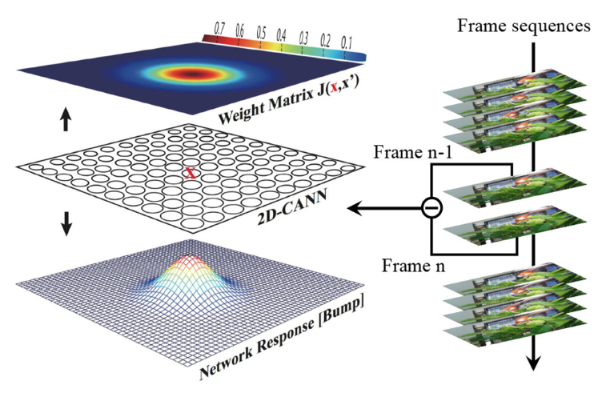
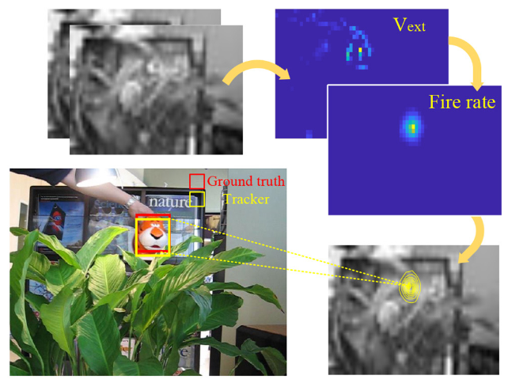

Tiger1数据集目标跟踪
~~~~~~~~~~~~~~~~~~~~~~~~~~~~~~~~~~~~~~~~~~~~~~~~~~~~~~~~~~~~~~~~~~~~~~~~~~~~~~~~~~~~~~~~~~

**数据及预处理**

Tiger1数据集由一段分辨率为640×480的视频构成，该视频共354帧，每一帧均有人工标注的矩形框
(x, y, w, h)作为待跟踪目标的groundtruth，其中x, y为矩形框的左上角坐标，w,h分别为矩形框
的宽和高。视频中，有光照度变化，待跟踪目标存在被阻挡情况，存在目标发生形变情况，存在目
标动作模糊情况，存在目标在平面内及平面外旋转的情况。

为节省图形内存，我们将每一帧彩色图像先转换为灰度图像，然后下采样至30×56分辨率。

**网络模型**

此任务中用到的网络模型是连续吸引子网络（CANN），是一种受神经科学启发的模型。如下图所示，
x为二维平面上的坐标位置，\ :math:`V(x,\ t)`\ 为位置x和时间t的神经元的膜电位，

.. _fig_23:

   图 CANN原始动态模型示意图

.. _fig_24:

   图 基于CANN的对象跟踪实例

r(x,t)为该神经元的发射率。有理由认为，\ :math:`r(x,\ t)`\ 随着\ :math:`V(x,\ t)`\ 
的增加而增加，但在存在全局抑制的情况下达到饱和。满足这一特性的模型可表示为：

.. math::
   
   \begin{array}{r}
   r(x,t) = \frac{V^{2}(x,t)}{1 + k\int_{- \infty}^{+ \infty} V^{2}\left( x',t \right) dx'}  \ \ \ \ (1)
   \end{array}
   
其中k是一个小的正超参数，控制全局抑制的强度。

在CANN模型中，\ :math:`V(x,\ t)`\ 是由外部刺激和来自其他神经元的递归输入以及其自身的
松弛度决定的。用\ :math:`V_{ext}(x,t)`\ 表示在时间t对神经元x的外部刺激，则该模型可表
示为：

.. math::
   
   \begin{array}{r}
   \tau\frac{\partial V(x,t)}{\partial t} = - V(x,t) + \beta\int_{- \infty}^{+ \infty} J\left( x,x' \right)r\left( x',t \right) dx' + V_{ext}(x,t)  \ \ \ \ (2)
   \end{array}

其中\ :math:`\tau`\ 是一个时间常数，通常在1毫秒的量级，\ :math:`\beta`\ 决定了循环输入
和外部刺激之间的比例。\ :math:`J\left( x,x^{'} \right)`\ 是位于\ :math:`x^{'}`\ 位置的
神经元与位于\ :math:`x`\ 位置的神经元之间的相互作用（突触权重）。
\ :math:`J\left( x,x^{'} \right)`\ 计算如下：

.. math::

   \begin{array}{r}
   J\left( x,x^{'} \right) = \frac{J_{0}}{2\pi a^{2}}e^{- \frac{\left| x - x^{'} \right|^{2}}{2a^{2}}}
   \end{array}

其中\ :math:`J_{0}`\ 是一个常数，\ :math:`a`\ 表示高斯交互作用范围，
\ :math:`|x - x^{'}|`\ 表示神经元\ :math:`x`\ 和\ :math:`x^{'}`\ 
\ :math:`\frac{J_{0}}{2\pi a^{2}}`\ 是最大的交互范围。上述公式对具有平移不变性的突触
模式（凸起形状）编码，产生类似的由神经元的高放电率表示的响应凸起模式。响应凸起可以预
示对象的位置。此外，神经元距离是圆形的，这意味着最顶部和底部的神经元以及最左侧和最右
侧的神经元作为相邻神经元连接。这种对称性保证了边界处的凸起稳定性。

如 :ref:`fig_23` 所示，来自视频的每两个相邻帧的差分信号被注入网络作为外部刺激
\ :math:`V_{ext}(x,t)`\ ，每个神经元接收2D差分帧中相应像素的强度。CANN能够平滑地跟踪
对象，因为连续的神经动力学导致响应凸起的移动轨迹是平滑的。轨迹有如下特性：

- 在没有外部刺激的情况下，网络仍然可以通过循环注入保持固定的响应凸起；
- 在存在物体的情况下，尤其是连续移动的物体，网络可以根据移动目标平滑地改变其响应凸起。
  :ref:`fig_24` 展示了一个基于CANN的对象跟踪实例，红色边界框是物体位置的金标准，响应
  凹凸表示的黄色边界框反映了预测的位置。

由于远程连接通常对神经元膜电位和发射率的影响很小，同时为了更方便在数字电路实现，
公式(2)可在没太多精度损失的情况下表示为：

.. math::

   \begin{array}{r}
   J\left( x,x^{'} \right) = \left\{ \begin{array}{r}
   \frac{J_{0}}{2\pi a^{2}}e^{- \frac{\left| x - x^{'} \right|^{2}}{2a^{2}}},\ if\ neuron\ x^{'} \in CF(x,\ R) \\
   0,\ otherwise
   \end{array} \right.\ 
   \end{array}

其中\ :math:`x^{'} \in CF(x,\ R)`\ 表示每个神经元x只与以x为中心的R×R矩形区域内的邻近
神经元有局部联系。

由于数字电路不能直接支持公式(1)和公式(2)中的连续微分动力学，
可采用迭代状态更新方法，将连续动力学离散为等效的差分方程。通过设置τ=1和∂t=1，CANN的连续
状态更新可以被修改为迭代版本的。

.. math::

   \begin{array}{r}
   \left\{ \begin{array}{r}
   V(x,t + 1) = \beta\sum_{x^{'} \in CF}^{}{J\left( x,x^{'} \right)r\left( x^{'},t \right)} + V_{ext}(x,t) \\
   r(x,t + 1) = \frac{V^{2}(x,t + 1)}{k\sum_{x^{'}}^{}{V^{2}\left( x^{'},t + 1 \right)}}
   \end{array} \right.\  \ \ \ \ (3)
   \end{array}

因此，整个计算数据流变成了\ :math:`\{ r(x,\ t)\ \&\ Vext(x,\ t)\}\  \Rightarrow \ V(x,\ t\  + \ 1)\  \Rightarrow \ r(x,\ t\  + \ 1)\  \Rightarrow \ ...`\ 。
通过这一离散化过程，平面连续吸引子模型可在数字电路上通过迭代实现。

为了更好地理解将CANN拓扑结构映射到多核NN架构上的过程，我们将差分方程公式(3)的
每个迭代分解为以下5个步骤：

循环输入：

.. math:: V_{1}(x,t + 1) = \beta\sum_{x^{'} \in CF}^{}{J\left( x,x^{'} \right)r\left( x^{'},t \right)}

1. 膜电位：

   .. math:: V(x,t + 1) = V_{1}(x,t + 1) + V_{ext}(x,t)

2. 电位平方：

   .. math:: V^{2}(x,t + 1) = V(x,t + 1) \cdot V(x,t + 1)

3. 抑制因子：

   .. math:: s_{inh}(t + 1) = \frac{1}{k\sum_{x^{'}}^{}{V^{2}\left( x^{'},t + 1 \right)}}

4. 发放率：

   .. math:: r(x,t + 1) = V^{2}(x,t + 1) \cdot s_{inh}(t + 1)