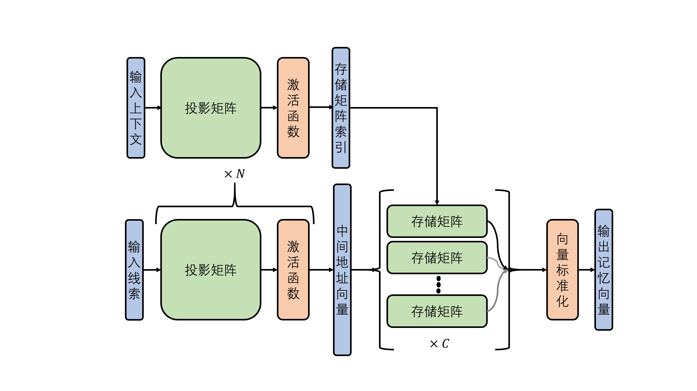

**设计目标**

实现一个分布式的、存储空间相对固定的、基于神经网络的联想记忆存储模型，存储向量元组，具有一定的抗噪能力，对不完整输入可做一定程度补全，并且读取误差尽量小，存储操作不基于误差反向传播。

**实现方案**

主要由三个模块组成，如下图所示。

   图 联想记忆模型基本结构

其中：

- 投影模块，将输入线索线性变换到更高维空间，并通过非线性激活函数产生中间地址向量，增加稀疏度和可分性。通过叠加多层，产生参数量一定条件下更好的投影效果，共层。
- 存储模块，将线索与输出记忆向量的对应关系存储到线性变换中，读取的记忆向量做标准化后输出为。存储模块由多个存储矩阵并联组成。
- 基于context的存储矩阵索引产生模块，共个。该模块实现与地址产生相似，也可以扩展到多层。可配置为选择输出唯一索引或多个索引。

变量维度：

   :math:`x`\ 维度\ :math:`m \times 1`\ ，\ :math:`W_{p,j}`\ 维度\ :math:`\left\{ m_{1} \times m,m_{2} \times m_{1},..\ .\ ,l \times m_{j - 1} \right\}`\ ，\ :math:`h`\ 维度\ :math:`l \times 1`\ ，\ :math:`W_{m,q}`\ 维度\ :math:`n \times l`\ ，\ :math:`y`\ 维度\ :math:`n \times 1`\ ，\ :math:`W_{c}`\ 维度\ :math:`C \times p`\ ，上下文索引维度\ :math:`p \times 1`\ 。

变量要求：

   输入\ :math:`x`\ 、上下文\ :math:`c`\ ，输出\ :math:`y`\ 需要标准化。

存储过程：

   给定待存储序列\ :math:`\left\{ \left( x_{i},c_{i},y_{i} \right) \right\}`

   1. 地址投影矩阵的更新方式，现给出如下两种方式：

      a. 采用高斯随机初始化并保持固定,叠加多层，\ **默认采用该方式**\ 。
      b. 初始化为全零矩阵，在存储过程中按照如下方式更新：

      .. math:: W_{p} \leftarrow W_{p} + \lambda_{i}{\widehat{h}}_{i}x_{i}^{T}

      .. math:: {\widehat{h}}_{i} = f(u)

      其中，\ :math:`u`\ 是与\ :math:`h`\ 维度相同的向量，各元素服从
      \ :math:`\lbrack 0,1\rbrack`\ 均分分布。\ :math:`f`\ 可选用top_k函数，其输出维度与其输入相同，top_k元素处取值为1，其他元素取值为0。k取值决定了稀疏程度。越稀疏，则不同存储内容的干扰小，但抗噪性能差。

   2. 存储矩阵索引生成模块的投影矩阵的更新方式：采用与地址生成的矩阵更新方式（2）相同的随机投影方式，输出为one-hot向量，指示了存储矩阵的索引。

   3. 存储矩阵的更新方式：

      存储\ :math:`\left( x_{i},c_{i},y_{i} \right)`\ 时，存储矩阵的更新方式如下所示：

      .. math:: W_{m,q} \leftarrow W_{m,q} + \eta_{i}y_{i}h_{i}^{T}

      .. math:: h_{i} = f\left( W_{p}\left( x_{i} \right) \right)

      .. math:: W_{p}\left( x_{i} \right) = W_{p,j - 1}\ldots W_{p,1}x_{i}

      .. math:: q = \underset{q}{argmax}{{e_{q}^{T}W}_{c}c_{i}}

      其中，\ :math:`e_{q}`\ 表示第\ :math:`q`\ 维为1、其他维度为0的单位列向量。学习
      率\ :math:`\eta_{i},\lambda_{i}`\ 影响了存储的强度。

读取过程：

   给定输入线索\ :math:`x_{k}`\ ，读出记忆向量如下：

   .. math:: q = \underset{q}{argmax}{{e_{q}^{T}W}_{c}c_{k}}

   .. math:: {\widehat{y}}_{k} = norm\left( W_{m,q}f\left( W_{p}\left( x_{k} \right) \right) \right)

遗忘过程：

   存储器的遗忘通过输出标准化间接实现，随着新存储内容的增加和相同存储内容的重复写入，存储内容的相对权重（学习率）会发生变化，权重占比变小的存储内容将会随之被动遗忘。

评估方式：

   1. 顺序存储\ **序列**\ :math:`\left\{ \left( x_{i},{c_{i},y}_{i} \right) \right\}`\ ，后评估各线索召回的记忆向量的相对畸变程度均值error，如下式计算：

      .. math:: error\mathbb{= E}\left\lbrack \left\| \widehat{y} - y \right\|_{2} \right\rbrack

   2. 顺序存储序列\ :math:`\left\{ \left( x_{i},c_{i},y_{i} \right) \right\}`\ ，后评估各线索召回的准确率，即若\ :math:`x_{i}`\ 召回的结果\ :math:`{\widehat{y}}_{i}`，与\ :math:`y_{i}`\ 相似度最高，则认为是正确的召回。

      .. math:: acc\mathbb{= E}\left\lbrack \mathbb{l}\left\lbrack \underset{y_{j}}{argmax}{y_{j}{\widehat{y}}_{i}^{T}} = = y_{i} \right\rbrack \right\rbrack

      其中，\ :math:`\mathbb{l}\lbrack s\rbrack`\ 是指示函数，\ :math:`s`\ 成立，则其值为1，否则为0。

**编译部署**

以上联想记忆模型可以编译部署到KA200芯片上，完成记忆和召回操作。我们基于Lyngor算子搭建了等效的计算图，给出了一种适用于编译的联想记忆模型实现，具体参数和结构可配置。该编译结果的主要特点如下：

1. 将记忆过程的计算图和召回过程的计算图统一，通过调节学习率lr来区分。当lr为0时表示进行召回操作，不修改记忆矩阵。当lr非0时，进行记忆操作。
2. 当前版本的编译工具对按索引赋值操作支持欠佳，需用等效算子实现，涉及到lyn.apu.recast，lyn.apu.elm_sub，lyn.apu.Dswap等算子，详见《Lyngor用户指南》和示例代码。
3. 记忆矩阵是记忆模型的状态量，需要进行存储，这涉及到lyn.apu.load，lyn.apu.save等算子。