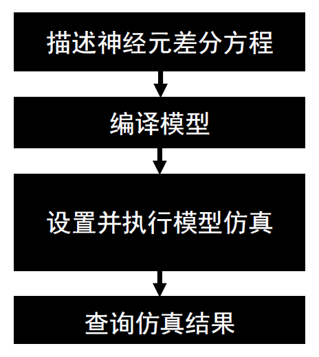
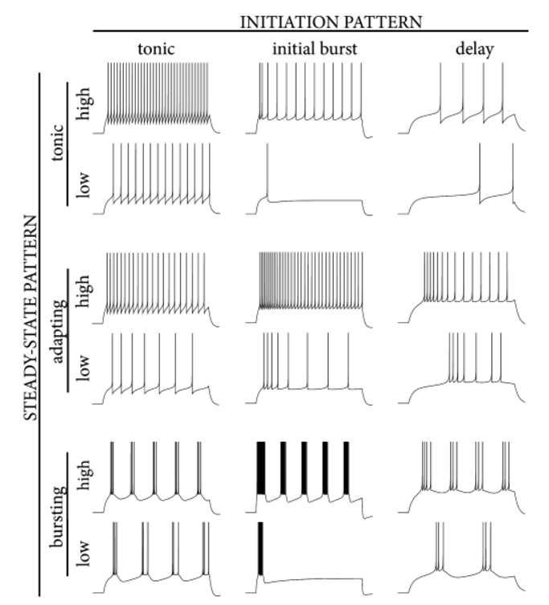
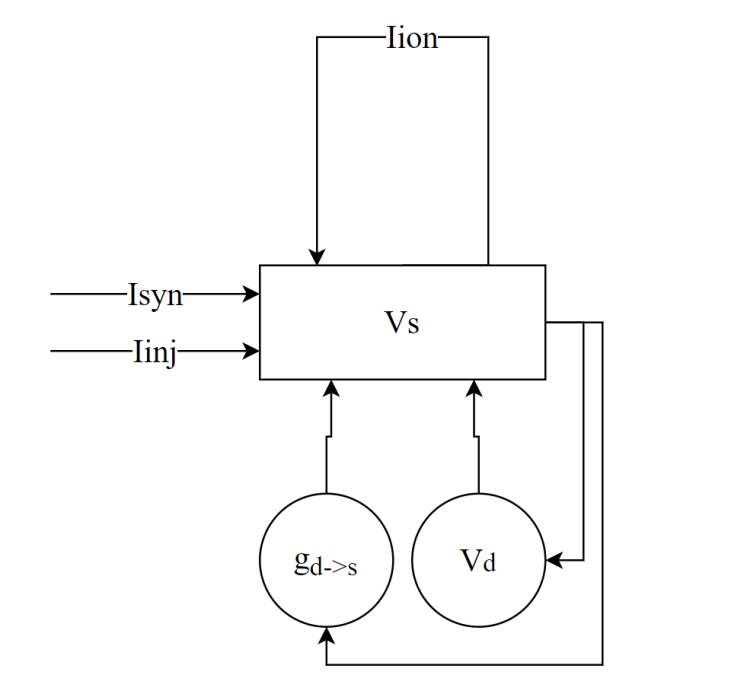
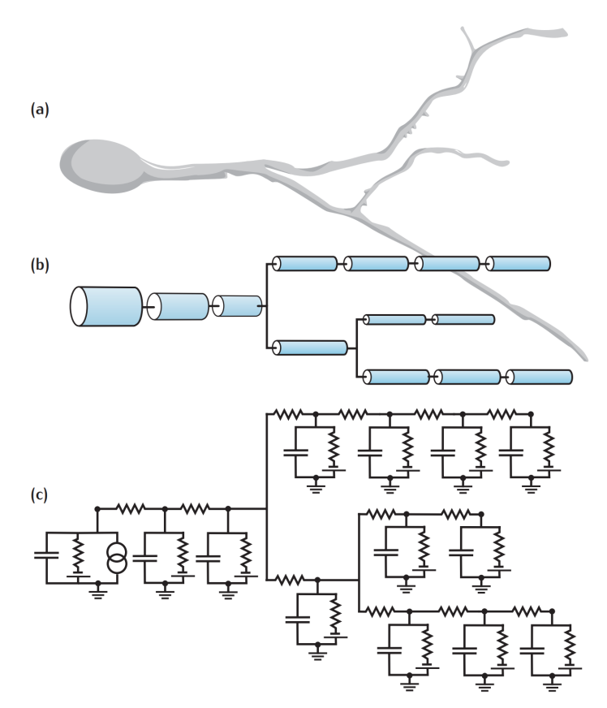
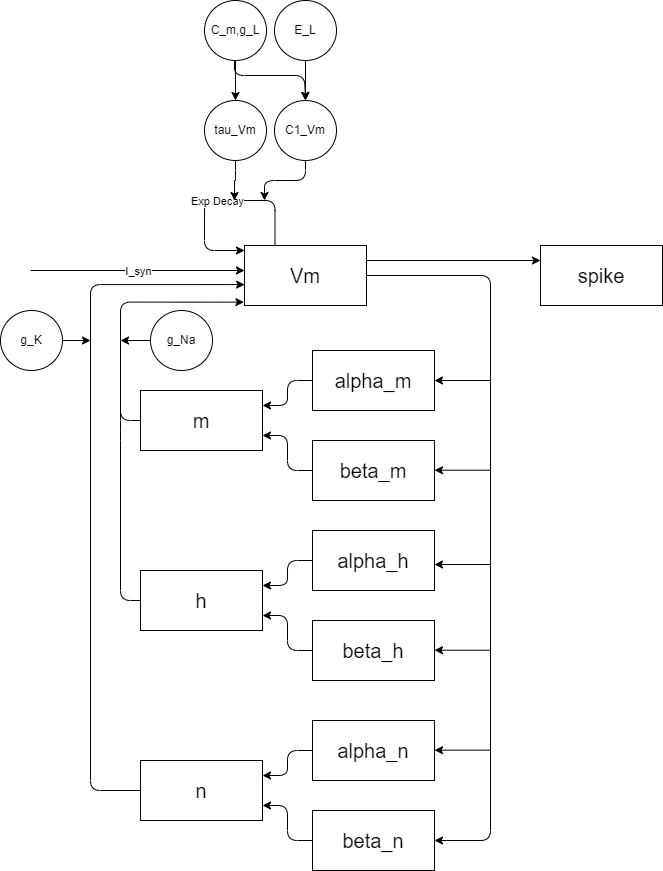
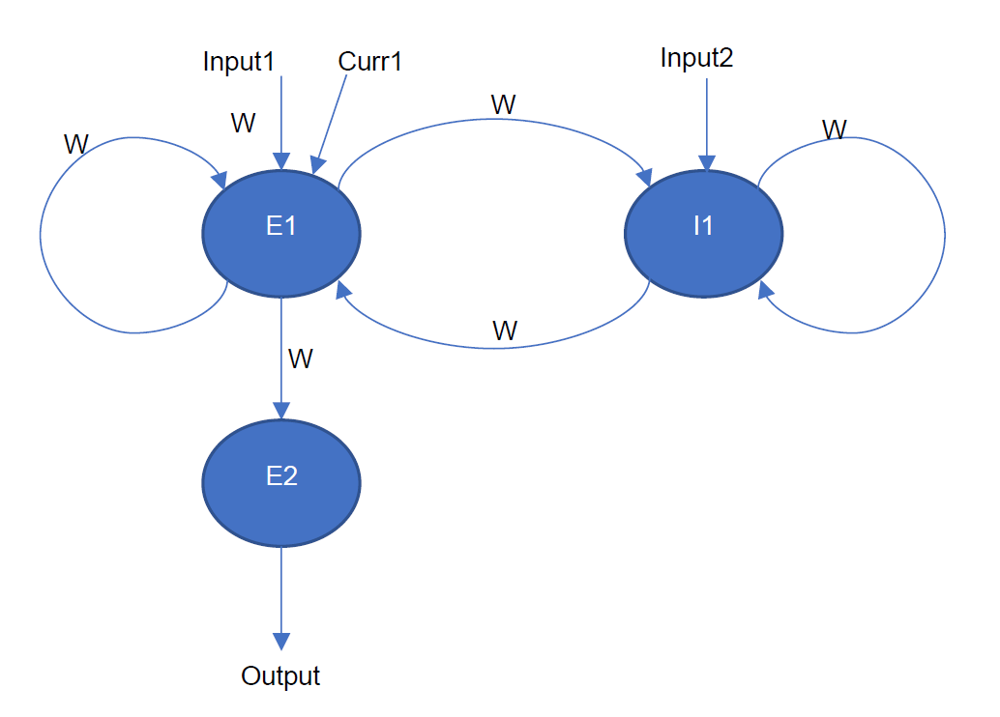
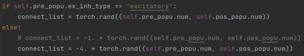
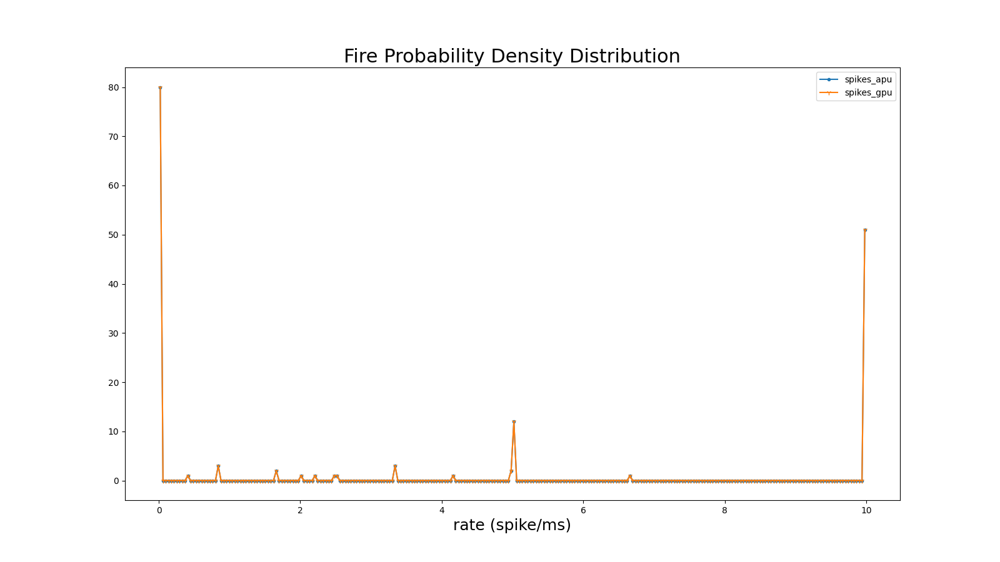
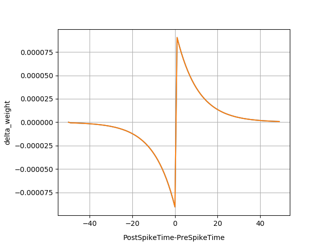

自定义神经元仿真工具
=========================================================================================

本章节主要介绍如何采用灵汐类脑计算平台进行神经元仿真，包括神经元仿真原理及特点，功能特性、仿真范围、仿真流程、典型神经元仿真案例等内容。

自定义神经元仿真工具主要支持以下功能：

- 支持采用Pytorch语言构建神经元簇，用于仿真一簇或多簇神经元的动力学特性；
- 支持构建LIF、Izhikevich、LIF+、AdEx、Hodgkin-Huxley、多房室等神经元模型；
- 支持自定义的新型自定义神经元模型；
- 支持由自定义神经元模型构建的神经网络；
- 支持BP训练（离线）得到最优神经元参数；
- 支持采用Lyngor实现全自动编译，及使用LynSDK进行多时间拍调度及输入、激励源配置；
- 支持发放结果和膜电位结果的分析，如Raster，Fire Rate，CV ISI，Pearson
  Correlation等统计曲线分析及神经元状态信息（如膜电位）的时序变化分析。

.. _limitation:

使用限制
----------------------------------------------------------------------------------------

自定义神经元仿真工具主要针对类脑神经元模型开发，可被仿真的模型需满足如下特性及约束：

- 具有一路或多路电流输入；
- 具有至少一种输出，如脉冲发放输出、膜电位输出；
- 具有多时间拍的运行逻辑；
- 神经元以“簇”为单位进行仿真，簇内包括一个或多个神经元；
- 这些神经元具有差分动力学描述（代码描述）；
- 可明确知道当前时间拍依赖于历史时间拍的状态变量是哪些；
- 神经元差分描述中没有if逻辑（因为if不容易实现向量计算），下文会提供类if的描述方案；
- 神经元差分描述中没有动态循环（循环结束条件由循环体内确定），可以具有静态循环（视作展开）；
- 神经元的描述所需算子在Lyngor支持的Pytorch算子范围内；
- 神经元的所有计算精度和存储精度采用16位浮点；
- 突触结构可表达为全互联结构或简单的神经网络结构。
- 网络输入输出的张量形状约束：输入输出张量采用Pytorch Tensor描述，其shape为[B,D2,D1,D0]，要求包括：

  - 输入的向量总大小（size）小于6MB，或言之小于6M/dsize个数据（若输入为fp32数据类型，则dsize=4，若输入为fp16数据类型，则dsize=2）；
  - D2,D1,D0每个维度不超过4095，B=1；
  - size/D2 <= 256K，相当于D1×D0×dsize <= 256K；
  - 输入具有多个Tensor时，编译器会将其合并为一个大的tensor。当D1，D0都相同时，D2维度合并；D2=1且D0相同时，在D1维度合并，否则会将所有tensor展成一维进行合并。合并后的tensor需要满足上述条件。

- 考虑到使用体验，建议仿真的神经元的总数量在一万个神经元以内。

.. attention::

   当前采用的仿真方式为clock-driven，而不是event-driven，也无法仿真连续动力学模型。

安装目录
----------------------------------------------------------------------------------------

自定义神经仿真工具包位于 *applications/neuralsim/neurons* 目录下，工具包目录结构参见下表。

表 自定义神经元仿真工具安装目录说明

+-----------------------+---------------------------------------------------+
| 目录/文件             | 说明                                              |
+=======================+===================================================+
| snnviz                | 画图的工具包                                      |
+-----------------------+---------------------------------------------------+
| multi_cluster_config  | 多簇模型的配置文件                                |
+-----------------------+---------------------------------------------------+
| multi_cluster_modules | 多簇模式的实现                                    |
+-----------------------+---------------------------------------------------+
| neurontypes           | 神经元的实现。其中：                              |
|                       |                                                   |
|                       | - lif_neuron.py是lif神经元的实现；                |
|                       | - izhikevich.py是izhikevich神经元的实现；         |
|                       | - adex.py是AdEx神经元的实现；                     |
|                       | - hodgkin_huxley.py是HH神经元的实现；             |
|                       | - multicompartment.py是多房室神经元的实现。       |
+-----------------------+---------------------------------------------------+

操作说明
--------------------------------------------------------------------------------

操作流程
~~~~~~~~~~~~~~~~~~~~~~~~~~~~~~~~~~~~~~~~~~~~~~~~~~~~~~~~~~~~~~~~~~~~~~~~~~~~~~~~

自定义神经元仿真工具操作流程如下图所示。

   图 神经元仿真流程图

描述神经元差分方程。采用向量化描述方法，通过Pytorch语言，基于本开发包给出的模板或案例进行描述，只需要描述单个时间拍的迭代过程。

编译模型。使用Lyngor将Pytorch描述的模型结构转化为芯片可执行文件。

设置并执行模型仿真：

1. 设置激励；
2. 调度多个事件拍的模型运算过程；
3. 记录脉冲或膜电位结果。

后分析，如使用统计结果分析及绘图工具分析神经元的发放统计特性。

描述神经元差分方程
~~~~~~~~~~~~~~~~~~~~~~~~~~~~~~~~~~~~~~~~~~~~~~~~~~~~~~~~~~~~~~~~~~~~~~~~~~~~~~~~

采用向量化描述方法，通过Pytorch语言，基于本开发包给出的模板或案例进行描述，只需要描述单个时间拍的迭代过程。

神经元仿真的各步骤描述
^^^^^^^^^^^^^^^^^^^^^^^^^^^^^^^^^^^^^^^^^^^^^^^^^^^^^^^^^^^^^^^^^^^^^^^^^^^^^^^^^

**神经元的微分及差分方程描述**

神经元默认动力学过程是以微分形式描述的，在仿真前，用户首先需要通过近似方法转换为差分方程，通常需要借助求解器或手工推算完成，如采用Euler方法进行求解得到的差分方程。

差分方程中，神经元的运行过程可逐时间拍推演，当前拍的更新依赖于临近的历史时间拍。

各个神经元的微分及差分方程描述请参见 :ref:`case` 中神经元定义部分。

差分方程通常是以一个神经元作为描述的，而为了仿真一簇神经元的特性，可以对一簇神经元进行描述，此时上述方程中的变量可以为向量（一维）、张量（多维），也可以为标量。

下面以LIF神经元为例进行说明。

**神经元簇的描述**

神经元簇的描述采用Pytorch代码（基于给出的参考神经元构建框架代码修改）。

其中变量采用Pytorch Tensor表达，计算过程也是按照Tensor为单位计算的。Tensor为[B, L]形态（用于一维数据处理）或[B, H, W, C]形态(用于图像处理）。其中B为Batch，默认为1。

如上的差分方程描述可转化为如下的代码逻辑：

::

   temp1 = self.v_rest - self.v
   temp2 = self.R \* inpt
   self.v = self.v + self.dt \* temp1 / self.tau_m + temp2
   fire = spike_func(self.v - self.v_th)
   fire_inv = 1. - fire
   self.v = fire \* self.v_reset + fire_inv \* self.v

.. note:: 
   
   神经元中状态变量的存取参考 :ref:`zdysjymx` 。

**神经元的仿真伪代码**

神经元构建时的伪代码：

::

   #init all state variables
   v = initial_value
   
   #loop for all time steps
   for i in range(ts):
      Iinj = Inject stimuli() # can be DC, poisson, etc.
   
   #this part is for compile
   Isyn = synaptic_integration(pre_spike)
   spike = neuron_processing(Iinj, Isyn)
   
   # end of compile
   record_spike.append(spike)
   pre_spike = spike
   analysis_result(record_spike) #plot raster, fire prob. Etc.

编译时的伪代码：

::

   #deifne the model
   Model={
      Isyn = synaptic_integration(pre_spike)
      spike = neuron_processing(Iinj, Isyn)
   }
   #define I/O
   Input = [Isyn, Iinj]
   Output = [spike]

采用LynSDK推理时的伪代码：

::

   #init all state variables
   v = initial_value
   
   #loop for all time steps
   for i in range(ts):
      Iinj = Inject stimuli() # can be DC, poisson, etc.
      copy_to_chip(Iinj)
      Spike = Forward_model(Iinj)
      Copy_to_host(spike)
      record_spike.append(spike)
      pre_spike = spike
      analysis_result(record_spike) #plot raster, fire prob. Etc.

**简易突触结构（加入FC）**

采用Pytorch的算子可以搭建简易的突触结构，如神经元之间全互连：

::
   
   Isyn=torch.mul(spike_pre, syn_weight)

也可以通过slice操作，取出部分输入的脉冲，与当前神经元簇进行连接，如：

::

   Isyn[0:9]=torch.mul(spike_pre[0:9], syn_weight1) + torch.mul(spike_pre[20:29], syn_weight2)

**统计结果分析**

仿真结束后，可采用如下一些典型分析方法，分析神经元特性。下述分析主要用于分析神经元的发放（spike）的群体特性，并且是将APU的分析结果跟CPU或GPU的分析结果绘制在同一张图中。

典型分析方法包括如下四项：

1. 随时间脉冲发放结果

   展示随时间的各神经元的脉冲发放过程。可直观观察神经元的脉冲发放时刻和发放密度。

   .. figure:: _images/随时间脉冲发放结果相关系数.png
      :alt: 随时间脉冲发放结果相关系数

      图 随时间脉冲发放结果相关系数

2. 平均脉冲发放率（Firing Rate）

   平均发放率定义了网络的平均活跃度。定义为：

   .. math:: FR = \frac{n_{sp}}{T}

   其中\ :math:`n_{sp}`\ 表示在时间间隔T内的脉冲事件数量。

   .. figure:: _images/平均脉冲发放率相关系数.png
      :alt: 平均脉冲发放率相关系数

      图 平均脉冲发放率相关系数

3. 脉冲间隔的变异系数（CV ISI）

   脉冲间隔的变异系数即脉冲时间间隔的标准差与均值的比值，此指标分析了脉冲的时间间
   隔特性。定义为：

   .. math:: CV = \frac{\sqrt{\frac{1}{n - 1}\sum_{i = 1}^{n}{({ISI}_{i} - \overline{ISI})}^{2}}}{\overline{ISI}}

   .. math:: {ISI}_{i} = t_{i + 1} - t_{i}

   .. math:: \overline{ISI} = \frac{1}{n}\sum_{i = 1}^{n}{ISI}_{i}

   其中n表示脉冲间隔\ :math:`{ISI}_{i}`\ 的数量，\ :math:`t_{i}`\ 表示某神经元发放
   的第i个脉冲的时间，\ :math:`\overline{ISI}`\ 表示\ :math:`\ ISI`\ 的均值。参考
   （Shinomoto et.al., 2003）。

   .. figure:: _images/CV_ISI相关系数.png
      :alt: CV ISI相关系数

      图 CV ISI相关系数

4. 皮尔逊相关系数（Pearson Correlation）分析

   皮尔逊相关系数定义了一个度量，量化了在定义仓位（bin）大小下两个仓位脉冲序列（i，j）
   的时间相关性。

   采用\ :math:`b_{i}`\ 表示脉冲序列，\ :math:`u_{i}`\ 表示其均值。脉冲序列\ :math:`b_{i}`\ 
   和\ :math:`j`\ 之间的相关系数表示为：

   .. math:: C\lbrack i,j\rbrack = \frac{{< b}_{i} - u_{i},b_{j} - u_{j} >}{\sqrt{{< b}_{i} - u_{i},b_{i} - u_{i} > \bullet {< b}_{j} - u_{j},b_{j} - u_{j} >}}

   其中，<,>表示点乘。例如对于长度N的脉冲序列，可以得到NxN的相关矩阵，用该矩阵非对角线
   元素的分布表示Pearson相关性。参考（Gruen, 2010）。

   .. figure:: _images/皮尔逊相关系数.png
      :alt: 皮尔逊相关系数

      图 皮尔逊相关系数

神经元模型代码构建的一些说明
^^^^^^^^^^^^^^^^^^^^^^^^^^^^^^^^^^^^^^^^^^^^^^^^^^^^^^^^^^^^^^^^^^^^^^^^^^^^^^^^^

典型神经元业务逻辑的表达方式包括：

**如何表示判断逻辑**

由于KA200采用基于Tensor的计算逻辑，因此判断逻辑是针对变量整体而非每个元素的。分为两种情况：

判断逻辑的条件为编译阶段的常量，如属性变量，比如：

::

   if self.on_apu:
      fire = ops.custom.cmpandfire(self.v.clone(), self.theta)
   else:
   v_ = self.v - self.theta
   fire = v_.gt(0.).float()

其中 ``self.on_apu`` 是一个开关属性。在编译时，开关属性已确定，Lyngor会按照此开关属性进行计算图构建并编译，即编译时只会编译这个属性开关（判断条件）为真的这个支路，而忽略掉属性开关不指向的其他支路。Lyngor可以支持此类编译。编译阶段，如果判断逻辑不明确，可以为标量或向量，如输入到神经元的变量：

::

   if(self.v - self.theta > 0.):
   self.v = self.v_0
   else:
   self.v = self.v.clone()

则需要改写为如下向量形式可完成编译：

::

   v_ = self.v - self.theta
   fire = v_.gt(0.).float()
   fire_inv = 1. - fire
   self.v = fire * self.v_0 + fire_inv * self.v.clone()

当 ``self.v`` 与 ``self.theta`` 维度不等时，支持自动广播成维度相等变量后，再进行计算。

**如何表示循环**

如果编译时循环条件已确定，该循环会被展开。例如：

::

   for i in range(3):
      layers.append(block(co, co, noise=noise))

会被展开为如下表达：

::

   layers.append(block(co, co, noise=noise))
   layers.append(block(co, co, noise=noise))
   layers.append(block(co, co, noise=noise))

循环条件是动态的情况，将于后续版本支持，当前不支持。

**效率优化方法**

神经元通常具有复位和decay计算，灵汐类脑计算芯片支持底层加速指令，例如当复位和衰减逻辑为如下表达时：

::

   V = (V>=Vth) ? Vreset: Vin
   V = alpha * V + beta

则通过如下自定义函数，可加速复位和衰减过程：

::

   V = ops.custom.resetwithdecay(V.clone(), Vth, Vreset, lpha, beta)

模型编译和推理
~~~~~~~~~~~~~~~~~~~~~~~~~~~~~~~~~~~~~~~~~~~~~~~~~~~~~~~~~~~~~~~~~~~~~~~~~~~~~~~~

编译和推理过程以及具体的代码实现流程参考 :ref:`build-and-install` ，但有一些地方需要注意：

先定义b,n,t,c,h,w，即测试数据的batch（对于APU推理来说，batch固定为1）。神经元规模限制说明参见 :ref:`limitation` 。

每个batch中样本的个数、每个样本的时间拍个数、以及每拍数据的c、h、w这三个维度数据的大小。

input_data = torch.randn(b,n,t,c,h,w)，即随机设置输入值。对于神经元来说，这些input是外部DC输入，如果要控制脉冲发放，可以尝试修改外部DC的值大大小。

出厂案例执行脚本汇总
~~~~~~~~~~~~~~~~~~~~~~~~~~~~~~~~~~~~~~~~~~~~~~~~~~~~~~~~~~~~~~~~~~~~~~~~~~~~~~~~

通过GPU/CPU执行
^^^^^^^^^^^^^^^^^^^^^^^^^^^^^^^^^^^^^^^^^^^^^^^^^^^^^^^^^^^^^^^^^^^^^^^^^^^^^^^^^

+----------------+---------------------------------------------------------+
| 神经元模型     | 执行脚本                                                |
+================+=========================================================+
| lif            | python3 test.py \-\-neuron lif \-\-use_lyngor 0         |
|                | \-\-use_legacy 0 \-\-use_gpu 1 \-\-plot 0               |
+----------------+---------------------------------------------------------+
| adex           | python3 test.py \-\-neuron adex \-\-use_lyngor 0        |
|                | \-\-use_legacy 0 \-\-use_gpu 1 \-\-plot 0               |
+----------------+---------------------------------------------------------+
| izhikevich     | python3 test.py \-\-neuron izhikevich \-\-use_lyngor 0  |
|                | \-\-use_legacy 0 \-\-use_gpu 1 \-\-plot 0               |
+----------------+---------------------------------------------------------+
| 多房室神经元   | python3 test.py \-\-neuron multicompartment             |
|                | \-\-use_lyngor 0 \-\-use_legacy 0 \-\-use_gpu 1         |
|                | \-\-plot 0                                              |
+----------------+---------------------------------------------------------+
| Hodgkin-Huxley | python3 test.py \-\-neuron hh \-\-use_lyngor 0          |
|                | \-\-use_legacy 0 \-\-use_gpu 1 \-\-plot 0               |
+----------------+---------------------------------------------------------+
| 多簇模型       | python3 test.py \-\-neuron multicluster                 |
|                | \-\-use_lyngor 0 \-\-use_legacy 0 \-\-use_gpu 1         |
|                | \-\-plot 0                                              |
+----------------+---------------------------------------------------------+

通过灵汐类脑计算设备执行
^^^^^^^^^^^^^^^^^^^^^^^^^^^^^^^^^^^^^^^^^^^^^^^^^^^^^^^^^^^^^^^^^^^^^^^^^^^^^^^^^

+----------------+---------------------------------------------------------+
| 神经元模型     | 执行脚本                                                |
+================+=========================================================+
| lif            | python3 test.py \-\-neuron lif \-\-use_lyngor 1         |
|                | \-\-use_legacy 0 \-\-use_gpu 0 \-\-plot 0               |
+----------------+---------------------------------------------------------+
| adex           | python3 test.py \-\-neuron adex \-\-use_lyngor 1        |
|                | \-\-use_legacy 0 \-\-use_gpu 0 \-\-plot 0               |
+----------------+---------------------------------------------------------+
| izhikevich     | python3 test.py \-\-neuron izhikevich \-\-use_lyngor 1  |
|                | \-\-use_legacy 0 \-\-use_gpu 0 \-\-plot 0               |
+----------------+---------------------------------------------------------+
| 多房室神经元   | python3 test.py \-\-neuron multicompartment             |
|                | \-\-use_lyngor 1 \-\-use_legacy 0 \-\-use_gpu 0         |
|                | \-\-plot 0                                              |
+----------------+---------------------------------------------------------+
| Hodgkin-Huxley | python3 test.py \-\-neuron hh \-\-use_lyngor 1          |
|                | \-\-use_legacy 0 \-\-use_gpu 0 \-\-plot 0               |
+----------------+---------------------------------------------------------+
| 多簇模型       | python3 test.py \-\-neuron multicluster                 |
|                | \-\-use_lyngor 1 \-\-use_legacy 0 \-\-use_gpu 0         |
|                | \-\-plot 0                                              |
+----------------+---------------------------------------------------------+

通过灵汐类脑计算设备执行且使用历史编译生成物
^^^^^^^^^^^^^^^^^^^^^^^^^^^^^^^^^^^^^^^^^^^^^^^^^^^^^^^^^^^^^^^^^^^^^^^^^^^^^^^^^

+----------------+------------------------------------------------------------+
| 神经元模型     | 执行脚本                                                   |
+================+============================================================+
| lif            | python3 test.py \-\-neuron lif \-\-use_lyngor 1            |
|                | \-\-use_legacy 1 \-\-use_gpu 0 \-\-plot 0                  |
+----------------+------------------------------------------------------------+
| adex           | python3 test.py \-\-neuron adex \-\-use_lyngor 1           |
|                | \-\-use_legacy 1 \-\-use_gpu 0 \-\-plot 0                  |
+----------------+------------------------------------------------------------+
| izhikevich     | python3 test.py \-\-neuron izhikevich \-\-use_lyngor 1     |
|                | \-\-use_legacy 1 \-\-use_gpu 0 \-\-plot 0                  |
+----------------+------------------------------------------------------------+
| 多房室神经元   | python3 test.py \-\-neuron multicompartment \-\-use_lyngor |
|                | 1 \-\-use_legacy 1 \-\-use_gpu 0 \-\-plot 0                |
+----------------+------------------------------------------------------------+
| Hodgkin-Huxley | python3 test.py \-\-neuron hh \-\-use_lyngor 1             |
|                | \-\-use_legacy 1 \-\-use_gpu 0 \-\-plot 0                  |
+----------------+------------------------------------------------------------+
| 多簇模型       | python3 test.py \-\-neuron multicluster \-\-use_lyngor 1   |
|                | \-\-use_legacy 1 \-\-use_gpu 0 \-\-plot 0                  |
+----------------+------------------------------------------------------------+

通过GPU/CPU以及灵汐类脑计算设备执行
^^^^^^^^^^^^^^^^^^^^^^^^^^^^^^^^^^^^^^^^^^^^^^^^^^^^^^^^^^^^^^^^^^^^^^^^^^^^^^^^^

+----------------+---------------------------------------------------------------+
| 神经元模型     | 执行脚本                                                      |
+================+===============================================================+
| lif            | python3 test.py \-\-neuron lif \-\-use_lyngor 1               |
|                | \-\-use_legacy 0 \-\-use_gpu 1 \-\-plot 0                     |
+----------------+---------------------------------------------------------------+
| adex           | python3 test.py \-\-neuron adex \-\-use_lyngor 1              |
|                | \-\-use_legacy 0 \-\-use_gpu 1 \-\-plot 0                     |
+----------------+---------------------------------------------------------------+
| izhikevich     | python3 test.py \-\-neuron izhikevich \-\-use_lyngor 1        |
|                | \-\-use_legacy 0 \-\-use_gpu 1 \-\-plot 0                     |
+----------------+---------------------------------------------------------------+
| 多房室神经元   | python3 test.py \-\-neuron multicompartment \-\-use_lyngor    |
|                | 1 \-\-use_legacy 0 \-\-use_gpu 1 \-\-plot 0                   |
+----------------+---------------------------------------------------------------+
| Hodgkin-Huxley | python3 test.py \-\-neuron hh \-\-use_lyngor 1 \-\-use_legacy |
|                | 0 \-\-use_gpu 1 \-\-plot 0                                    |
+----------------+---------------------------------------------------------------+
| 多簇模型       | python3 test.py \-\-neuron multicluster \-\-use_lyngor 1      |
|                | \-\-use_legacy 0 \-\-use_gpu 1 \-\-plot 0                     |
+----------------+---------------------------------------------------------------+

通过GPU/CPU以及灵汐类脑计算设备执行，并进行脉冲统计曲线图的绘制
^^^^^^^^^^^^^^^^^^^^^^^^^^^^^^^^^^^^^^^^^^^^^^^^^^^^^^^^^^^^^^^^^^^^^^^^^^^^^^^^^

+----------------+------------------------------------------------------------+
| 神经元模型     | 执行脚本                                                   |
+================+============================================================+
| lif            | python3 test.py \-\-neuron lif \-\-use_lyngor 1            |
|                | \-\-use_legacy 0 \-\-use_gpu 1 \-\-plot 1                  |
+----------------+------------------------------------------------------------+
| adex           | python3 test.py \-\-neuron adex \-\-use_lyngor 1           |
|                | \-\-use_legacy 0 \-\-use_gpu 1 \-\-plot 1                  |
+----------------+------------------------------------------------------------+
| izhikevich     | python3 test.py \-\-neuron izhikevich \-\-use_lyngor 1     |
|                | \-\-use_legacy 0 \-\-use_gpu 1 \-\-plot 1                  |
+----------------+------------------------------------------------------------+
| 多房室神经元   | python3 test.py \-\-neuron multicompartment \-\-use_lyngor |
|                | 1 \-\-use_legacy 0 \-\-use_gpu 1 \-\-plot 1                |
+----------------+------------------------------------------------------------+
| Hodgkin-Huxley | python3 test.py \-\-neuron hh \-\-use_lyngor 1             |
|                | \-\-use_legacy 0 \-\-use_gpu 1 \-\-plot 1                  |
+----------------+------------------------------------------------------------+
| 多簇模型       | python3 test.py \-\-neuron multicluster \-\-use_lyngor 1   |
|                | \-\-use_legacy 0 \-\-use_gpu 1 \-\-plot 1                  |
+----------------+------------------------------------------------------------+

在使用多簇模型+STDP时，需执行test_stdp.py脚本，具体配置：

+----------+----------+--------------------------------------------------------+
| 执行设备 | 是否画图 | 执行脚本                                               |
+==========+==========+========================================================+
| 灵汐类脑 | 是       | python3 test_stdp.py \-\-use_lyngor 1                  |
|          |          | \-\-use_legacy 0 \-\-use_gpu 0 \-\-plot 1              |
+----------+----------+--------------------------------------------------------+
| GPU/CPU  | 是       | python3 test_stdp.py \-\-use_lyngor 0 \-\-use_legacy 0 |
|          |          | \-\-use_gpu 1 \-\-plot 1                               |
+----------+----------+--------------------------------------------------------+
| 灵汐类脑 | 否       | python3 test_stdp.py \-\-use_lyngor 1 \-\-use_legacy 0 |
|          |          | \-\-use_gpu 0 \-\-plot 0                               |
+----------+----------+--------------------------------------------------------+
| GPU/CPU  | 否       | python3 test_stdp.py \-\-use_lyngor 0 \-\-use_legacy 0 |
|          |          | \-\-use_gpu 1 \-\-plot 0                               |
+----------+----------+--------------------------------------------------------+

.. _case:

典型案例
--------------------------------------------------------------------------------

LIF模型
~~~~~~~~~~~~~~~~~~~~~~~~~~~~~~~~~~~~~~~~~~~~~~~~~~~~~~~~~~~~~~~~~~~~~~~~~~~~~~~~

**使用场景**

LIF模型结构相对简单，使用场景最为广泛。除了一般的大脑模拟场景外，还多见于理论模型分析，多层SNN学习模型。LIF模型的缺陷在于，此模型过于线性，并缺少神经元中的细节。通常，不会使用一个单独的LIF模型，而是由LIF模型加一简单突触模型构成，我们将以LIF模型+电流输入+指数函数突触+白噪声这种常见的形式为例进行说明。

**模型变量和参数**

LIF模型的变量和参数：

.. csv-table:: 
    :header: 变量, 含义, 类型, 典型值, 常见范围, 常见初始化方法

    :math:`V_{m}` , 神经元膜电位, 状态值, -65, -80~-55, 均一初始化/均匀分布
    :math:`I_{tot}` , 输入电流, 瞬时值/由外界输入, 300, -1000~1000, 置0
    spike, 神经元是否发放脉冲, 瞬时值, 0/1, 0/1, 置0
    
.. csv-table:: 
    :header: 参数, 含义, 常见复用性, 典型值,  常见范围,常见初始化方法

    :math:`C_{m}` , 神经元电容, 组内共用, 250, 100~1000, 均一初始化
    :math:`g_{L}` , 漏电流电导, 组内共用, 25, 0~100, 均一初始化
    :math:`E_{L}` , 漏电流平衡电压, 组内共用, -65, -60~-80, 均一初始化
    :math:`V_{th}`, 发放阈值, 组内共用, -50, -40~-60, 均一初始化
    :math:`V_{reset}`, 发放后重置的电压值, 组内共用, -65, -60~-80, 均一初始化

**模型公式**

LIF模型可以表示为：

.. math:: C_{m}\frac{dV_{m}}{dt} = - g_{L}\left( V_{m} - E_{L} \right) + I_{tot}

.. math:: if{\ \ V}_{m} > V_{th},\ V_{m} = V_{reset}

在仿真前，用户首先需要通过近似方法转换为差分方程，如采用Euler方法进行求解得到的
差分方程如下：

.. math:: V_{m} = V_{m} - g_{L}\left( V_{m} - E_{L} \right) \bullet dt/C_{m} + I_{tot} \bullet dt/C_{m}

即

.. math:: V_{m} = (1 - g_{L} \bullet dt/C_{m})V_{m} + E_{L} \bullet g_{L} \bullet dt/C_{m} + I_{tot} \bullet dt/C_{m}

即

.. math:: V_{m} = \alpha V_{m} + \beta + I_{e}

.. math:: if{\ \ V}_{m} > V_{th},\ V_{m} = V_{reset}

其中\ :math:`\alpha = 1 - g_{L} \bullet dt/C_{m}`\ ，代表乘性泄露系数，
\ :math:`\beta = E_{L} \bullet g_{L} \bullet dt/C_{m}`\ 代表加性泄露系数，
\ :math:`I_{e} = I_{tot} \bullet dt/C_{m}`\ 输入电流。

因此，给出的参考程序代码中，实际给定的输入参数为\ :math:`\alpha`\ ，
\ :math:`\beta`\ ，\ :math:`I_{e}`\ ，\ :math:`V_{reset}`\ （代码中命名为V_0），
\ :math:`V_{th}`\ （代码中命名为theta）及膜电位初始值v_init。

AdEx模型
~~~~~~~~~~~~~~~~~~~~~~~~~~~~~~~~~~~~~~~~~~~~~~~~~~~~~~~~~~~~~~~~~~~~~~~~~~~~~~~~

**使用场景**

AdEx模型的全称是adaptive exponential model，顾名思义，其在LIF模型的基础上加入了指数项，并增加了模型的适应性。这使得AdEx模型可以模拟更加丰富的放电行为，如下图所示。

   图 AdEx模型模拟放电示意图

**模型变量和参数**

各变量和参数的含义及取值如下：

.. csv-table:: 
    :header: 变量, 含义, 类型, 典型值, 常见范围, 常见初始化方法

    :math:`V_{m}` , 神经元膜电位, 状态值, -65, -80~-55, 均一初始化/均匀分布
    :math:`w` , 适应变量, 状态值, 0, 0~100, 均一初始化
    :math:`I` , 输入电流, 瞬时值/由外界输入, 10, 0~100, 置0

.. csv-table:: 
    :header: 参数, 含义, 常见复用性, 典型值, 常见范围, 常见初始化方法

    :math:`V_{rest}` , 静息态膜电位, 组内共用, -70, -75~-65, 均一初始化
    :math:`\mathrm{\Delta}` , 陡峭常数, 组内共用, 2, 1~10, 均一初始化
    :math:`R` , 电阻, 组内共用, 0.5, 0.1~1, 均一初始化
    :math:`V_{th}` , 放电阈值, 组内共用, -50, -50~0, 均一初始化
    :math:`V_{peak}` , 放电峰值, 组内共用, 35, 20~50, 均一初始化

**模型公式**

AdEx模型由两个微分方程构成，具体如下：

.. math:: \tau_{m}\frac{dV_{m}}{dt} = - \left( V_{m} - V_{rest} \right) + \mathrm{\Delta}exp\left( \frac{V_{m} - V_{th}}{\mathrm{\Delta}} \right) - Rw + RI

.. math:: \tau_{w}\frac{dw}{dt} = a\left( V_{m} - V_{rest} \right) - w

.. math:: ifV_{m} \geq V_{peak},\ V_{m} \leftarrow V_{reset},\ w \leftarrow w + b

采用Euler方法进行求解得到的差分方程如下：

.. math:: V_{m} = V_{m} + \frac{dt}{\tau_{m}}( - \left( V_{m} - V_{rest} \right) + \mathrm{\Delta}\exp\left( \frac{V_{m} - V_{th}}{\mathrm{\Delta}} \right) - Rw + RI

.. math:: w = w + \frac{dt}{\tau_{w}}(a\left( V_{m} - V_{rest} \right) - w)

.. math:: if{\ \ V}_{m} > V_{peak},\ V_{m} = V_{reset},\ w = w + b

Izhikevich模型
~~~~~~~~~~~~~~~~~~~~~~~~~~~~~~~~~~~~~~~~~~~~~~~~~~~~~~~~~~~~~~~~~~~~~~~~~~~~~~~~

**使用场景**

Izhikevich模型的计算相对简单，但引入了非线性，使得此模型相比LIF模型具有更丰富的动力学特性。在不同的参数下，可以表现多种脉冲时间响应特性。由此特性，此模型常用与对时间特性较为敏感的类脑模拟模型中，如研究大脑时间节律。

**模型变量和参数**

.. csv-table:: 
   :header: 变量, 含义, 类型, 典型值, 常见范围, 常见初始化方法

   :math:`V_{m}` , 神经元膜电位, 状态值, -65, -80~30, 均一初始化/均匀分布
   :math:`u` , 膜电压恢复变量, 状态值, 0, 0~10, 置0
   spike, 神经元是否发放脉冲, 瞬时值, 0/1, 0/1, 置0

.. csv-table:: 
   :header: 参数, 含义, 常见复用性, 典型值, 常见范围, 常见初始化方法

   a, 衰减常数, 组内复用, 0.02, 0.01~0.02, 均一初始化
   b, 恢复敏感性, 组内复用, 0.2, 0.2, 均一初始化
   c, 重置电压, 组内复用, -55, -55, 均一初始化
   d, 恢复常数, 组内复用, 2, 1~4, 均一初始化

**模型公式**

.. math:: \frac{dV_{m}}{dt} = 0.04V_{m}^{2} + 5V_{m} + 140 - u + I

.. math:: \frac{du}{dt} = a\left( bV_{m} - u \right)

.. math::

   \begin{equation}
   \text{if } V_{m} \geq 30, \text{ then} \begin{cases}
   V_{m} = c \\
   u = u + d
   \end{cases}
   \end{equation}

此处，\ :math:`0.04V_{m}^{2} + 5V_{m} + 140`\ 中的参数为实验拟合所得。

**差分形式：**

.. math:: u = u + \ a\left( bV_{m} - u \right)*\Delta t

.. math:: V_{m} = V_{m} + \left( 0.04V_{m}^{2} + 5V_{m} + 140 - u + I \right)*\Delta t

.. math::

   \begin{equation}
   \text{if } V_{m} \geq 30, \text{ then} \begin{cases}
   V_{m} = c \\
   u = u + d
   \end{cases}
   \end{equation}

多房室神经元模型
~~~~~~~~~~~~~~~~~~~~~~~~~~~~~~~~~~~~~~~~~~~~~~~~~~~~~~~~~~~~~~~~~~~~~~~~~~~~~~~~

**使用场景**

多房室神经元模型旨在模拟生物脑中神经元的真实形态，其包含多个树突，结构较为复杂，计算量较大，因此目前使用场景较少。通常，一个多房室神经元模型可以单独使用，用于研究单个神经元的特性，也可以用多个多房室模型组合成神经网络，用于研究神经环路的特性。一般来说，神经环路中的多房室神经元数量从几个到几千个不等。下面，我们将以单个多房室神经元模型这种常见的形式为例进行说明。

**模型示意图**

   图 多房室神经元模型

**模型变量和参数**

多房室神经元模型的变量和参数（仅列出多房室神经元模型专用参数，其余未列出的与LIF模型和HH模型一致）：

.. csv-table:: 
   :header: 参数, 含义, 常见复用性, 精度需求, 典型值, 常见范围, 常见初始化方法

   :math:`R_{a}` , 轴向电阻率, 组内共用, FP32, 1, 0.1-100, 均一初始化
   :math:`d` , 房室直径, 每个房室是独立的, FP32, 1, 0.1-10, 均一初始化
   :math:`l` , 房室长度, 每个房室是独立的, FP32, 1, 0.1-1000, 均一初始化

**模型公式**

在多房室神经元模型中，神经元被切分成（离散化）很多个彼此相连的圆柱体（房室）。根据对神经元形态刻画的精细程度不同，房室的数量从2个到几千个不等，一般10个左右房室可以刻画神经元的基本形态。神经元形态刻画的精细程度还与信息传递的速度有关，比如A房室和B房室中间间隔了n个房室，则要经过n个时间步才能把信息从A房室传递到B房室，在实际计算中，如果时间步足够小（如0.01 ms），则上述时延对网络的影响是可以忽略不计的。

一般而言，神经元每个branch会有2个分岔，每个分岔上有1-5个房室。每个圆柱体都包含一个RC电路（可用LIF模型或者HH模型来模拟），如下图所示：

多房室神经元模型可以表示为：

.. math:: C_{m}\frac{dV_{s}}{dt} = - \sum_{}^{}I_{ion} - \sum_{i}^{}{g_{d_{i} \rightarrow s}\left( V_{s} - V_{d_{i}} \right)} - I_{syn} + \frac{I_{inj}}{\pi d_{s}l_{s}}

.. math:: C_{m}\frac{dV_{d_{j}}}{dt} = - \sum_{}^{}I_{ion} - g_{s \rightarrow d_{j}}\left( V_{d_{j}} - V_{s} \right) - \sum_{i}^{}{g_{d_{i} \rightarrow d_{j}}\left( V_{d_{j}} - V_{d_{i}} \right)} - I_{syn} + \frac{I_{inj}}{\pi d_{d_{j}}l_{d_{j}}}

在soma的膜电位计算中，\ :math:`V_{s}`\ 是soma的膜电位，\ :math:`\sum_{}^{}I_{ion}`\ 是房室中的离子通道产生的电流（即LIF模型中的\ :math:`g_{L}\left( V_{m} - E_{L} \right)`\ 和HH模型中的\ :math:`- g_{L}\left( V_{m} - E_{L} \right) - g_{Na}m^{3}h\left( V - E_{Na} \right) - g_{K}n^{4}\left( V - E_{k} \right)`\ ），
\ :math:`g_{d_{i} \rightarrow s}`\ 是与soma有连接的树突\ :math:`d_{i}`\ 与soma的连接电导，
\ :math:`V_{d_{i}}`\ 是树突\ :math:`d_{i}`\ 的膜电位，\ :math:`I_{syn}`\ 是突触电流，
\ :math:`I_{inj}`\ 是外部注入的电流（可以为白噪声、斜坡电流、恒定电流等多种形式），
\ :math:`d_{s}`\ 是soma房室的直径，\ :math:`l_{s}`\ 是soma房室的长度。

在树突的膜电位计算中，\ :math:`V_{d_{j}}`\ 是树突\ :math:`d_{j}`\ 的膜电位，
\ :math:`\sum_{}^{}I_{ion}`\ 是房室中的离子通道产生的电流（即LIF模型中的
\ :math:`g_{L}\left( V_{m} - E_{L} \right)`\ 和HH模型中的
\ :math:`- g_{L}\left( V_{m} - E_{L} \right) - g_{Na}m^{3}h\left( V - E_{Na} \right) - g_{K}n^{4}\left( V - E_{k} \right)`\ ），
\ :math:`g_{s \rightarrow d_{j}}`\ 是soma与树突\ :math:`d_{j}`\ 的连接电导（如果该树突与soma不直接相连，则该项为0），\ :math:`g_{d_{i} \rightarrow d_{j}}`\ 是与树突\ :math:`d_{j}`\ 有连接的树突\ :math:`d_{i}`\ 与soma的连接电导，\ :math:`V_{d_{i}}`\ 是树突\ :math:`d_{i}`\ 的膜电位，\ :math:`I_{syn}`\ 是突触电流，\ :math:`I_{inj}`\ 是外部注入的电流（可以为白噪声、斜坡电流、恒定电流等多种形式），\ :math:`d_{d_{j}}`\ 是树突\ :math:`d_{j}`\ 房室的直径，
\ :math:`l_{d_{j}}`\ 是树突\ :math:`d_{j}`\ 房室的长度。

房室i对房室j的连接电导计算如下：

.. math:: g_{i \rightarrow j} = \frac{1}{2R_{a}\left( \frac{l_{i}}{{d_{i}}^{2}} + \frac{l_{j}}{{d_{j}}^{2}} \right)d_{j}l_{j}}

其中\ :math:`R_{a}`\ 是轴向电阻率。

Hodgkin-Huxley模型（HH_PSC_ALPHA）
~~~~~~~~~~~~~~~~~~~~~~~~~~~~~~~~~~~~~~~~~~~~~~~~~~~~~~~~~~~~~~~~~~~~~~~~~~~~~~~~

**使用场景**

HH模型中包括对多种离子通道的建模，其模型方程设计可以和通道蛋白的结构一一对应。在数学上，构成了一套特殊的动力系统，具有多种状态。HH模型的特点是：

- 具有丰富的阈值下动力学特征；
- 模拟了脉冲的形状和发放过程；
- 具有更好的生物可解释性。

这些特点，使得HH模型常用于更加注重分子生物学原理的大脑模拟模型中。如，新发现的某种蛋白，研究其对神经元活动的影响，可以构建以HH模型为基础神经元模型，研究其动力学特征。

.. attention::

   此模型目前处于实验版本阶段，由于芯片采用FP16精度，因此仿真精度有限，尚不能用于高精度仿真场合。

**模型示意图**

经典的HH模型包含一种钠离子通道和一种钾离子通道，示意图如下：

   图 HH模型计算流程示意图

**模型变量和参数**

.. csv-table:: 
   :header: 变量, 含义, 类型, 典型值, 常见范围, 常见初始化方法

   :math:`V_{m}` , 神经元膜电位, 状态值, -65, -80~-55, 均一初始化/均匀分布
   m, 钠离子通道蛋白1打开比率, 状态值, 0.1, 0~1（严格满足）, 均一初始化/置0
   :math:`\alpha_{m}` , 使m蛋白打开的速率, 瞬时值, 0.5,  0~20,置0
   :math:`\beta_{m}` , 使m蛋白关闭的速率, 瞬时值, 0.5, 0~100, 置0
   h, 钠离子通道蛋白2打开比率, 状态值, 0.1, 0~1（严格满足）, 均一初始化/置0
   :math:`\alpha_{h}` , 使h蛋白打开的速率, 瞬时值, 0.5, 0~100, 置0
   :math:`\beta_{h}` , 使h蛋白关闭的速率, 瞬时值, 0.5, 0~100, 置0
   n, 钾离子通道蛋白打开比率, 状态值, 0.1, 0~1（严格满足）, 均一初始化/置0
   :math:`\alpha_{n}` , 使n蛋白打开的速率, 瞬时值, 0.5, 0~100, 置0
   :math:`\beta_{nh}` , 使n蛋白关闭的速率, 瞬时值, 0.5, 0~100, 置0
   spike, 神经元是否发放脉冲, 瞬时值, 0/1, 0/1, 置0

.. csv-table:: 
   :header: 参数, 含义, 常见复用性, 典型值, 常见范围, 常见初始化方法

   :math:`C_{m}` , 神经元电容, 组内共用, 100, 此模型常用典型值, 均一初始化
   :math:`g_{L}` , 漏电流电导, 组内共用, 30, 此模型常用典型值, 均一初始化
   :math:`E_{L}` , 漏电流平衡电压, 组内共用, -54.4, 此模型常用典型值, 均一初始化
   :math:`g_{Na}` , 钠离子通道最大电导, 组内共用, 12000, 此模型常用典型值, 均一初始化
   :math:`E_{Na}` , 钠离子通道平衡电压, 组内共用, 50, 此模型常用典型值, 均一初始化
   :math:`g_{K}` , 钾离子通道最大电导, 组内共用, 3600, 此模型常用典型值, 均一初始化
   :math:`E_{K}` , 钾离子通道平衡电压, 组内共用, -77, 此模型常用典型值, 均一初始化

**模型公式**

.. math::

   \begin{array}{r}
   C_{m}\frac{dV_{m}}{dt} = - g_{L}\left( V_{m} - E_{L} \right) - g_{Na}m^{3}h\left( V - E_{Na} \right) - g_{K}n^{4}\left( V - E_{k} \right)
   \end{array}

.. math::

   \begin{array}{r}
   \frac{dm}{dt} = \alpha_{m}(1 - m) - \beta_{m}m
   \end{array}

.. math::

   \begin{array}{r}
   \alpha_{m} = 0.1\left( \frac{V_{m} + 40}{1 - \exp\left( - \left( V_{m} + 40 \right)\text{/10} \right)} \right)
   \end{array}

.. math::

   \begin{array}{r}
   \beta_{m} = 4\exp\left( - (V + 65)\text{/18} \right)
   \end{array}

.. math::

   \begin{array}{r}
   \frac{dh}{dt} = \alpha_{h}(1 - h) - \beta_{h}h
   \end{array}

.. math::

   \begin{array}{r}
   \alpha_{h} = 0.07\exp\left( - (V + 65)\text{/20} \right)
   \end{array}

.. math::

   \begin{array}{r}
   \beta_{h} = \frac{1}{\exp\left( - (V + 35)\text{/10} \right) + 1}
   \end{array}

.. math::

   \begin{array}{r}
   \frac{dn}{dt} = \alpha_{n}(1 - n) - \beta_{n}n
   \end{array}

.. math::

   \begin{array}{r}
   \alpha_{n} = 0.01\frac{V + 55}{1 - \exp\left( - (V + 55)\text{/10} \right)}
   \end{array}

.. math::

   \begin{array}{r}
   \beta_{n} = 0.125\exp\left( - (V + 65)\text{/80} \right)
   \end{array}

其中，exp为指数函数，其中的常数分别为，

.. math:: C_{m} = 100.0,E_{Na} = 50,E_{k} = - 77,E_{L} = - 54.4

.. math:: g_{Na} = 12000,g_{K} = 3600,g_{L} = 30

上述常数均为常用单位制下的数值，可以直接带入，不需要单位转换。

此模型较为复杂，大致可以分为三部分：

- 膜电位方程，包括式（1）；
- 钠离子通道方程，包括式（2-7），其中m,h为受膜电压影响调控的变量；
- 钾离子通道方程，包括式（8-10），其中n为受膜电压调控的变量。

模型微分方程转差分方程的近似求解方式采用RKF45。模型的参考模型为Nest simulator的HH_PSC_ALPHA模型。

多簇模型
~~~~~~~~~~~~~~~~~~~~~~~~~~~~~~~~~~~~~~~~~~~~~~~~~~~~~~~~~~~~~~~~~~~~~~~~~~~~~~~~

**模型示意图**

多簇模型即多簇回环网络，其中互联部分只支持全连接或一对一连接，每对神经元簇间的连接的所有突触具有统一延迟，其取值为1到50（目前均为1）。下图为3个神经元簇组成的resevoir network，图中有两个兴奋神经元簇E1、E2，以及一个抑制神经元簇I1，其中E1与I1相互互联（全连接），E1输出给E2，E1和I1具有自连接（全连接）。

   图 多簇模型网络拓扑结构示意图

**模型变量和参数**

神经元簇的类型可以不相同，比如可以是LIF神经元或者Izhikevich神经元等，这里实现的是LIF神经元，下面对LIF神经元的变量和参数进行说明。

.. csv-table:: 
   :header: 变量, 含义, 类型, 典型值, 常见范围, 常见初始化方法

   :math:`V_{m}` , 神经元膜电位, 状态值, -65, -80~55, 均一初始化/均匀分布
   :math:`I_{tot}` , 输入电流, 瞬时值/由外界输入, 300, -1000~1000, 置0
   spike, 神经元是否发放脉冲, 瞬时值, 0/1, 0/1, 置0

.. csv-table:: 
   :header: 参数, 含义, 常见复用性, 典型值, 常见范围, 常见初始化方法

   decay, 泄露系数, 簇内共用, 0.8, 0~1, 均一初始化
   :math:`V_{th}`, 发放阈值, 簇内共用, -50, -40~60, 均一初始化
   :math:`V_{reset}`, 发放后重置的电压值, 簇内共用, -65, -60~80, 均一初始化

**使用说明**

多簇模型的网络结构通过配置文件来进行构造，配置文件为 *multi_cluster_config*目录下的 *multicluster_configure.json* 文件，程序会默认读取此文件里的配置构造网络，如需使用其他配置，可以按照需求修改其内容，或者将此目录下预置的配置文件的内容拷贝到此文件中。

下面对配置文件的内容和预置的配置文件进行说明。

**配置文件说明**

配置文件包含的信息说明如下：

::

   {
      "task": "multi_cluster", # 任务名称
      "version": "0.0.1", # 配置文件版本号
      "population": [ # 神经元簇的配置信息
         { # 神经元簇0的配置信息
            "neuron_index": [ # 神经元id，全局唯一，从1开始
               1,
               40
            ],
            "params": { # 神经元参数和变量初始值
               "V_th": -50.0,
               "V_reset": -65.0,
               "V_m": 20.0,
               "decay": 0.8
            },
            "neuron_number": 40, # 神经元数量
            "neuron_type": "lif", # 神经元类型，只用于标识此神经元簇中的神经元类型，无其他功能
            "ex_inh_type": "excitatory" # 神经元簇的类型，可以为"excitatory"或"inhibition"
         },
         ...
      ],
      "projection": [ # 突触的配置信息
         { # 突触0的配置信息
            "proj": "0_0", #突触连接的前后神经元簇id，对应神经元簇list中的index，从0开始
            "sparse_ratio": 0.6 # 突触连接权重矩阵的稀疏率，取值范围为(0,1]
         },
         ...
      ]
   }

需要说明的是，当前版本的多簇模型的配置有如下限制：

- 所有神经元簇中的神经元数量需完全相同；
- 某个特定神经元簇中的神经元参数需完全相同；
- 如果神经元簇中神经元数量为1，则"neuron_index"对应的list仍然需要填写两个数字，只是这时两个数字是相同的，可参考 *multi_cluster_config* 目录下的
  *multicluster_configure_4pop_1_12proj_param1.json* 或
  *multicluster_configure_4pop_1_12proj_param2.json* 。

**预置的配置文件**

*multi_cluster_config* 目录下提供了预置的配置文件，方面快速使用，预置的配置文件名称中除了multicluster_configure外，还包含四部分信息，不同部分信息用下划线 ``_`` 连接：

- 神经元簇数量
- 神经元簇中神经元的数量
- 突触数量
- 神经元参数类型

例如multicluster_configure_4pop_1_12proj_param1.json：

- ``4pop`` 指多簇网络的神经元簇数量为4；
- ``1`` 代表每个population的神经元数量为1；
- ``12proj`` 代表此多簇网络有12个突触连接（包括神经元簇自己与自己的连接）；
- ``param2`` 表示第二套lif神经元参数，目前预置配置文件提供了两套lif神经元参数，分别用param1和param2来区分。

**多簇模型的平均脉冲发放率示例**

此小节采用一个示例，对多簇模型运行结果的平均发放率进行说明。示例使用预置的配置文件 *multicluster_configure_4pop_40_12proj_param2.json* ， *projection.py* 中神经元簇的连接权重矩阵均采用[0,1）区间均匀分布的随机数进行填充，兴奋的神经元簇的连接权重矩阵与抑制的神经元簇的连接矩阵的平均数值为1：-4，如下代码段所示：

并且仿真10000拍的多簇模型的平均脉冲发放率如下图所示：

   图 多簇模型网络的平均脉冲发放率

多簇模型+STDP
~~~~~~~~~~~~~~~~~~~~~~~~~~~~~~~~~~~~~~~~~~~~~~~~~~~~~~~~~~~~~~~~~~~~~~~~~~~~~~~~

**案例说明**

该案例演示了两个神经元簇之间的权重通过STDP进行更新的规则。STDP(Spike-Timing-Dependent
Plasticity,脉冲时间依赖可塑性)是基于突触前后脉冲发放时间的学习规则。STDP机制描述如下：在一定时间内，若突触前神经元发放脉冲后突触后神经元也发放了脉冲，则认为两个脉冲的触发有因果关系，他们之间的突触连接会增强，增强的程度与两者的时间差有关。相反，若突触前神经元在后神经元之后发放脉冲，则认为二者没有因果关系，突触连接会减弱。

两个神经元簇均为兴奋性，两个簇之间单向全连接，前簇包含一个神经元，后簇包含100个神经元，突触连接随机初始化。设置神经元参数和外部DC源，使得前簇的神经元在第50拍发放脉冲，后簇的100个神经元依次在第1拍到第100拍发放脉冲。记录100条突触连接的权重变化值，绘制曲线。

**使用说明**

多簇模型+STDP的网络结构通过配置文件来进行构造，配置文件为 *multi_cluster_config* 目录下的 *stdp.json* 文件， *test_stdp.py* 程序会默认读取此文件里的配置构造网络。

下面对配置文件的内容和预置的配置文件进行说明。

**配置文件说明**

::

   {

   "task": "multi_cluster_stdp",
      "version": "0.0.1",
      "population": [
          {
            "neuron_index": [
               1,
               1
            ],
            "params": {
               "V_th": -0.5,
               "V_reset": -65.0,
               "V_m": -65.0,
               "decay": 0.99
            },
            "neuron_number": 1,
            "neuron_type": "lif",
            "ex_inh_type": "excitatory"
         },
         {
            "neuron_index": [
               2,
               101
            ],
            "params": {
               "V_th": -0.5,
               "V_reset": -65.0,
               "V_m": -65.0,
               "decay": 0.99
            },
            "neuron_number":100,
            "neuron_type": "lif",
            "ex_inh_type": "excitatory"
         }
      ],
      "projection": [
         {
            "proj": "0_1",
            "sparse_ratio": 1.0,
            "learning": "True"
         }
      ]
   }

其中，神经元的阈值均为-0.5，阈值较大使得每个神经元在dc源下只发放一次脉冲。Projection中设置sparse_ratio为1.0，即突触前1个神经元跟突触后100个神经元进行全连接。“learning”设置为True，表示可学习状态，即通过STDP对连接权重进行调整更新。

**STDP配置说明**

STDP设置权重增加和权重减少的学习的率均为0.01，trace的更新方式为非additive方式，即有脉冲的时候，trace增加一点，否则维持不变。

**结果展示**

模型仿真过程中，保存每一条突触连接的权重变化量，最后取出变化量中非0的值，绘制变化量随delta_t的变化曲线图。Delta_t为突触后脉冲发放的时间-突触前脉冲发放的时间。绘制的图如下图所示：

   
   图 Delta_t为突触后脉冲发放的时间-突触前脉冲发放的时间

